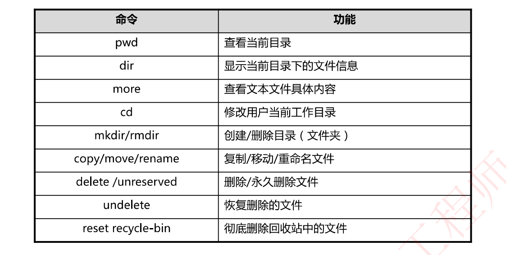
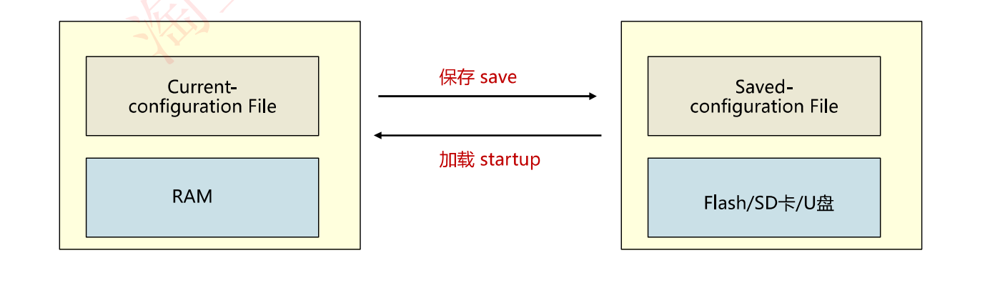
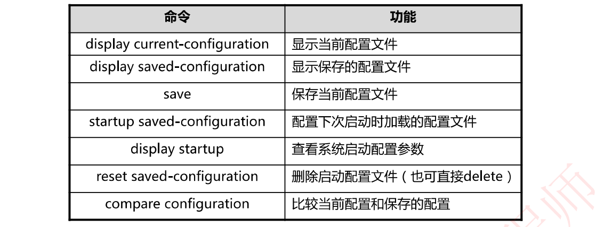
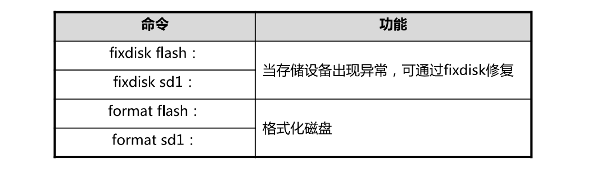

# 6-17 VRP文件管理系统

VRP的文件管理系统基本与Linux的文件系统一致

## 配置文件管理

华为数通设备的配置文件主要有2个，一个是`current-configuration file`，即目前运行的配置文件，存放在内存当中，内存掉电或机器重启之后，配置文件不复存在；如果需要保存，则需要输入`save`命令，可以将配置文件保存在flash(即设备的硬盘)、SD卡、U盘中，下次启动时保存的文件还在

若需将保存的配置文件加载使用，需要用`startup`命令

## 常见的配置文件管理命令

## 网络设备中的存储器

- SDRAM同步动态随机存取存储器，作用如同电脑中的内存。
- NVRAM非易失性随机访问存储器，是指断电后仍能保持数据的一种RAM（存精简系统)
- Flash闪存，类似PC的硬盘（固态硬盘)
- SD Card
- USB

