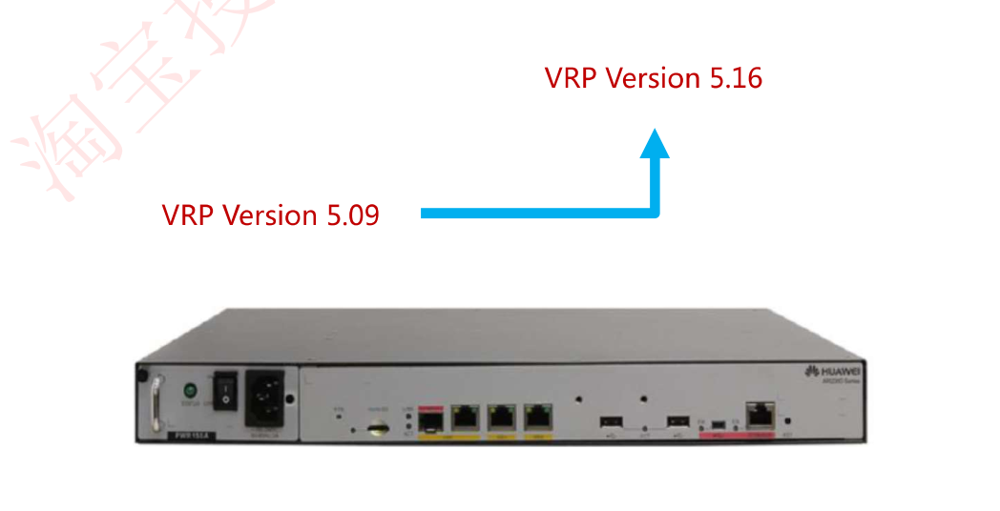
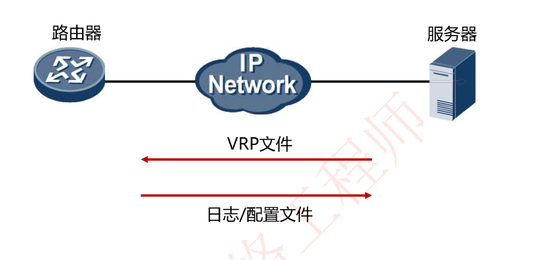
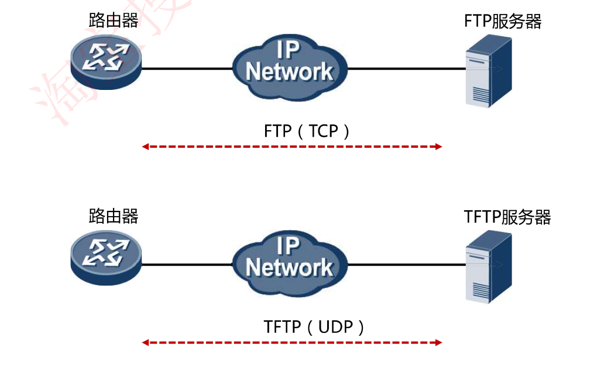
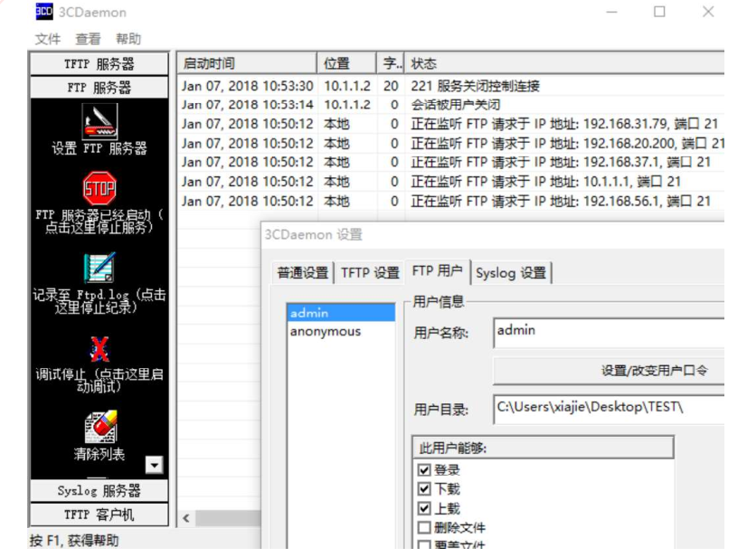
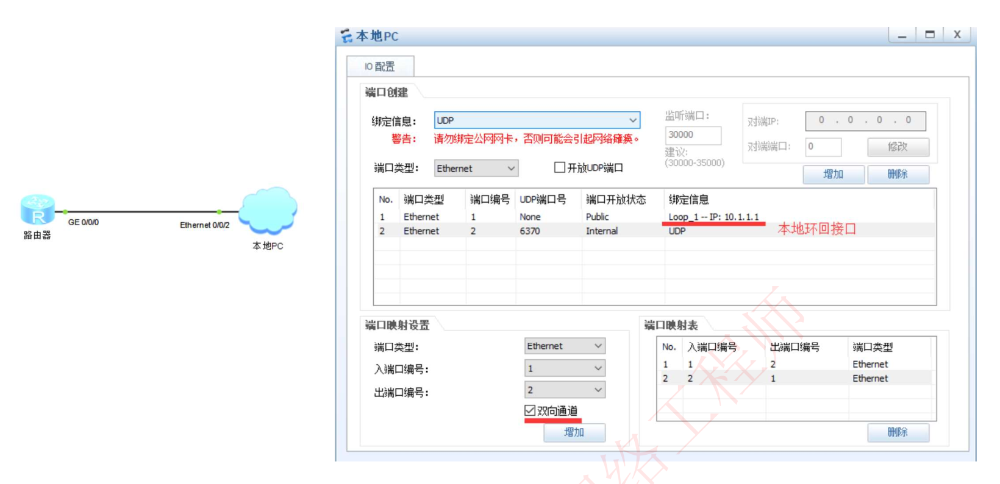
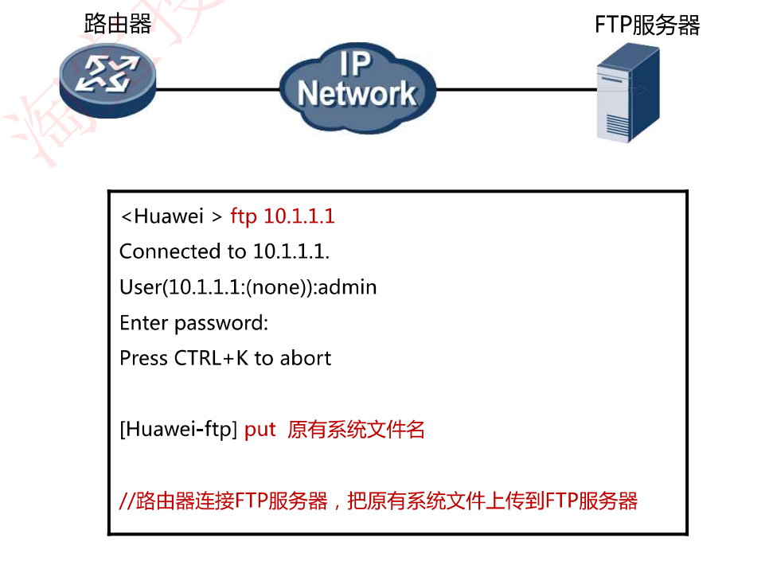
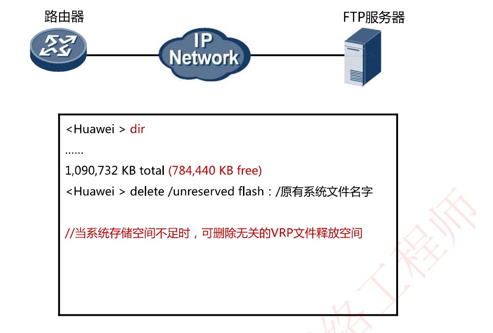
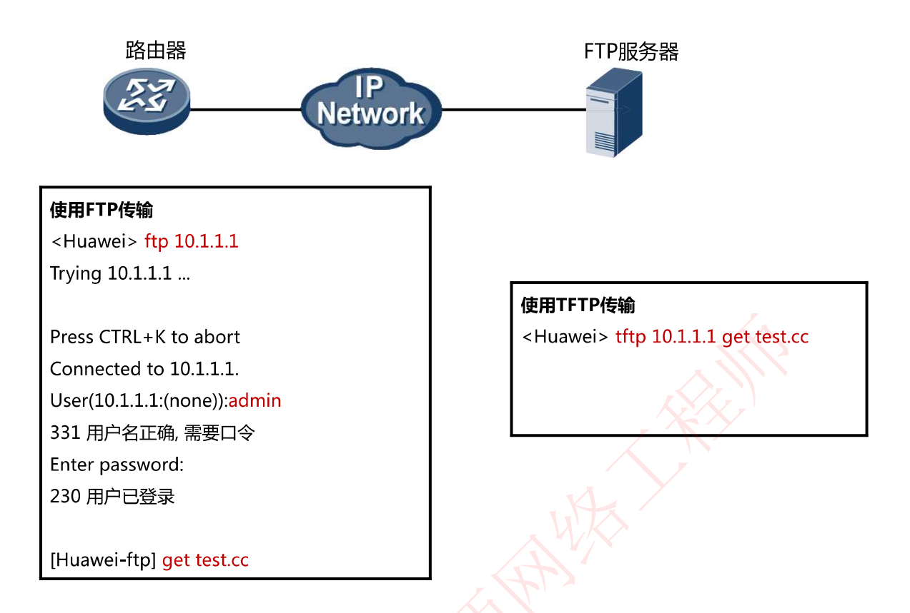
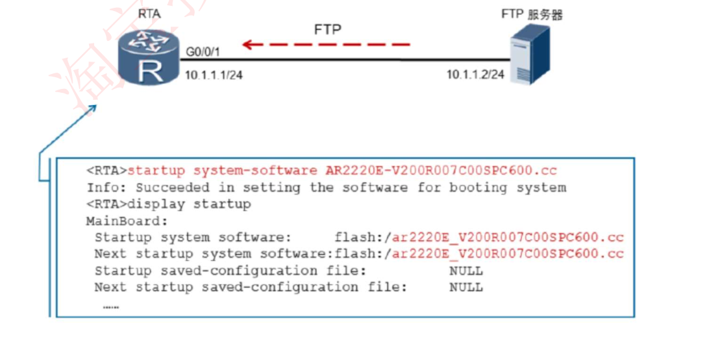

# 6-18 VRP系统升级演示

华为会定期对VRP进行更新，随着VRP版本的更新，VRP支持的特性越来越多，BUG越来越少，可根据需求更新VRP版本。

## VRP系统文件的传输

- FTP/TFPT/SFTP通过PC上传到路由器
- USB/SD卡拷贝
- Console线缆传送

### 文件传输协议

常用的文件传输协议有FTP和TFTP

## VRP升级步骤

### 搭建FTP/TFTP服务器，测试与路由器连通性

下载3Daemon搭建FTP/TFTP服务器，ENSP路由器与真机桥接，测试连通性

### 备份原有系统，用于升级失败回退

### 删除原有系统文件，释放空间

### 下载新的系统文件

### 升级

