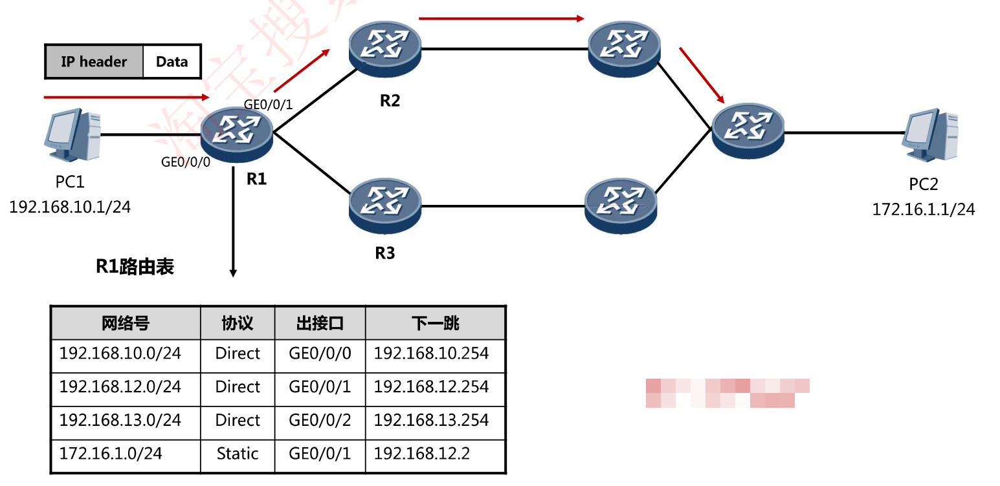
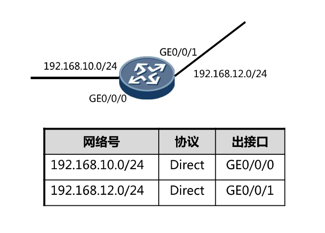
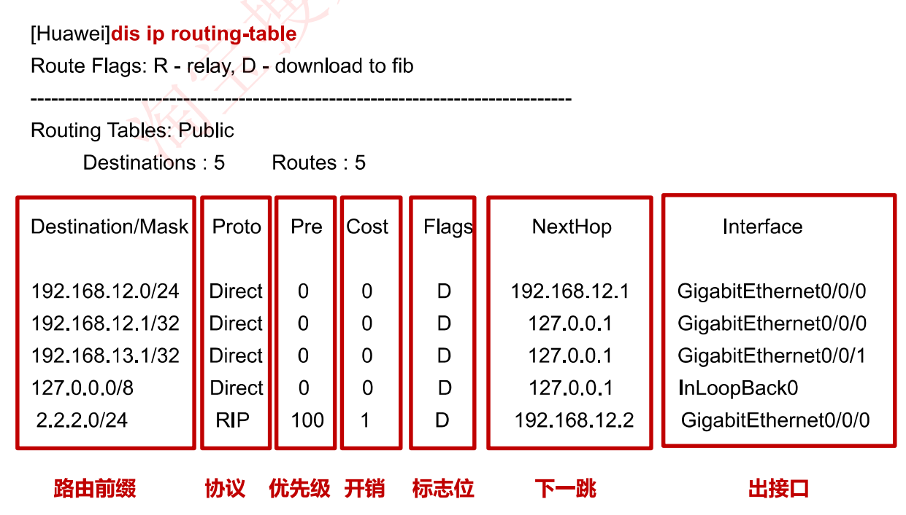
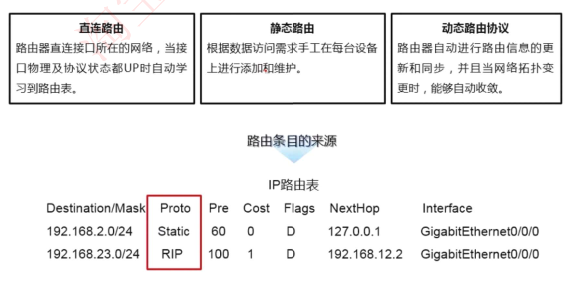

# 6-18.5-1 IP路由基础

## 什么是路由

当路由器（或其他三层设备）收到一个IP数据包时，会查看数据包的IP头部中的**目的IP地址**，并在路由表中进行查找，在匹配到**最优的路由**后，将数据包扔给该路由所指出接口或者下一跳。



## 路由器的工作内容

- 建立并维护路由表RIB（静态路由/路由协议)

- 根据路由表转发数据

## IP路由表



- 初始情况下，路由器所知的网络，只有其直连接口所在网络
- 直连网络在路由表中的标记为Direct
- 直连网络出现在路由表中的前提，是该网络的接口物理机协议状态都UP

- 温馨提示∶接口UP，协议DOWN可能原因:
  1. IP地址冲突，子网掩码设置错误
  2. 没有设置DCE时钟
  3. 没有设置对FR/PPP的封装
  4. Hello和Dead的更新时钟，两端路由器不同

## 查看路由表

```bash
[Huawei]dis ip routing-table
```



### 路由条目的来源



- 直连路由-路由器本地接口所在网段
- 静态路由-手工配置的路由条目
- 动态路由-路由器之间通过动态路由协议学习到的路由

## 动态路由协议的分类

