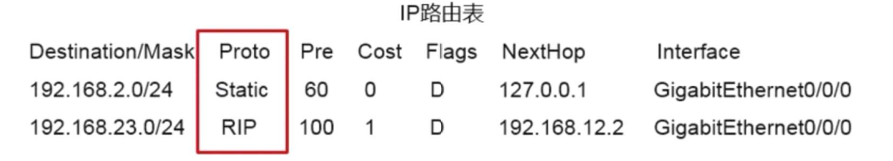
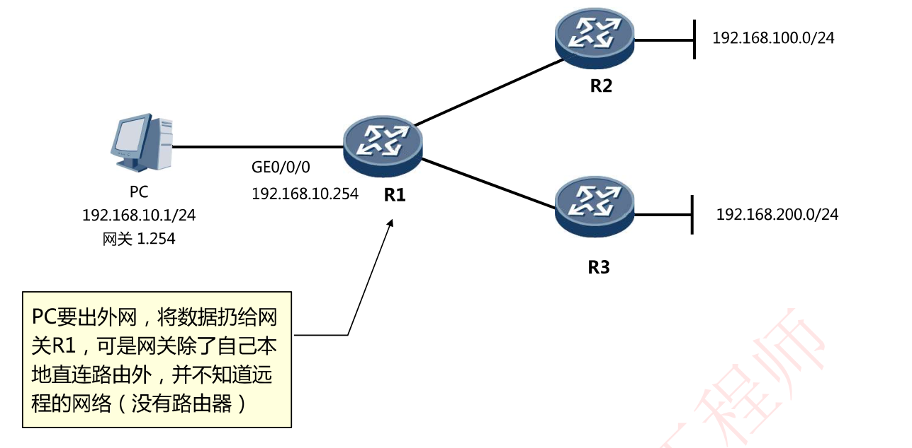
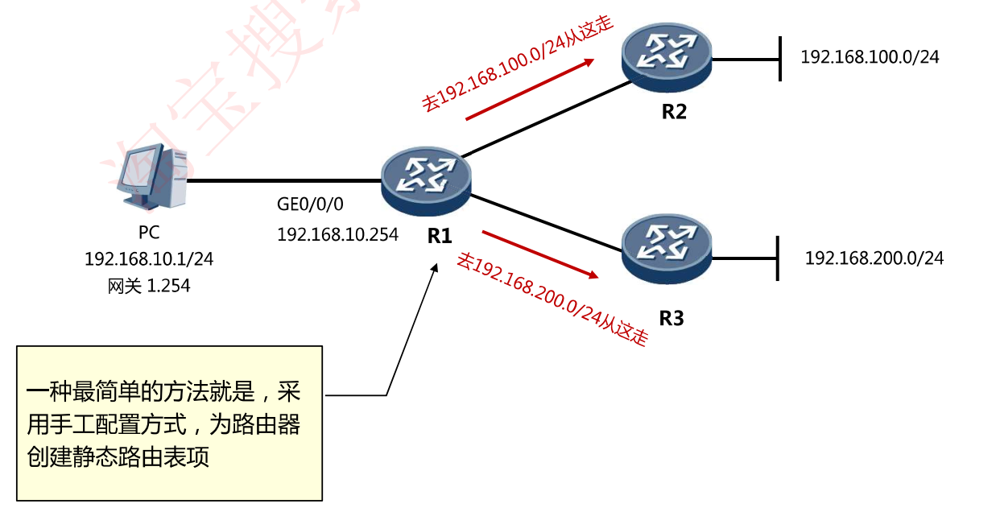
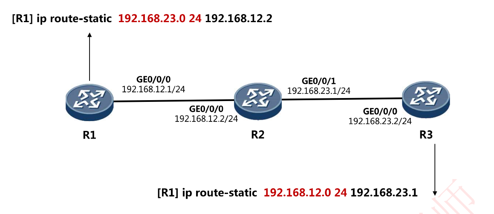
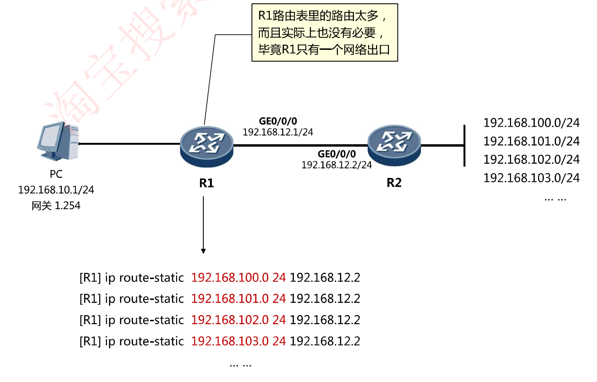
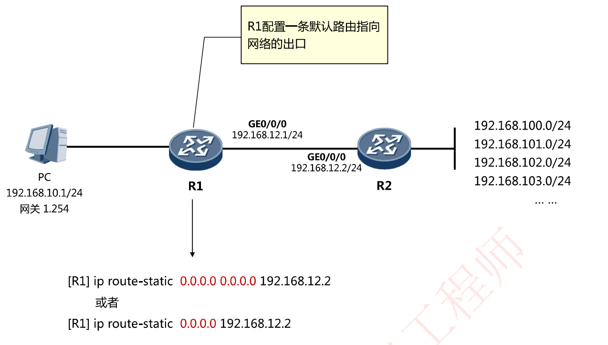
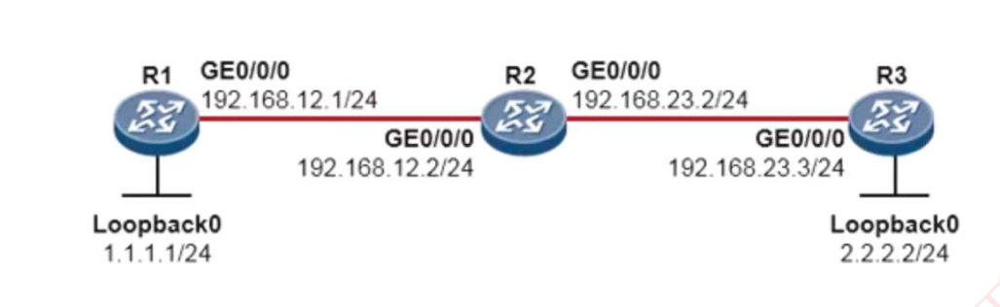

# 6-18.5-2 静态路由与默认路由



笔者注：上图是一张路由表，`NextHop`项即下一跳指明了要将此IP数据报转发至哪一个IP地址，`Interface`项指明了应当从本路由器的那一个接口转发出去

详细可参考：[18张图带你详解IP路由表七大要素：路由前缀、协议类型、优先级、开销、下一跳、出接口](https://cloud.tencent.com/developer/article/1875682)

## 静态路由

PC要出外网，将数据扔给网关R1，可是网关除了自己本地直连路由外，并不知道远程的网络（没有路由器)



一种最简单的方法就是，采用手工配置方式，为路由器创建静态路由表项



### 静态路由的特点

1. 配置简单

2. 手工配置，可控性高

3. 节省网络带宽

4. **如果网络大，那么工作量大。**

5. **如果网络故障，无法响应拓扑动态变化**

## 静态路由配置命令

静态路由的配置（**关联下一跳IP的方式**)

```shell
[Router] ip route-static 网络号 掩码 下一跳IP地址
```

静态路由的配置（**关联出接口的方式**)

```shell
[Router] ip route-static 网络号掩码出接口
```

静态路由的配置(**关联出接口和下一跳IP的方式**)

```shell
[Router] ip route-static 网络号 掩码 出接口 下一跳IP地址
```

### 配置示例

```shell
[R1] ip route-static 192.168.100.0 255.255.255.0 192.168.12.2

[R1] ip route-static 192.168.100.0 24 192.168.12.2
```

## 静态路由配置实验



注意︰

- 通信是双向的，因此要留意往返流量（的路由)
- 路由行为是逐跳的，因此需要保证沿途每一台路由器都有路由

## 默认路由

R1路由表里的路由太多而且实际上也没有必要，毕竟R1只有一个网络出口



实际上，对于具有**相同下一跳的不同目的网络**的路由条目，我们可以用**一条默认路由**条目来替代。

默认路由条目中

- 目的网络地址为0.0.0.0
- 地址掩码也为0

其CIDR形式为0.0.0.0/0

于是我们可以配置一条默认路由



### 默认路由小结

- 默认路由是一种特殊的静态路由，走投无路的选择
- 配置简单，简化管理
- 降低路由CPU、内存资源
- 用处∶网络出口路由器/防火墙/核心交换机

## 查看及排错

常用命令∶

- `Ping`：测试网络连通性
- `Tracert`：跟踪到达目标网络的每一跳
- `Display ip routing table`：查看路由表
- `Display ip interface brief`：接口消息摘要

## Loopback环回接口

Loopback接口，也叫环回口，是一个逻辑的、虚拟接口

使用全局命令`interface loopback + 接口编号`创建，创建完成后即可为接口配置IP地址

Loopback接口在手工创建后，是不会DOWN掉的，因此非常稳定

Loopback接口常用于网络管理和路由更新，比如：

- 模拟路由器的直连网段，可用于测试

- 可用于设备管理( Loopback接口比较稳定)

- 协议使用，比如OSPF、BGP、MPLS等的RouterID作为SNMP traps消息的源地址

- 其他用途( Loopback接口用途十分广泛)

### 小实验

