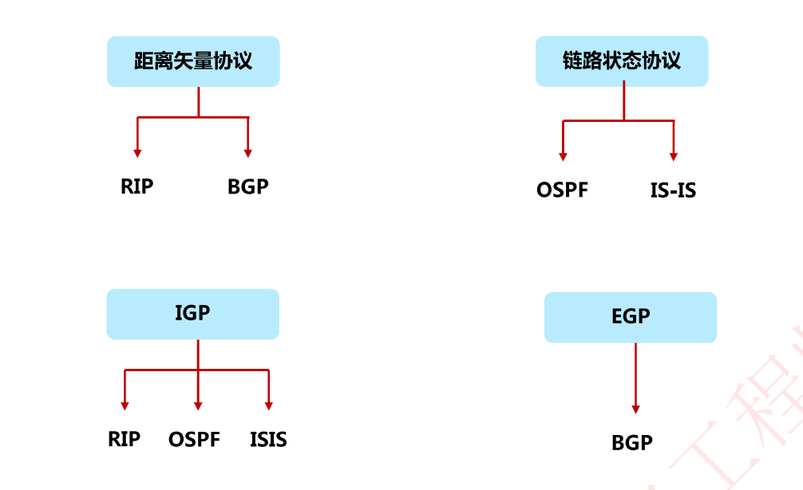
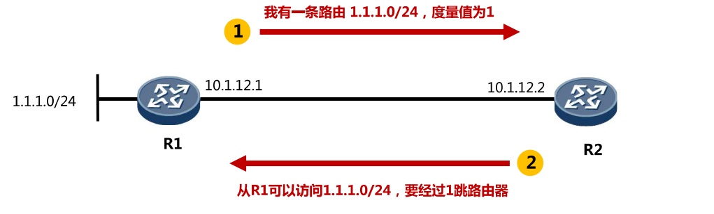
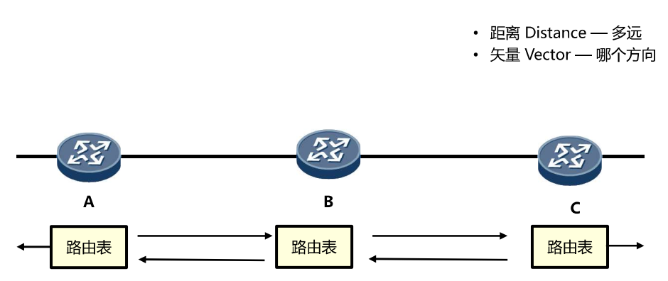
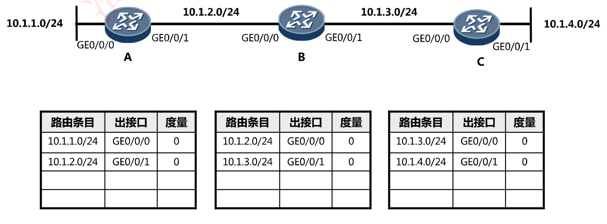
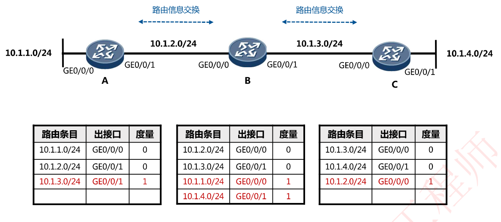
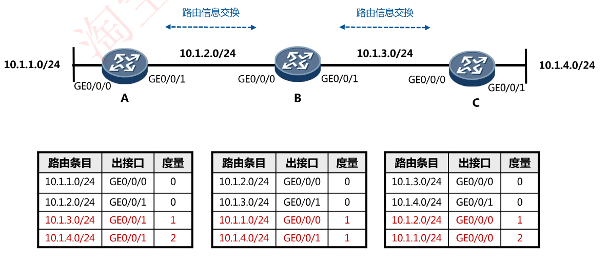
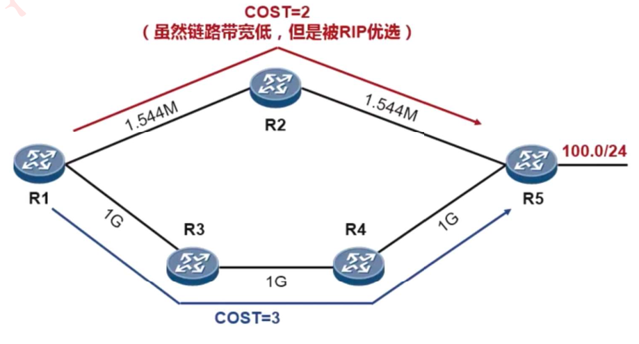
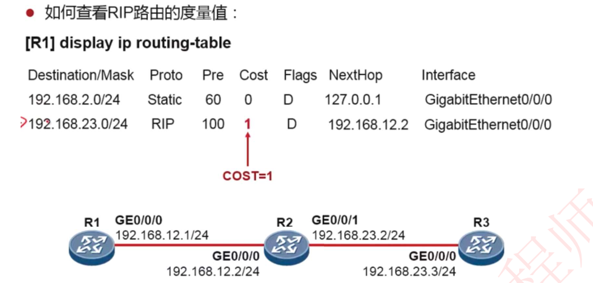
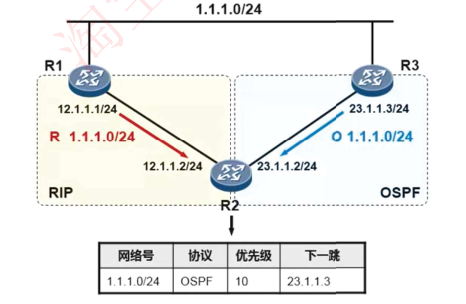
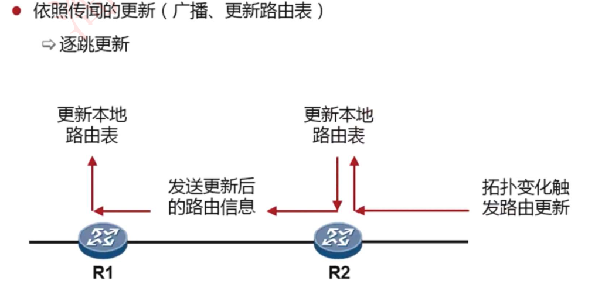

# 6-19 距离矢量路由协议与RIP

## 动态路由协议的分类

## 距离矢量路由协议与RIP原理

使用距离矢量路由协议的路由器并不了解网络的拓扑。该路由器只知道：

- 自身与目的网络之间的**距离**

- 应该往哪个**方向**或哪个接口转发数据包（方向即矢量）

## 距离矢量路由协议的特点

周期性地更新（广播）整张路由表

## 距离矢量路由协议的工作过程

路由器初始启动

- 最初的网络发现：直连路由写入路由表，直连网络的路由条目度量值为0

- 初次路由信息交换：广播交换路由表

- 再次路由信息交换：各个路由器到达域内所有网络的路由条目都有了

### 路由器完成收敛的标志

- 所有路由表包含相同网络可达性信息
- 网络（路由）进入一个稳态

### 路由器继续交换路由信息

- 当无新路由信息被更新时收敛结束
- 网络在达到收敛前无法完全正常工作

## RIP路由的度量值

RIP以跳数(Hops )作为度量值，虽然简单，但事实上不科学，如下图:

### 查看RIP路由的度量值

## 路由优先级

如下图所示，欲到达1.1.1.0/24网段，R2路由器有两条路由可以选择

- 通过R1到达，而R2~R1直连网络内部使用RIP协议
- 通过R2到达，而R2~R3直连网络内部使用OSPF协议

最终会选择后者，**因为OSPF协议的优先级更高**

### 华为路由器上常见路由协议的优先级

记住：

- 直连路由优先级：0   最高
- OSPF路由优先级：10
- 静态路由优先级：60
- RIP协议路由优先级：100

## 拓扑发生变化之后RIP的工作过程

- 网络拓扑变化首先影响直连路由器

- 直连路由器更新本地路由表

- 直连路由器发送更新后的路由信息，其他路由器逐跳更新各自的本地路由表

