# 6-26 二层交换机的工作原理

如下图，是一个典型的园区网络，可以看到，交换机的数量要远大于路由器数量，只在网络出口处设置了路由器（图中出口处是设置了防火墙），因此对于园区网络，交换机是主角。

简单介绍使用路由器的几种情况：

- 防火墙只有以太网接口，如果运营商甩过来的都是ATM接口或POS接口（这两种接口常用于运营商的骨干网），则必须用路由器

- 如果路由器上要跑很多功能如MPLS VPN等，这种服务只能由路由器提供
- 如今小型网络在出口处使用防火墙，够用了，不用路由器；公安、政务等网络则出口处使用路由器，防火墙专注安全业务

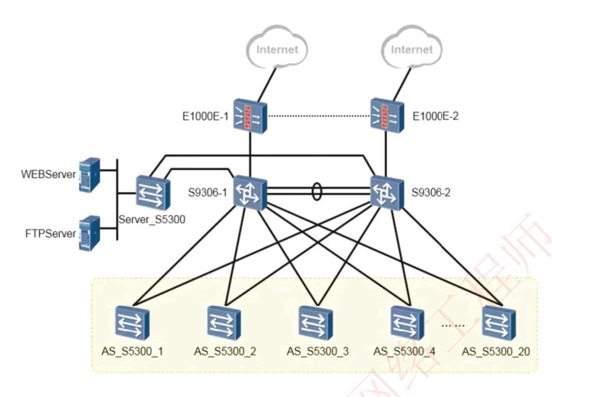

## 二层交换机的主要功能

- 维护MAC地址表

- MAC寻址数据帧的转发及过滤

- 二层环路避免及冗余性支持：STP协议

## MAC地址及MAC地址表

交换机对于目的MAC地址根据MAC地址表进行查表转发，路由器对于根据IP地址根据路由表进行查表转发

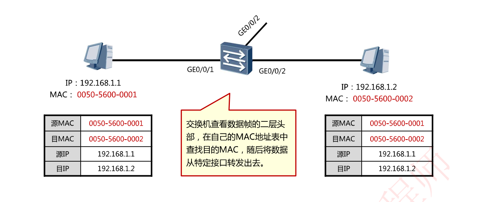

### MAC地址

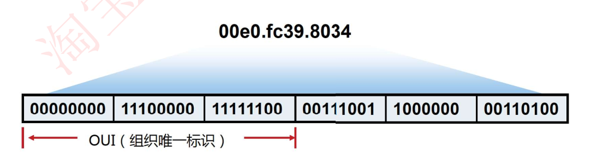

- MAC地址有48位，通常被表示为**点分十六进制**数

- MAC地址全球唯一，由IEEE对OUI进行管理和分配;

- 每个地址由两部分组成，分别是供应商代码和序列号。其中前24位二进制代表该供应商代码。剩下的24位由厂商自己分配。

### 交换机的寻址原理：根据源MAC地址进行学习，根据目的MAC地址进行转发

1. 初始情况下，交换机MAC地址表是空的

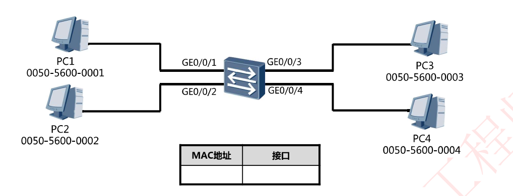

2. PC1发送一个数据帧给PC4，暂且假设PC1已经知道PC4的MAC地址。

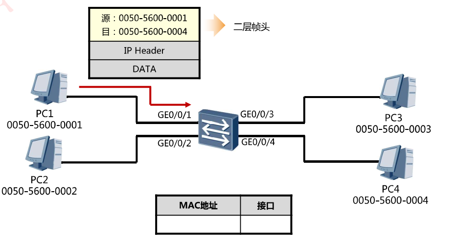

3. 交换机在收到数据帧后，将数据帧的源MAC地址学习到MAC地址表中，并与接收该帧的接口GE0/0/1口关联。（**根据源MAC地址自学习，根据目的MAC地址转发**）

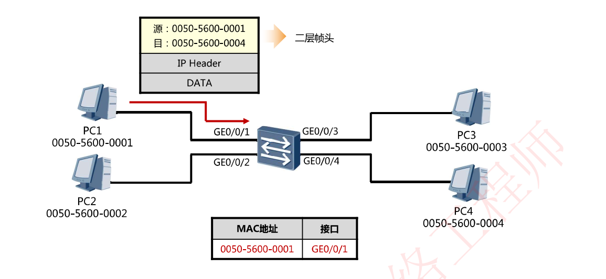

4. 交换机在MAC地址表中查询数据帧的目的MAC地址，发现没有匹配的表项，因此将数据帧从除了其入站接口之外的所有接口泛洪出去

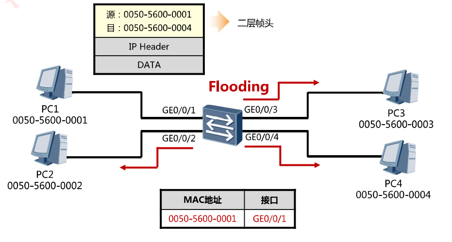

5. PC2及PC3收到数据帧后将其丢弃，因为这些数据帧并非发送给自己；

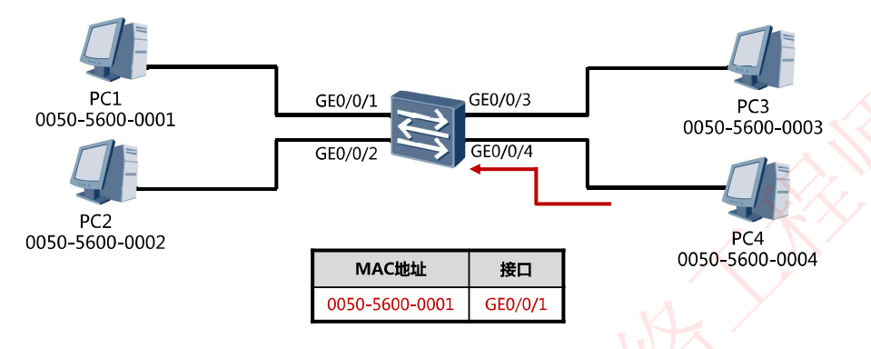

6. PC4则收下数据帧，现在PC4要回复数据给PC1

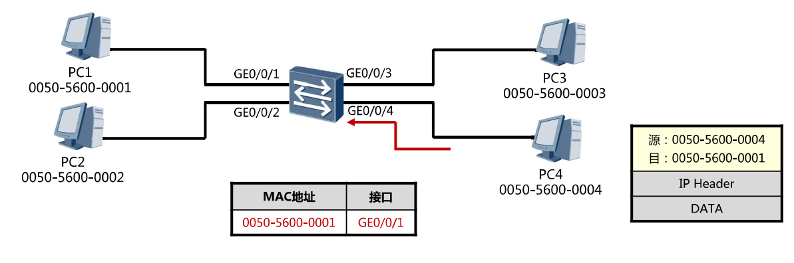

7. 交换机收到了数据帧，将帧头中的源MAC地址学习到MAC表中，并与接口GE0/0/4关联（基于源MAC地址自学习）

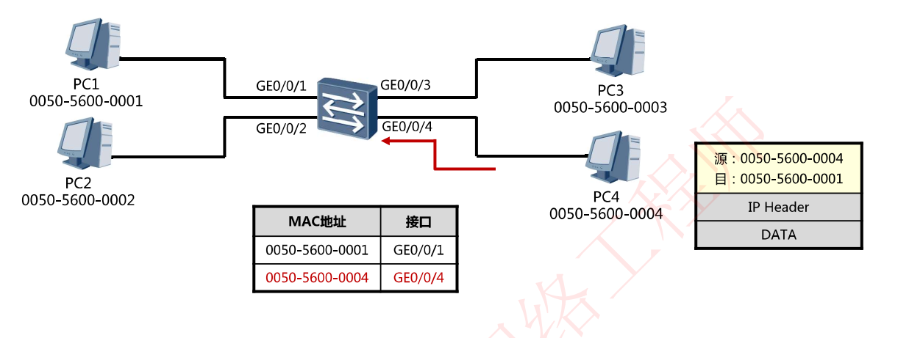

8. 交换机在MAC表中查找数据帧的目的MAC地址，发现有一个匹配的表项，出接口是GEO/0/1，于是将数据帧转发到GE0/0/1口（基于目的MAC地址进行转发）

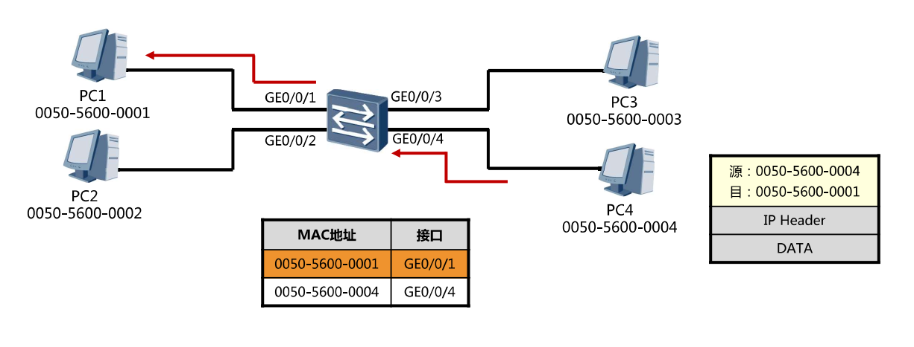

