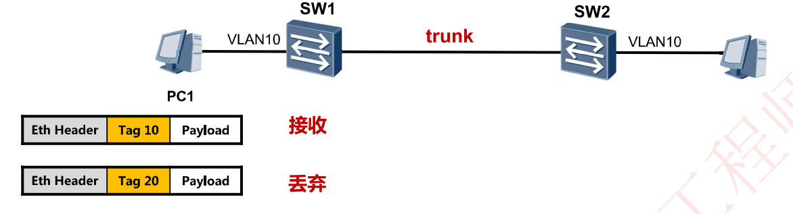
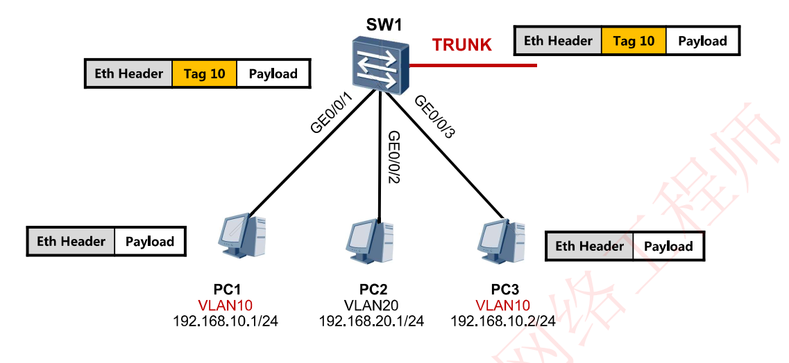
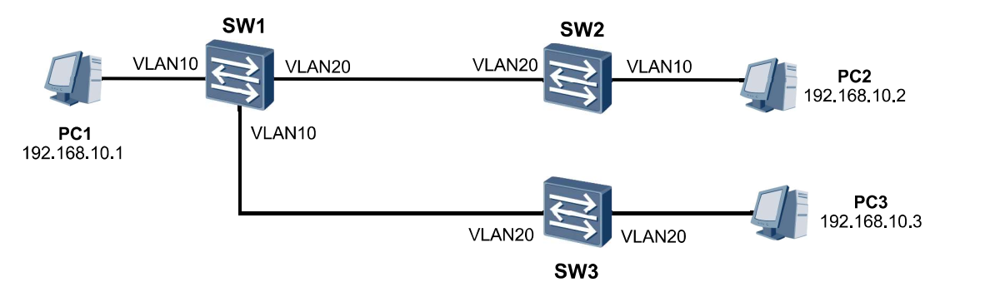
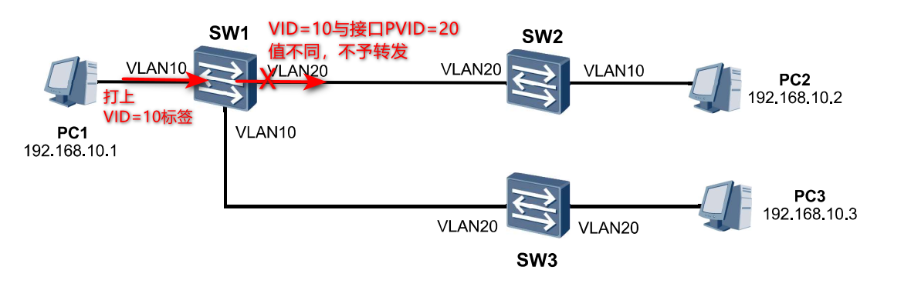
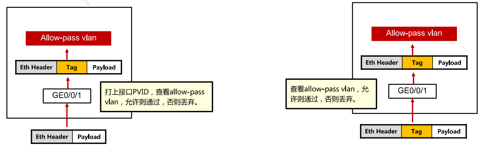
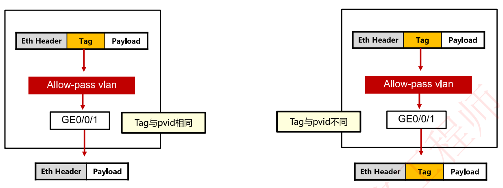
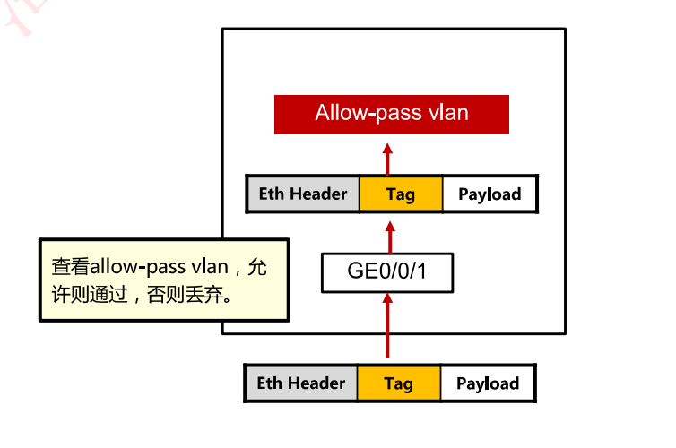
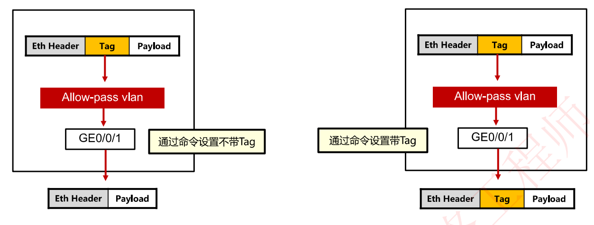

# 6-29 二层端口类型分析

## Access接口

### Access接口接收帧

- 如果该帧不带tag，则接受帧并打上端口VID ;
- 如果该帧携带tag，则当vlanlD与PVID相同时，接收该报文，否则丢弃。

### Access接口发送帧

- 交换机将帧中的 VID 与端口的 PVID 相等的帧从**相应**VLAN接口先删除Tag再转发出去。

- 如果该接口为Trunk，查看allow-pass vlan，如果存在直接转发出去

如图所示

- 当图中左上角的帧从GE0/0/1接口或GE0/0/3接口转发时，由于帧的VID与接口的PVID相等，都是10，那么删除VID标签后转发

- 当帧从Trunk接口转发时，先查看allow-pass vlan列表，如果存在就不作处理直接转发

### 思考

思考PC1能否和PC2进行通信?

- 不能，SW1右侧端口不会转发该帧

思考PC1能否和PC3进行通信?

- 能通信

  - 由于帧的VID=10，SW1下侧Trunk口PVID=10，因此去标签后转发至SW3左侧接口

  - SW3处左侧接口处，由于该帧已经不带VID标签，因此SW3TRunk口需要为该帧添加自己的PVID值作为VID值，于是SW3的右侧端口接收该帧后，将该帧VID值置为20后再转发

  - SW3的右侧接口处，判断接口PVID值与帧的VID都是20，去掉VID标签后转发，PC3收到该帧

## Trunk接口

### Trunk接口接收帧

- Trunk接口收到帧，如果不带Tag，打上接口PVID，查看allow-pass vlan，允许则通过，否则丢弃
- Trunk接口收到帧，如果带Tag，查看allow-pass vlan，允许则通过，否则丢弃。

### Trunk接口发送帧

- Trunk接口发送帧，若vlanID与接口pvid相同，且该vlan在allow-pass vlan列表中，则去掉Tag，发送数据帧。

- Trunk接口发送帧，若vlanID与接口pvid不同，且该vlan在allow-pass vlan列表中，直接发送数据帧。

## Hybrid接口

### Hybrid接口接收帧

Hybrid接口收到帧，若数据帧带tag，且vlanID在 allow-pass vlan列表里面，则接受该报文，否则丢弃。

### Hybrid接口发送帧

Hybrid接口发送帧，当vlanID是接口允许通过的vlanID时，发送该帧。可以通过命令设置发送时是否携带Tag。

