# 6-4 网络和交换机发展过程

## 网络演进历史

### ARPnet阿帕网

**1946年2月14日**，冯·诺依曼研制世界第一台电子计算机ENIAC问世。

**1969年11月**，美国国防部建立ARPAnet网络，只有4个结点，加利福尼亚州大学洛杉矶分校、加州大学圣巴巴拉分校、斯坦福大学、犹他州大学四所大学的4台大型计算机，这是现代计算机网络的雏形。

### 从中继器到集线器HUB

#### 主机直连

最早的计算机网络就事主机直接连接

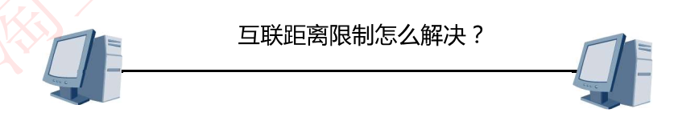

#### 中继器

直连主机的网络无法远距离传输，**中继器**作为**物理层**设备，可以将**信号放大**使得完成更远距离传输

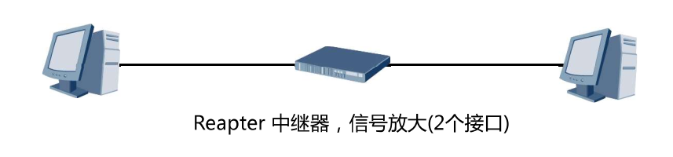

#### 集线器

随着越来越多设备需接入网络，出现了另一个**物理层**设备**集线器HUB**，集线器也可以**放大信号**

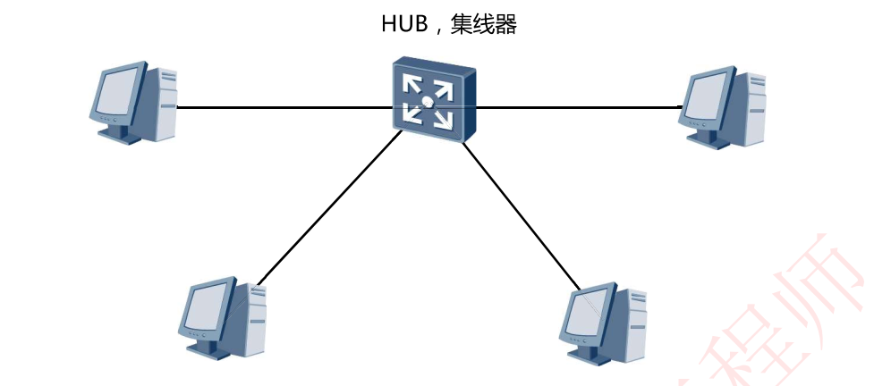

通过中继器和集线器，形成了最初的局域网

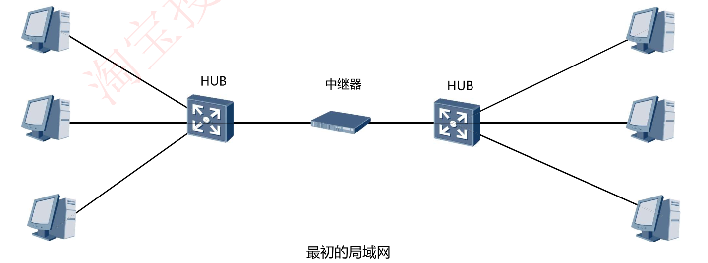

#### 集线器带来的困扰

**集线器工作原理**：从一个接口进入的数据，进行信号放大之后，**向其它所有接口进行泛洪(广播)**

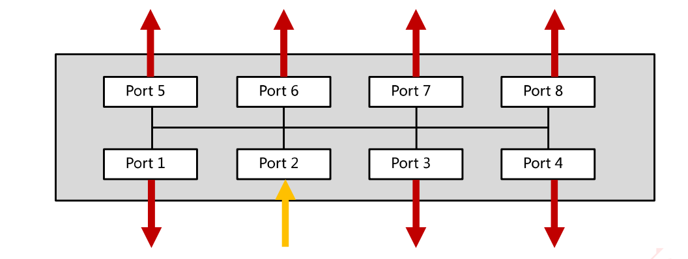

如果将两个集线器进行连接

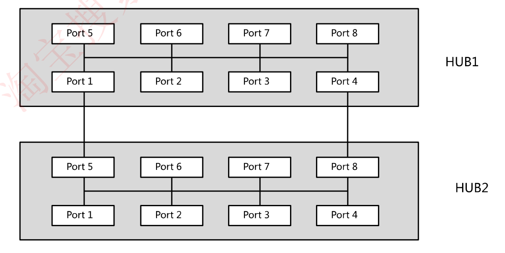

则会带来问题——现场环路，形成广播风暴，影响通信效率

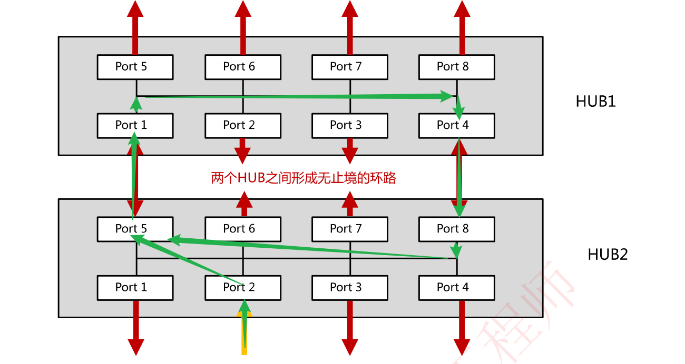

因此我们可以总结出集线器带来的两个问题

1. 产生环路，形成广播风暴，影响通信效率
2. 由于向其他接口进行广播，则会数据扩散，产生安全威胁

## 划时代的设备——交换机

**交换机工作原理**：数据交换**不再使用泛洪方式**，而是使用**专用交换通道**

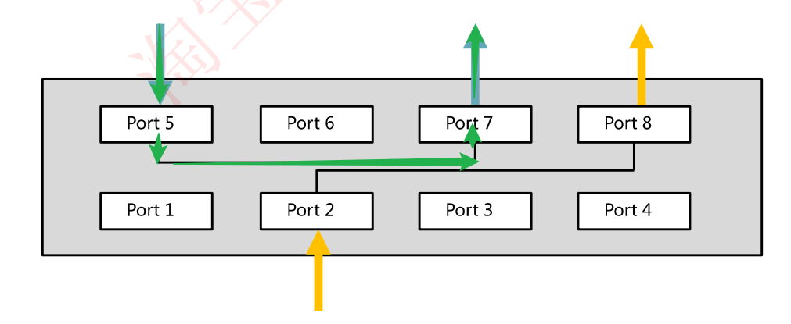

扩展：最早的交换机由3com公司发明，3com即是H3C华三公司的母公司

## 网络层设备——路由器

由于有了**隔离广播域**的需求，交换机**引入了VLAN**虚拟局域网

划分VLAN之后的VLAN10和VLAN20默认不能进行通信，各个VLAN之间需要使用三层设备**路由器来实现跨VLAN通信**

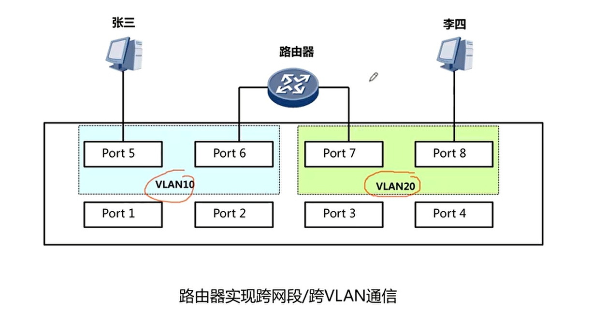

### 三层交换机——把路由器功能集成到了交换机内部

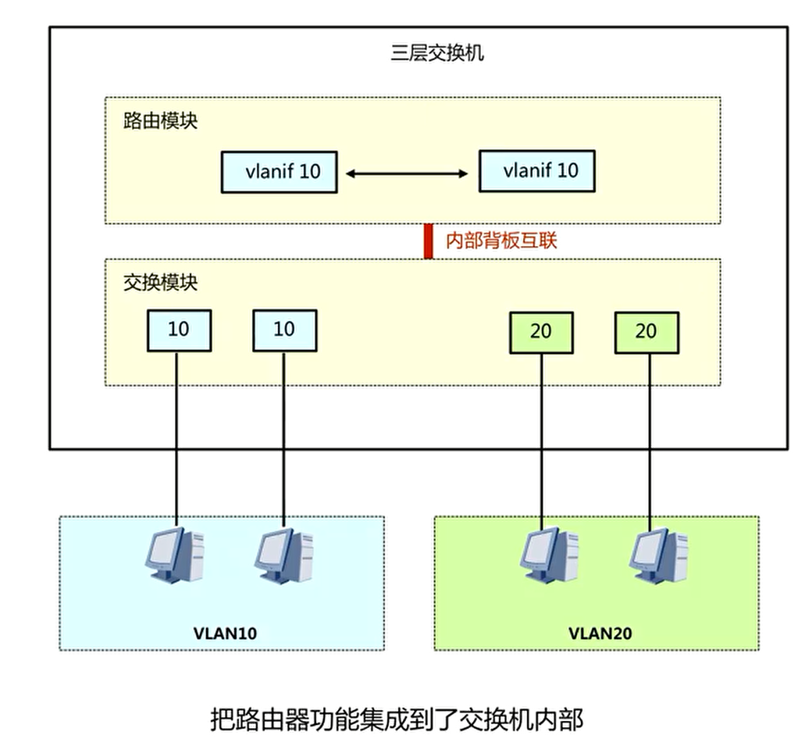

#### 路由器和交换机的区别

https://zhuanlan.zhihu.com/p/30483794

### 网络演进总结

一、交换机前身：中继器、集线器

二、二层交换机：基于MAC地址进行转发

三、三层交换机：集成路由功能

四、多业务交换机(对核心交换机通过插板卡实现多种功能)：FW(防火墙模块板卡)/AC(行为控制模块板卡)/LB/WS(无线模块板卡)

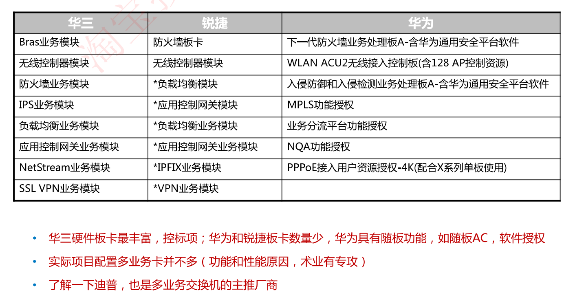

五、可编程交换机：SDN，一般企业网很少用
			SDN部署:Google、AT&T
			CISCO N9K: ACI(Application Centric Infrastructure)
			以应用为中心的基础设施
			HW127/128∶敏捷网络，敏捷开发H3C 125、锐捷N18K∶都支持SDN

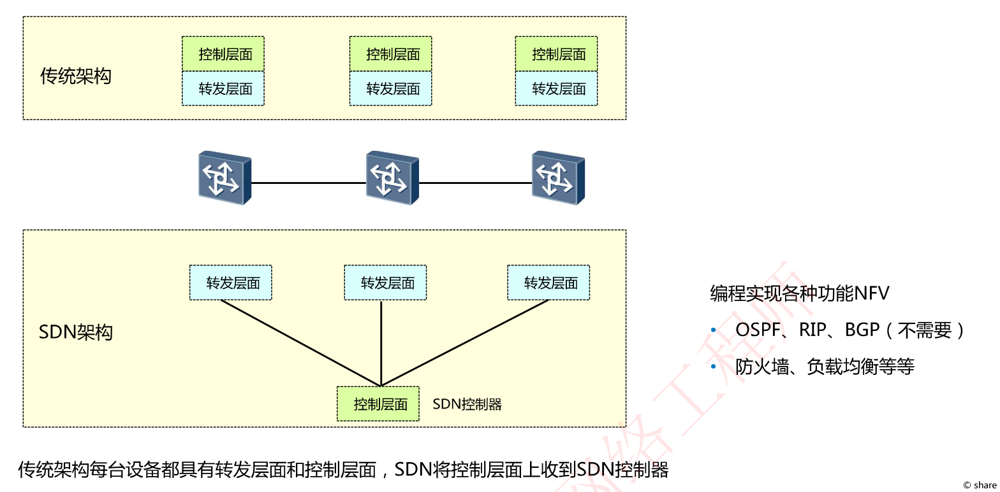

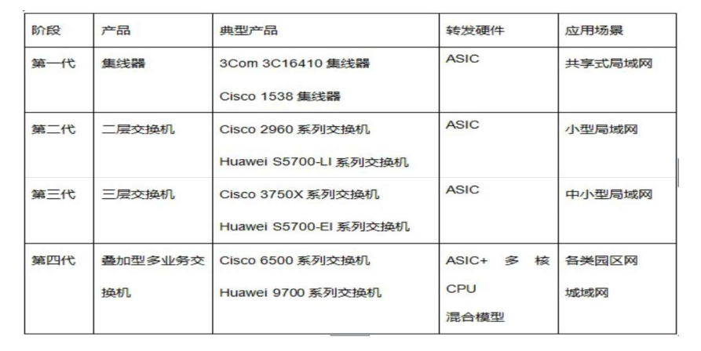

### 数通设备总结

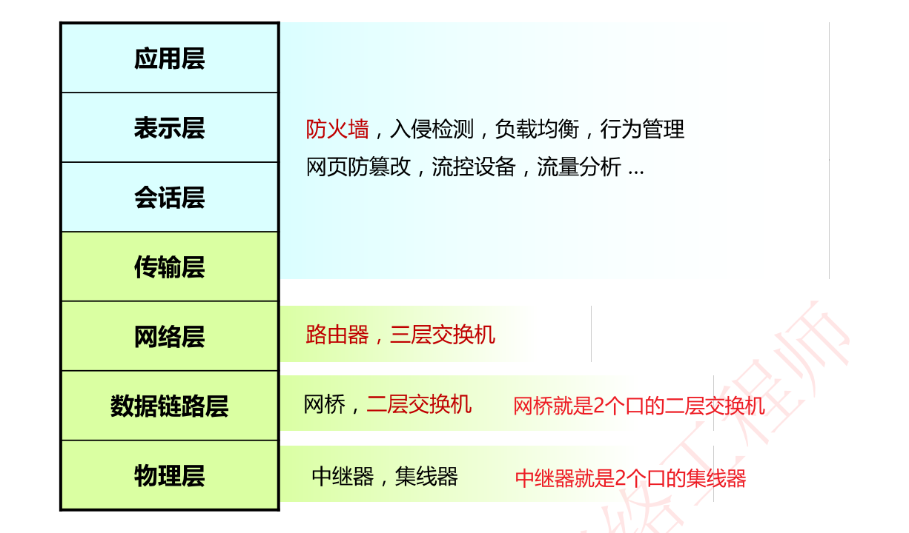