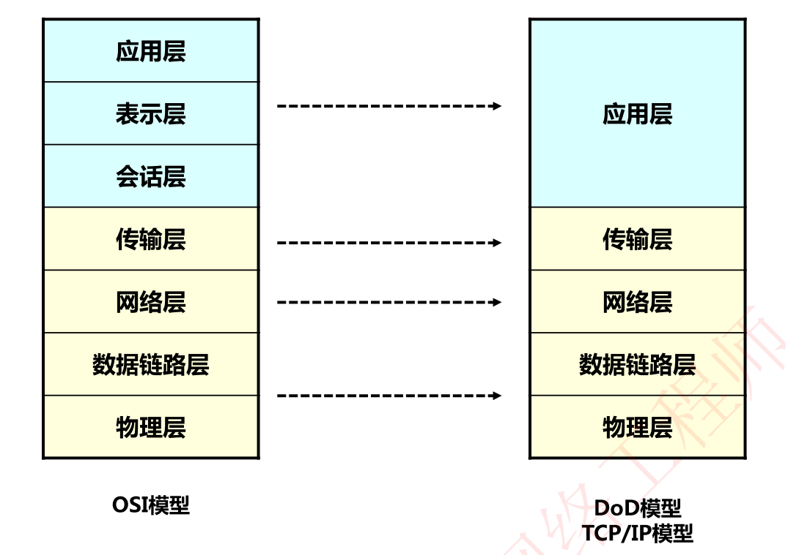
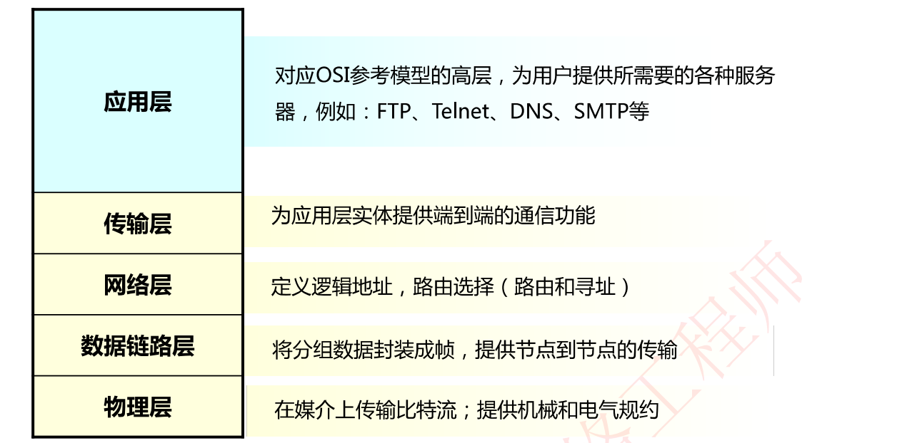
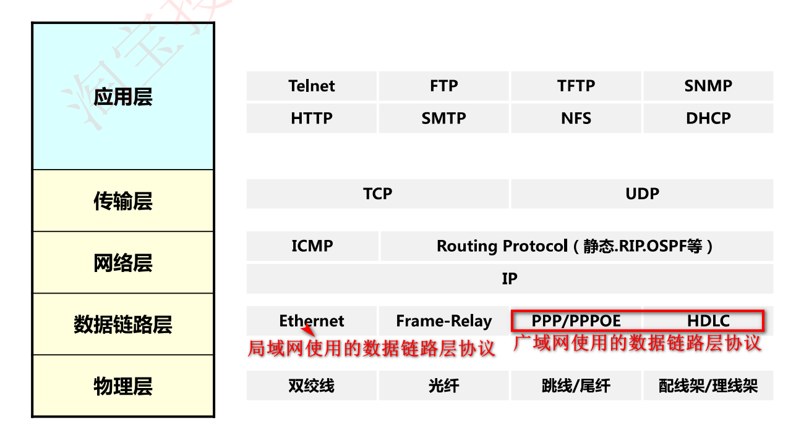

# TCP/IP四层模型

## 对比OSI七层模型和TCP/IP四层模型

五层架构的TCP/IP模型也将下两层统称物理层，即成为TCP/IP四层模型

## TCP/IP协议簇——TCP/IP(传输控制协议/因特网协议)

**传输控制协议/因特网协议（TCP/IP )**簇是由美国国防部(DoD)所创建的，主要用来确保数据的完整性及在毁灭性战争中维持通信。

是由一组不同功能的协议组合在一起构成的协议簇

TCP/IP是当今数据网络的基础

## TCP/IP参考模型

