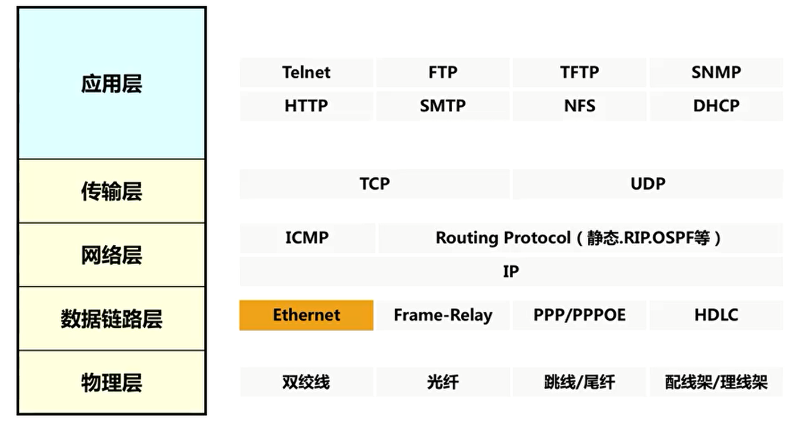
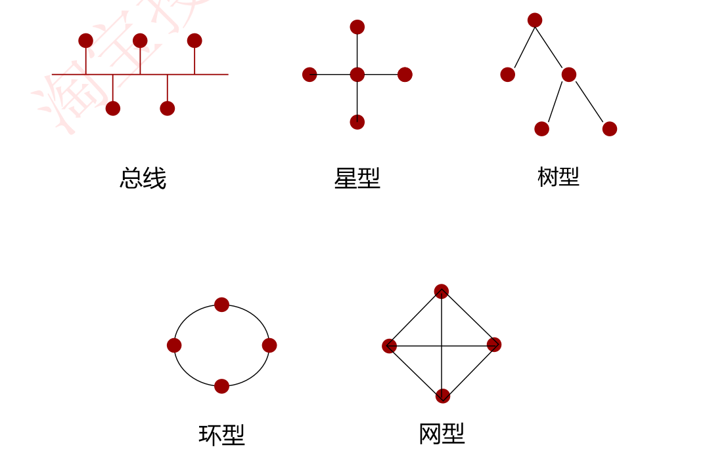
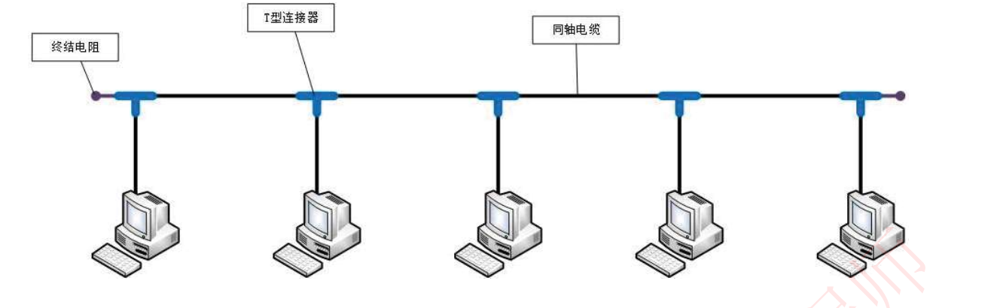
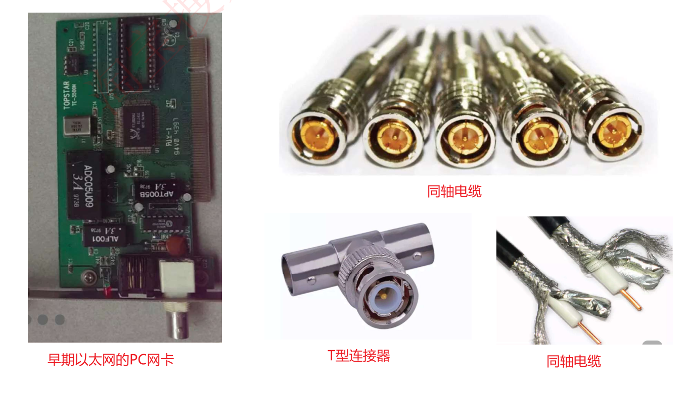
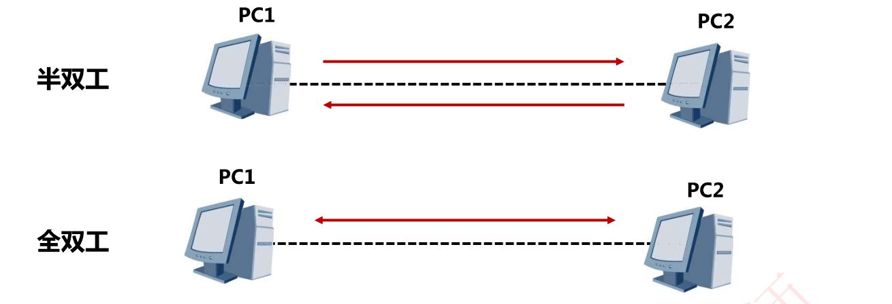
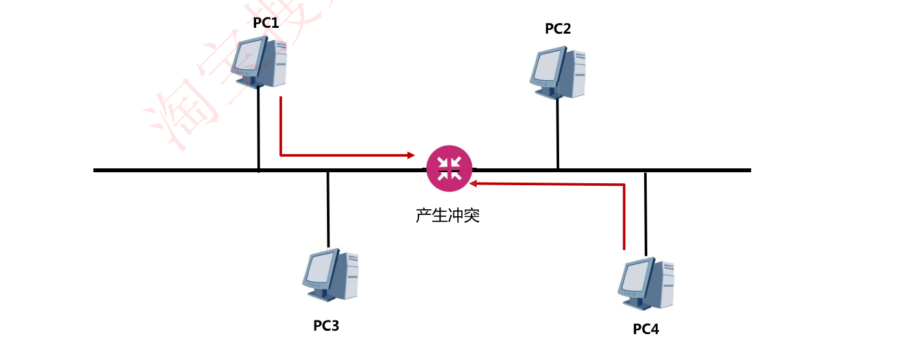

# 6-6 以太网基础

## 数据链路层协议的分类

- 局域网协议：以太网（目前局域网使用最多的协议）
- 广域网协议：PPP/PPPOE、HDLC

## 以太网

以太网属于**数据链路层**协议，用于**局域网**

## 局域网的四大协议（与以太网同时出现）

**以太网**：（施乐发明，后续优化成Ethernet Ⅱ ，IEEE基于Ethernet Ⅱ推出**802.3** )，当前局域网绝大多数使用此协议

Apple Talk：苹果公司的私有局域网协议

令牌环：IBM发明，IEEE标准化为802.5

FDDI（双环）：美国国家标准学会在令牌环基础上制定

## 以太网拓扑——目前树形结构使用最多

### 早期以太网拓扑——总线型架构

早期以太网：中间使用同轴电缆连接，两端存在终结电阻，通过T型连接器将主机接入网络

## 双工模式

半双工模式下，共享物理介质的通信双方必须采用CSMA/CD机制来避免冲突。全双工模式下，通信双方可以同时实现双向通信，这种模式不会产生冲突，不需要使用CSMA/CD机制。

同一物理链路上相连的两台设备的双工模式必须保持一致。(厂商对接案例)

**案例分析：对讲机是半双工的典型例子（同一时间只能听或者说），电话网络是典型的全双工例子（同一时间既可以听也可以说）**

## 冲突域与冲突检测技术CSMA/CD

如果我们使用半双工通信，则会产生冲突

### CSMA/CD

CSMA/CD是一种在**共享式网络**上检测并避免冲突的机制。

**共享式网络**如总线连接的以太网，使用集线器HUB连接的以太网（使用交换机连接的以太网是一种交换式以太网，不是总线型以太网）

在共享以太网这种半双工通信的网络中，为解决冲突问题，提出了解决办法**CSMA/CD**(Carrier Sense Multiple Access/Collision Detection)，即**载波监听多址接入碰撞检测**

现在，共享式网络早已经被交换式以太网淘汰，其相应的CSMA/CD技术也早已淘汰不用

#### CSMA/CD技术原理

- 先听后发，边听边发
- 一旦冲突，立即停止
- 等待时机，然后再发：检测到冲突会启动一个随机计时器

注意：“听”即监听、检测；“发”即发送数据

### 冲突域与广播域

#### 冲突域

如下图所示，PC1、PC4同时发送数据，则会产生冲突，那么我们说PC1和PC4处于一个冲突域

##### 集线器是一个冲突域

比如，集线器作为物理层设备，当集线器的一个接口收到数据后即向所有端口泛洪，这时集线器的各个接口只能有一个口发送，其他接口不能发送，那么集线器的各个接口处于一个冲突域

- 集线器是一个冲突域：

##### 交换机的一个接口是一个冲突域，一个VLAN是一个广播域

交换机作为数据链路层设备，转发是通过MAC地址定向转发，而不进行数据泛洪

（硬记下来就行）

#### 广播域

我发一个广播，大家都能收到，则我们处于一个广播域

##### 交换机的一个VLAN是一个广播域

二层交换机出厂默认是一个VLAN即VLAN1,若不划分VLAN，那么一个交换机就处于一个广播域内

## 总结与思考

- 企业网络中部署千兆以太网时使用哪种传输介质？——千兆以太网传输必须使用超5类标准及以上的双绞线，或者使用千兆及更高等级的光纤
- 什么是冲突域？——冲突域是一个通过共享物理介质进行双向传输的所有节点的集合。当同一冲突域中的主机同时发送数据时，数据到达目的地之前可能会发生冲突。比如总线型以太网
- **CSMA/CD**作用是什么？——CSMA/CD是一种在**共享式网络**上检测并避免冲突的机制。