# 6-7 以太网帧格式

## 网络通信协议

二层协议主要在局域网和广域网

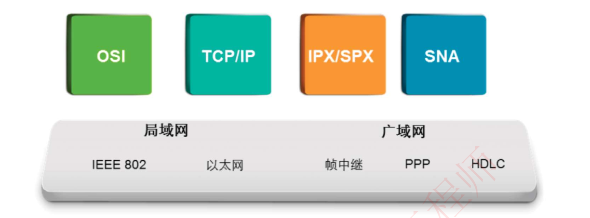

局域网的二层通信协议：以太网、IEEE 802

广域网的二层通信协议：帧中继、PPP、HDLC

不同的协议栈用于定义和管理不同网络的数据转发规则。

## 借助OSI模型理解数据传输过程

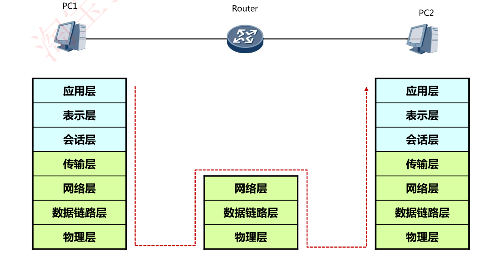

数据包封装过程

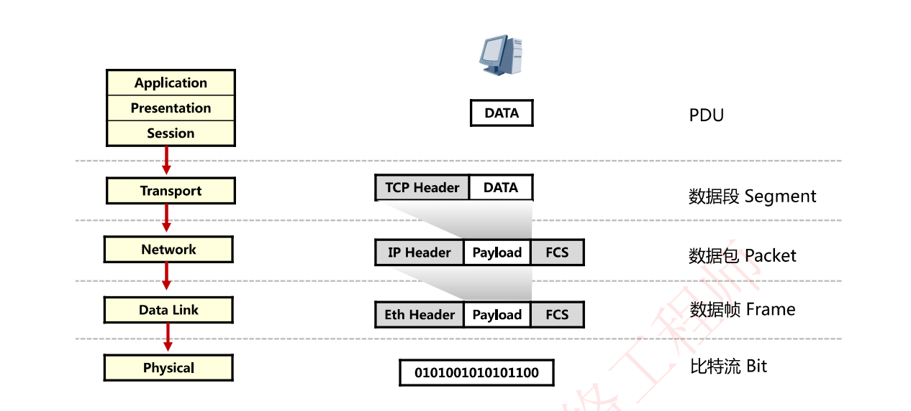

数据包解封装过程

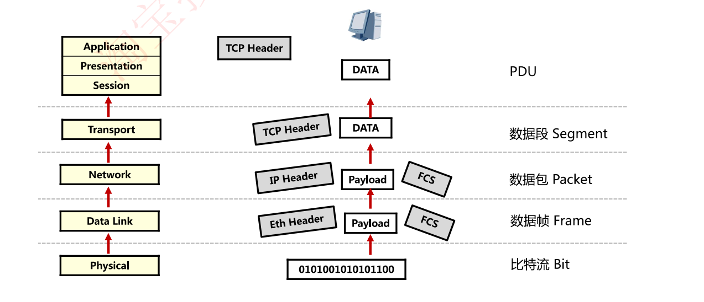

当两个终端之间在通信时，数据链路层控制数据帧在**物理链路**上的传输

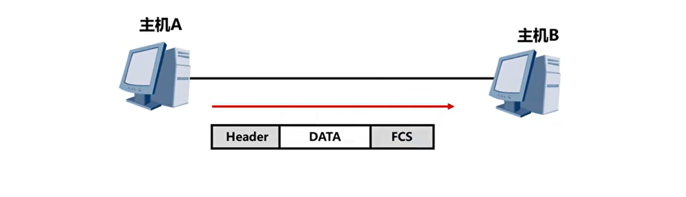

## 帧格式

以太网有2种帧，一种叫以太网2，一种叫802.3，二者的帧格式大同小异

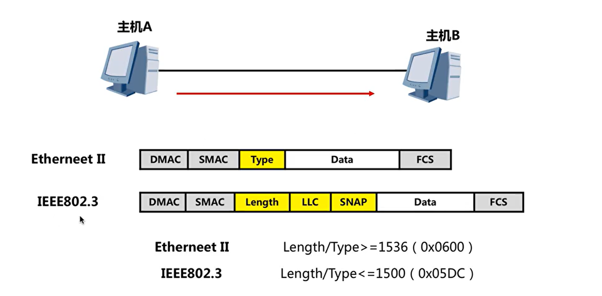

### Ethernet Ⅱ

**Ethernet Ⅱ**：**Xerox(施乐实验室)与DEC、Intel**在1982年制定的以太网标准帧格式Ethernet Ⅰ，1988年改进为Ethernet Ⅱ

- **Ethernet Ⅱ帧类型值大于等于1536（0x0600）**
- **以太网数据帧的长度在64-1518字节之间。**

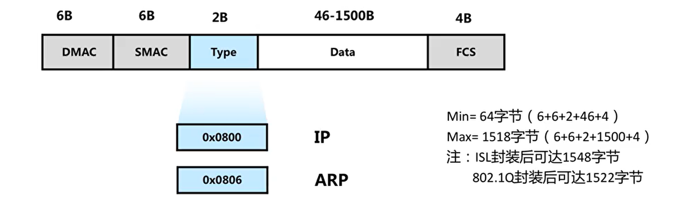

- 源目MAC地址
- Type：类型值，标识里面封装的数据是哪种类型的字段，类型值取值大于等于1536（0x0600）
  - 0x0800表示封装的是IP协议
  - 0x0806表示封装的是ARP协议
- Data：封装的网络层数据包，长度在46-1500字节之间
- FCS：冗余校验位

最小帧长度：64字节

最大帧字节：1518字节

### IEEE 802.3

IEEE在1985年公布的Ethernet 802.3的SNAP版本以太网帧格式（国际电器工程师协会在以太网2基础上定义）

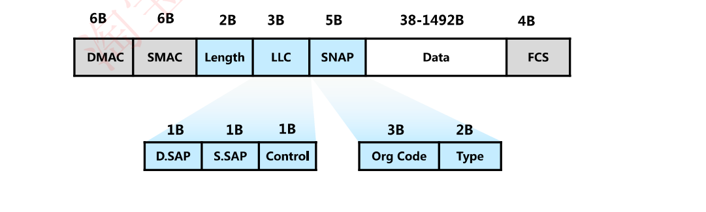

IEEE802.3帧长度字段小于等于1500 ( Ox05DC )

总长度︰64-1518B

- 源目MAC地址
- Length：长度标识，**帧长度字段值小于等于1500 ( Ox05DC )**
- LLC、SNAP至今没有应用到：IEEE无用功

- Data：封装的网络层数据包，**长度在38-1492字节之间**
- FCS：冗余校验位

最小帧长度：64字节

最大帧字节：1518字节

真实网络环境中，90%的通信使用的是**Ethernet Ⅱ**数据帧，仅在极小场景如交换机之间进行通信的STP协议使用的是802.3数据帧

百度百科两种帧格式对比错误

## 数据帧的传输

**局域网**中数据的传输**基于MAC地址**进行转发传输

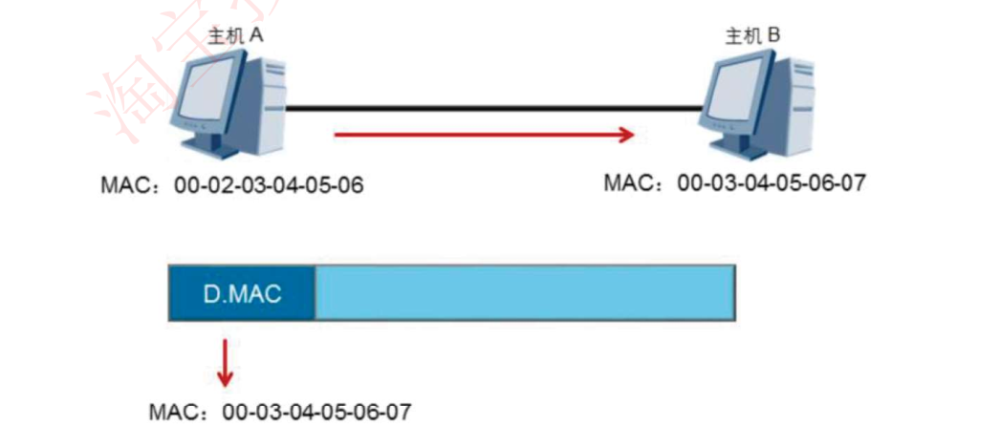

## 以太网地址即MAC地址/硬件地址

MAC地址共计48位，前24位为OUI厂商代码，由厂商向IEEE申请；后24位为序列号，厂商自行分配

局域网内部通信使用的是MAC地址，因此只要保证局域网内部MAC地址不重复即可正常通信；

局域网外部通信使用的就是IP地址了，即使相同MAC地址也可以正常通信

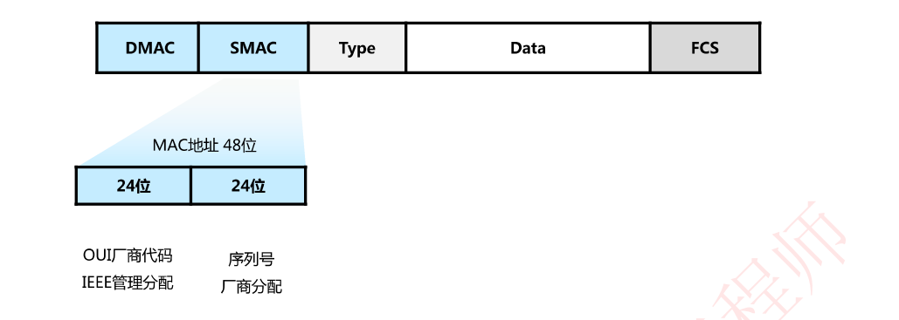

产品MAC地址前3个字节

- 华为：0x00E0FC
- 思科：0x0000.0c
- 施乐：全0

## 以太网对单播多播组播广播的标识

### 单播

单播帧目的MAC地址标识：MAC地址第8位标识为0

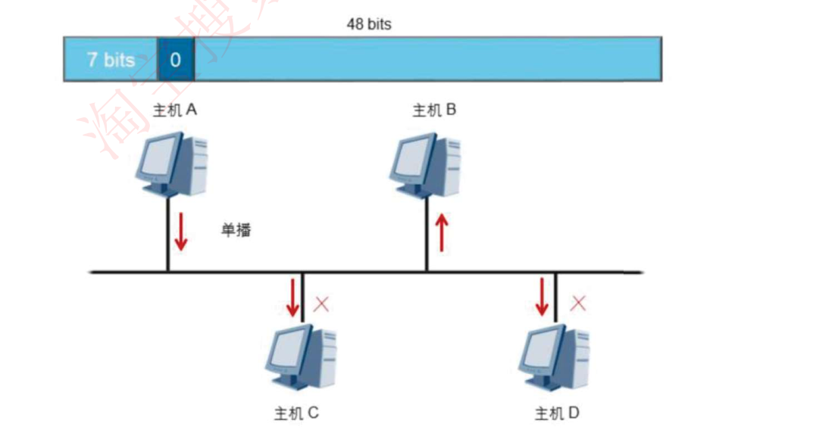

### 广播

广播帧的目的MAC地址：为十六进制的**FF:FF:FF:FF:FF:FF**，所有收到该广播帧的主机都要接收并处理这个帧。

广播方式会产生大量流量，导致带宽利用率降低，进而影响整个网络的性能。

### 组播

组播比广播更加高效，需要事先对于某几台设备分至一个组播组当中

组播帧目的MAC地址标识：MAC地址第8位标识为1

组播转发可以理解为选择性的广播，主机侦听特定组播地址，接收并处理目的MAC地址为该组播MAC地址的帧。

## 数据帧的发送和接收

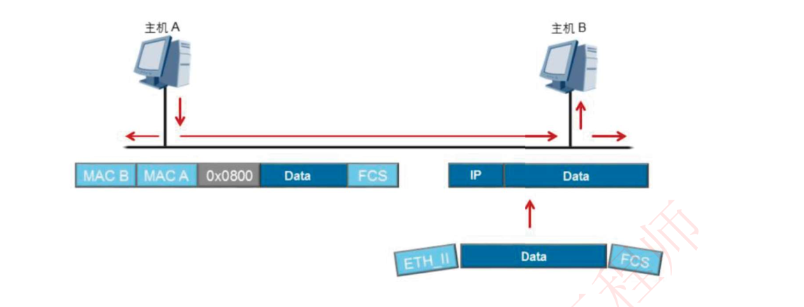

当主机接收到的数据帧所包含的目的MAC地址是自己时，会把以太网封装剥掉后送往上层协议。

## 总结

网络设备如何确定以太网数据帧的上层协议?

- 以太网帧中包含一个Type字段，表示帧中的数据应该发送到上层哪个协议处理。比如，IP协议对应的Type值为Ox0800，ARP协议对应的Type值为Ox0806。

终端设备接收到数据帧时，会如何处理?

- 主机检查帧头中的目的MAC地址，如果目的MAC地址不是本机MAC地址，也不是本机侦听的组播或广播MAC地址，则主机会丢弃收到的帧。如果目的MAC地址是本机MAC地址，则接收该帧，检查帧校验序列(FCS )字段，并与本机计算的值对比来确定帧在传输过程中是否保持了完整性。如果检查通过，就会剥离帧头和帧尾，然后根据帧头中的Type字段来决定把数据发送到哪个上层协议进行后续处理
