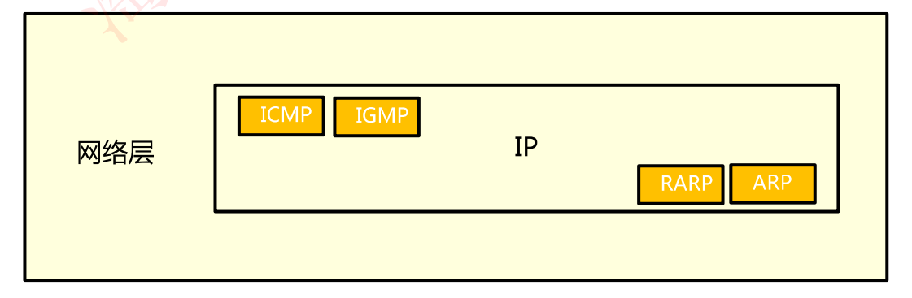
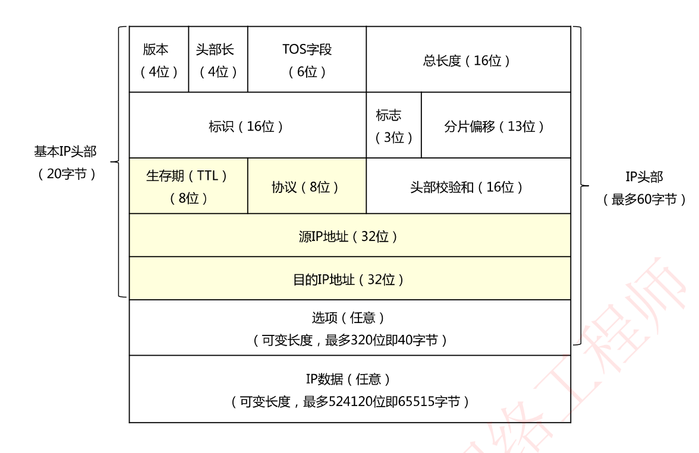
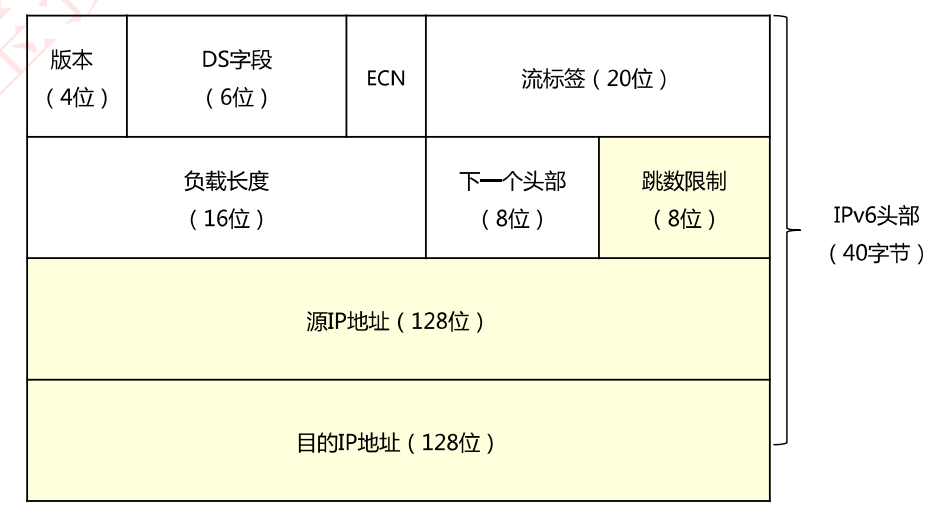
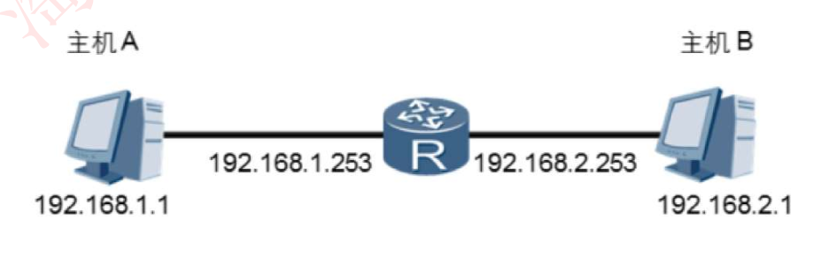

# IP协议基础

## 网络层协议

## IP报文格式

### 重点字段

**生存期TTL**：共8位，数值从0~255，表示一个IP报文最多可以在网络中经过255个三层设备，每当经过一个3层设备，TTL值就减1，TTL值为0时丢弃该IP报文

**协议类型**：用来说明报文中封装的是TCP、UDP以及其他类型，常见协议号如下表所示

| 协议号 | 协议类型 |
| ------ | -------- |
| 1      | ICMP     |
| 6      | TCP      |
| 17     | UDP      |

**源IP地址**

**目的IP地址**

### IPv6报文格式(了解)

## 网关/默认网关

网关是指接收并处理本地网段主机发送的报文并转发到目的网段的设备

网关用来转发来自不同网段之间的数据包，若发现数据包的目的地址不是本网段的地址，就将此数据包转发给提前配置好的默认网关，由网关进行转发

‘网关’是一个大概念，不具体特指一类产品，只要连接两个不同的网络的设备都可以叫网关；而‘路由器’么一般特指能够实现路由寻找和转发的特定类产品，路由器很显然能够实现网关的功能。当然电信行业说的‘路由器’又和家用的‘路由器’两个概念，这个暂且不表。

回到题目中你说问的默认网关是什么，默认网关事实上不是一个产品而是一个网络层的概念，PC本身不具备路由寻址能力，所以PC要把所有的IP包发送到一个默认的中转地址上面进行转发，也就是默认网关。这个网关可以在路由器上，可以在三层交换机上，可以在防火墙上，可以在服务器上，所以和物理的设备无关。

