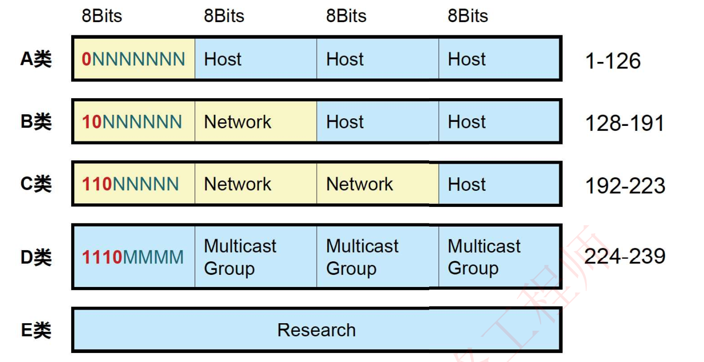
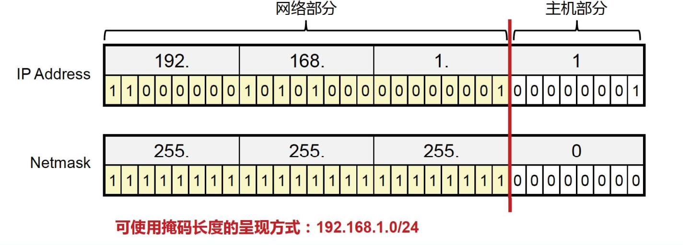
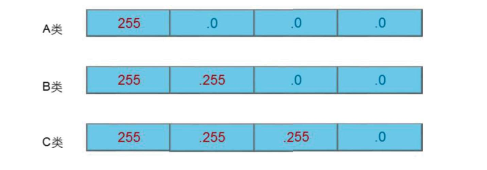

# IP地址概述

## IP地址

在IP网络中，通信节点需要有一个唯一的P地址;

IP地址用于IP报文的寻址以及标识一个节点;

IPv4地址一共32bits，使用点分十进制的形式表示;

## IP地址的类别

A、B、C类最常用，D类属于组播地址，E类供研究使用

## 网络掩码

网络掩码与IP地址搭配使用，用于描述一个IP地址中的网络部分及主机部分。

网络掩码32bits，与32bits的IP地址一一对应，掩码中**为1的位**对应IP地址中的**网络位**，掩码中**为0的位**对应IP地址中的**主机位**。

### 默认子网掩码

## IP网络通信类型

