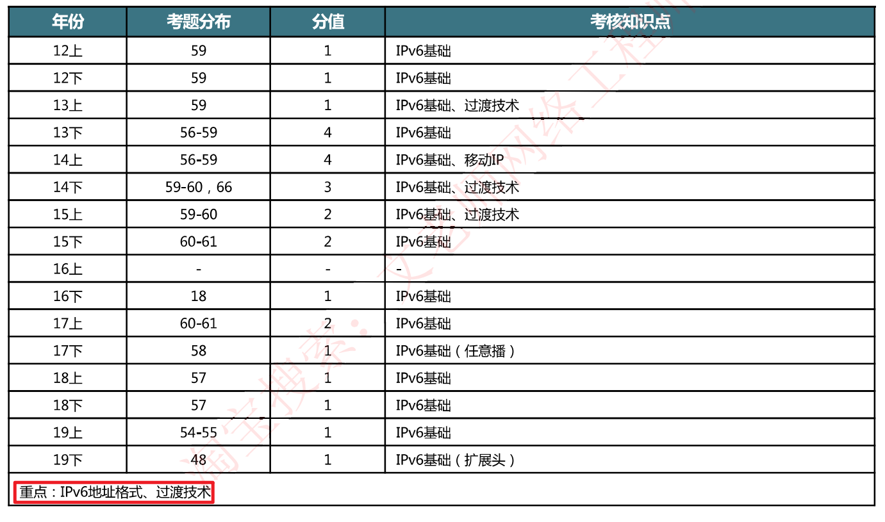

# 历年试题分布

**重点考察：IPv6地址格式、三种过渡技术**

# 7-1 IPv4问题与改进

网络地址短缺： IPv4为32位，只能提供43亿个地址    **IPv6 128位**

地址分配不合理：IPv4中1/3被美国占用，IBM等大型企业分配的地址比很多国家分配的都多

路由速度慢

- 随着网络规模扩大，路由表越来越庞大，路由处理速度越来越慢（早期路由器性能不足，存在此问题，现
- lPv4头部多达13个字段，**IPv6只有8个字段**

缺乏安全功能：IPv4没有加密、认证等机制    **IPv6集成IPSec**(IPSec技术详细见第8章 网络安全)

不支待新的业务模式：IPv4包头没有扩展字段       **IPv6支持多报头嵌套**

IPv4处理效率低下：IPv4要进行报文分段；IPv6只能由源发节点进行分段，中间路由器不能分段，目的是简化路由处理    关键技术是**MTU发现技术**，MTU发现技术用来发现整个链路上最小的MTU，源发节点的分段MTU必然小于该最小的MTU

最重要的三个改进：

- **增大地址长度**
- **增加安全特性**
- **支持多级嵌套**