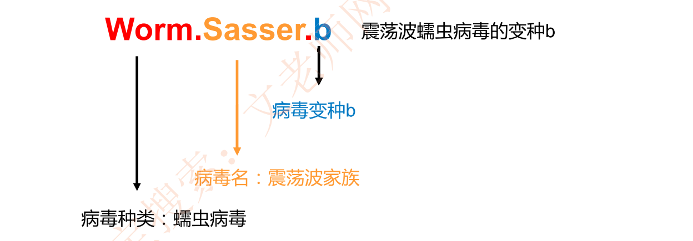
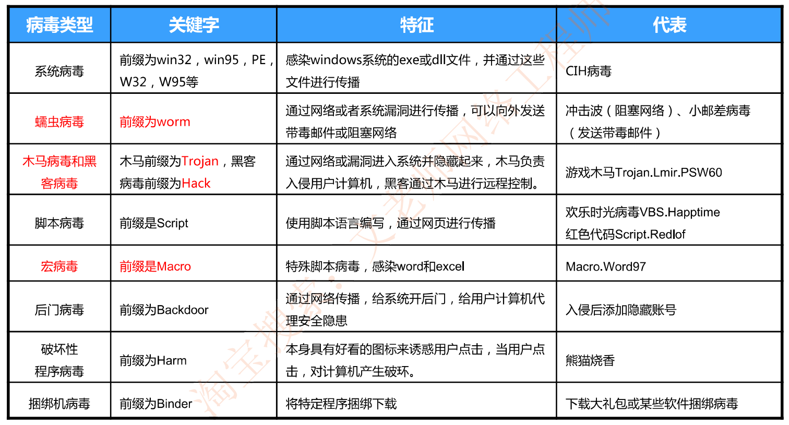
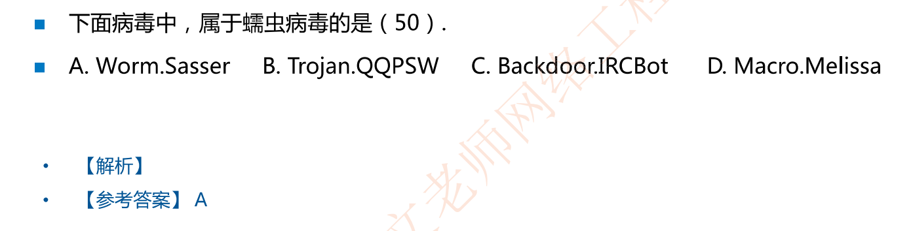
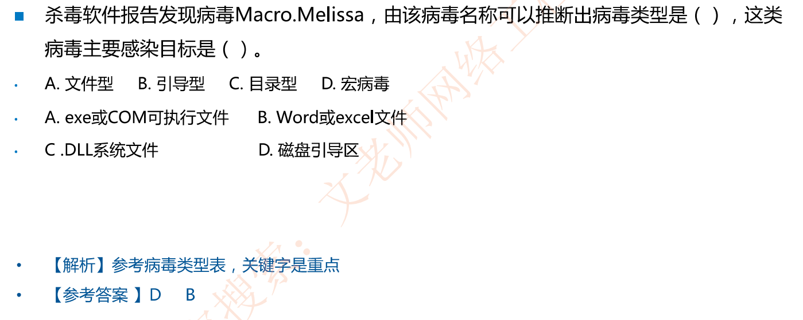

# 8-10 计算机病毒及其防护

## 计算机病毒简介

病毒：指一段可执行的程序代码，通过对其他程序进行修改，可以**感染**这些程序使其含有该病毒程序的一个拷贝。

病毒四个阶段：

- **潜伏阶段**：（震网病毒)

- **繁殖阶段**：（勒索病毒)

- **触发阶段**：（震网病毒)

- **执行阶段**：

## 病毒的分类与命名规则

病毒名称的一般格式：**<病毒前缀(种类)>.<病毒名(家族)>.<病毒后缀(变种名)>**

### 常见病毒类型(及其重要，尤其是标红)

### 例题

