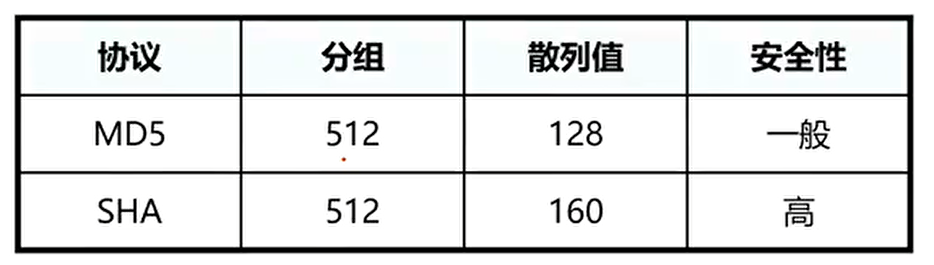
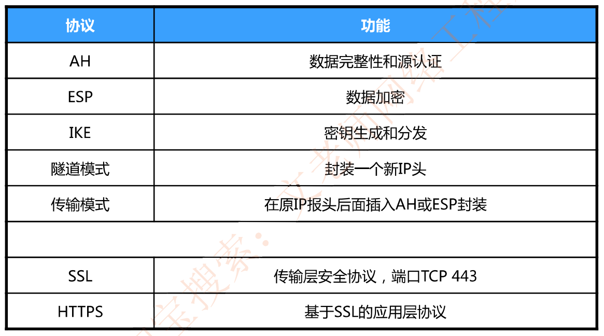

# 章节总结——重点梳理

- 网络攻击分类：主动(拒绝服务、重放等)攻击和被动(流量监听、流量分析等)攻击

- 加密技术：

  - 对称:DES、3DES、IDEA、AES、RC4

  - 非对称:RSA

- 数字签名原理

- 散列：验证数据完整性，防止非法篡改  MD5、SHA、HMAC

- 数字证书：CA用自己的私钥签名，**证明主体的公钥**，证书链
- 秘钥管理：PKI
- VPN：概念和实现原理，PPP，LCP和NCP，**PAP和CHAP**

- IPSec

  

- 病毒：蠕虫病毒-前缀为worm宏病毒-前缀为macro，感染excel或word

- IDS：收集信息并进行分析，发现违反安全策略的行为或攻击。IDS是被动监听设备，一般旁挂部署；IPS是主动安全设备，一般串行部署。IDS的数据分析技术和处理方式有以下几种

  - 异常检测∶既能对已知的攻击进行检测,也能检测未出现过的攻击，缺点是误报较多。

  - 误用检测︰对已知入侵行为检测准确率高，漏检率低，缺点是未知入侵检测准确率低。

    