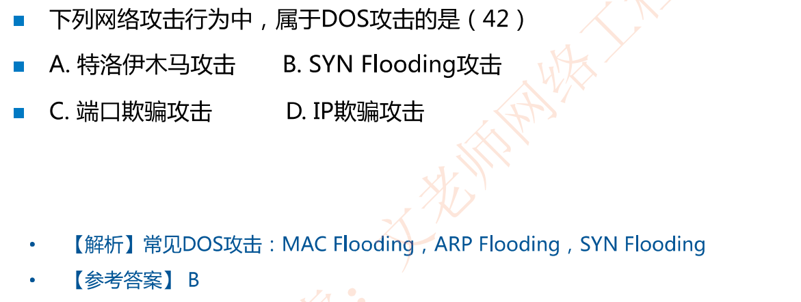
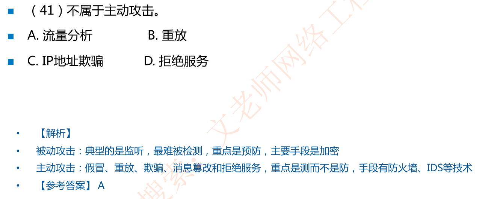

# 网络安全基础

## 网络安全威胁类型(给出例子要能判断是哪一类型)

**(1)窃听**:例如搭线窃听、安装通信监视器和读取网上的信息等。

**(2)假冒**:当一个实体假扮成另一个实体进行网络活动时就发生了假冒。

**(3)重放**:重复一份报文或报文的一部分，以便产生一个被授权效果。解决重放攻击需要使用时间序列模块，即加入时间戳

**(4)流量分析**:对网上信息流观察和分析推断出网上传输的有用信息。Telnet协议的数据包就是明文

**(5)数据完整性破坏**:有意或无意地修改或破坏信息系统，或者在非授权和不能监测的方式下对数据进行修改。

**(6)拒绝服务**:∶当一个授权实体不能获得应有的对网络资源的访问。如DDOS，SYN-Flooding泛洪攻击即A给B发送很多的SYN请求，但是并不完成三次握手，这样会占用B大量资源

**(7)资源的非授权使用**:即与所定义的安全策略不一致的使用。即越权

**(8)陷门和特洛伊木马**:通过替换系统合法程序，或者在合法程序里插入恶意代码，

**(9)病毒**:随着人们对计算机系统和网络依赖程度的增加，计算机病毒已经构成了对计算机系统和网络的严重威胁。如熊猫烧香、勒索病毒

**(10)诽谤**:利用计算机信息系统的广泛互连性和匿名性散布错误的消息，以达到坻毁某个对象的形象和知名度的目的。

## 网络安全漏洞

网络安全漏洞总结为4种类型

1. 物理安全性:没关门，机房楼上就是厕所，一般机房要选在中奖楼层

2. 软件安全漏洞:软件有恶意代码，留有后门等

3. 不兼容使用安全漏洞:我买的高通笔记本64位程序不兼容，退货

4. 选择合适的安全哲理:理想与现实，考虑性价比，够用就好。安全性与易用性成反比，需要综合考虑

## 网络攻击(重点考察)

**被动攻击**:典型的是**监听**，最难被检测，重点是**预防**，主要手段是**加密**

**主动攻击**:假冒、重放、欺骗、消息篡改和拒绝服务，重点是检测而不是防御，手段有防火墙、IDS等技术

​		要能够区分主动攻击和被动攻击

物理临近攻击:防止外人乱进机房

内部人员攻击:内鬼渗透，国共抗战，内部瓦解

分发攻击:软件开发出来未安装之前，被篡改(疫苗运输恒温不合格)

## 安全措施目标(了解)

访问控制

认证:身份认证、消息认证

完整性:确保接收到的信息与发送的信息一致审计:不可抵赖

保密:确保敏感信息不被泄露

### 基本安全技术

数据加密、数字签名、身份认证、防火墙、入侵检测、内容检查

## 例题

