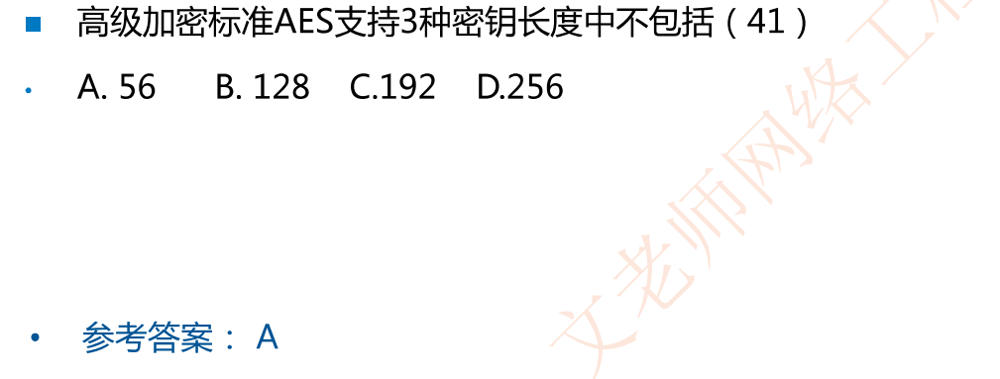
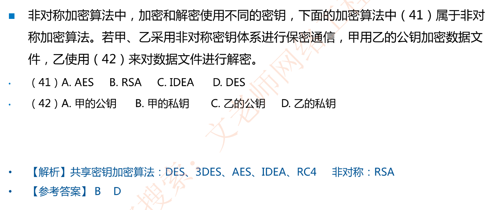
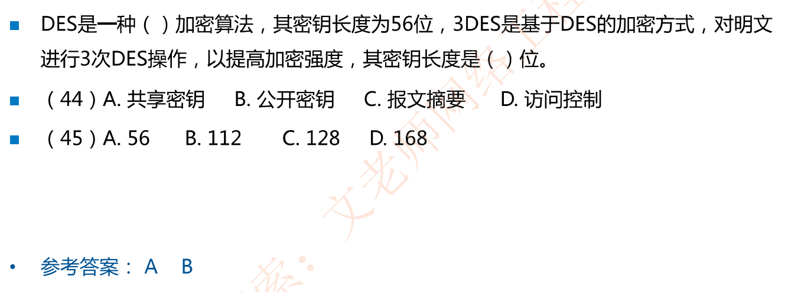

# 现代加密技术

## 分类

共享密钥加密算法/**对称加密算法**:(加密和解密密钥也一样

公钥加密算法/**非对称加密算法**:加密和解密密钥不一样

## 共享密钥加密算法/对称加密算法 

###  DES/3DES/IDEA   (记住加粗)

数据加密标准(DES)︰一种分组密码，在加密前，先对整个明文进行分组。**每一个分组为64位**，之后进行16轮迭代，产生一组**64位密文**数据,使用的**密钥是56位**。

3DES:使用两个密钥，累计执行三次DES算法，其中有两次使用的是同一个秘钥，**密钥长度是112位**。

国际数据加密算法(IDEA)**使用128位密钥**，把明文分成64位的块，进行8轮迭代。IDEA可以使用硬件或软件实现，比DES快。

### AES和RC4 (记住加粗)

高级加密标准(Advanced Encryption Standard，AES)

AES支持**128，192和256位**三种密钥长度，可通过硬件实现

流加密算法和RC4:加密速度快，可以达到DES 10倍，WiFi常用

## 公钥加密算法

每个实体有两个密钥:公钥公开，私钥自己保存

公钥加密，私钥解密，可实现保密通信

私钥加密，公钥解密，可实现数字签名

典型的公钥加密算法：RSA

## 例题

