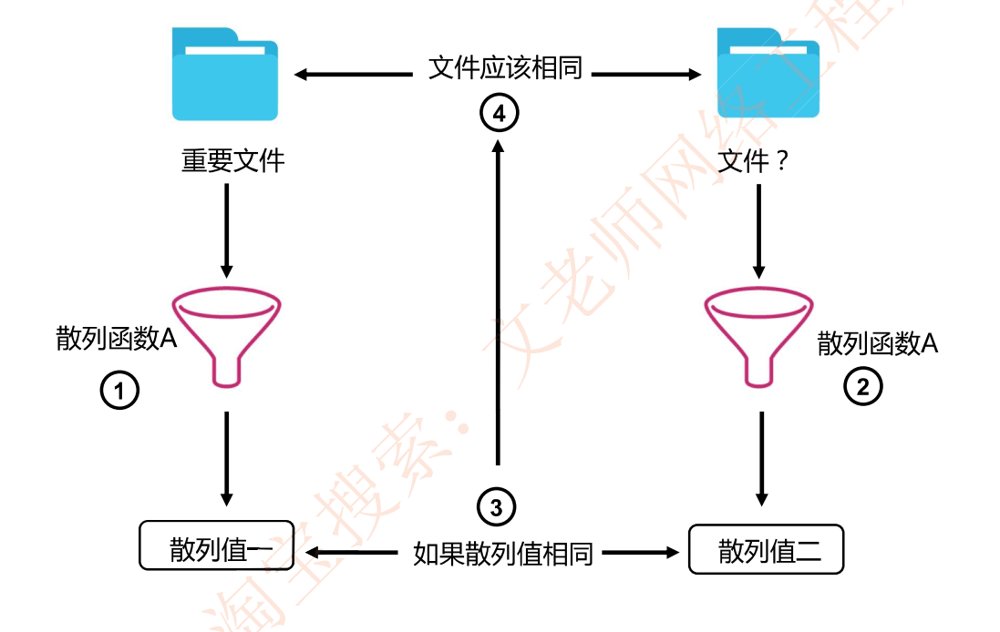
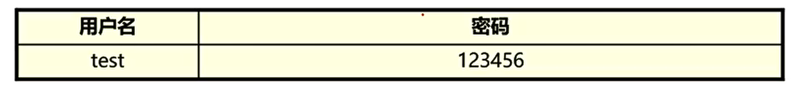
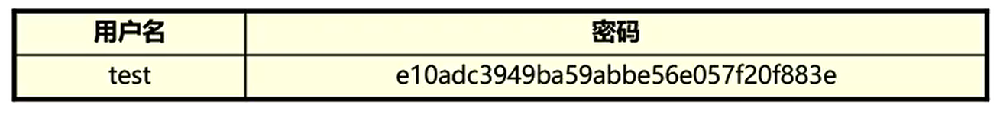
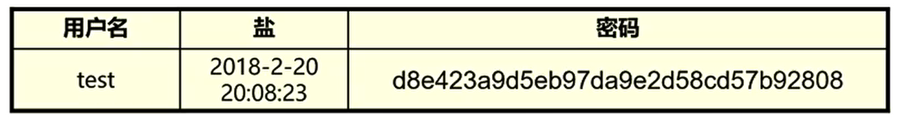
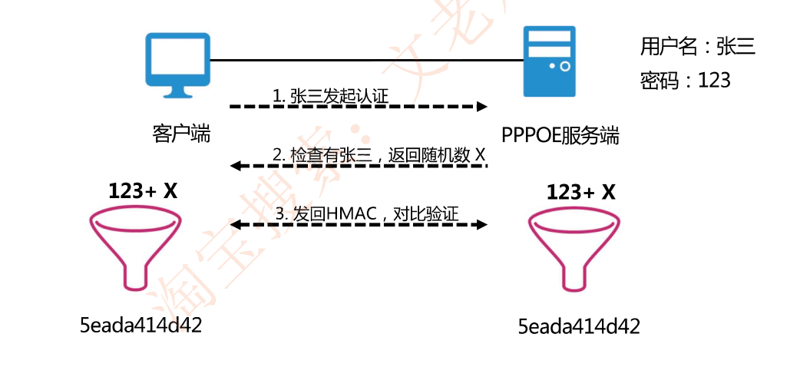
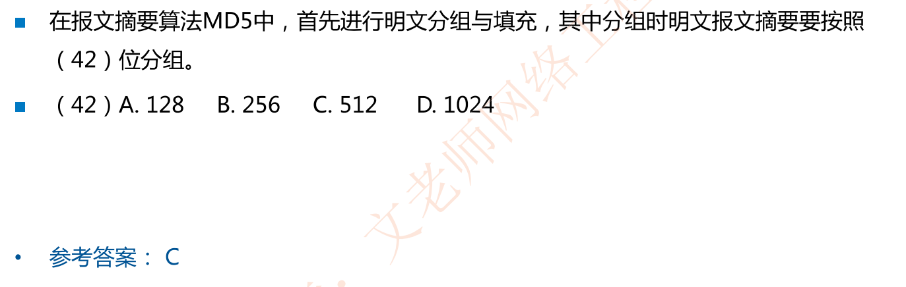
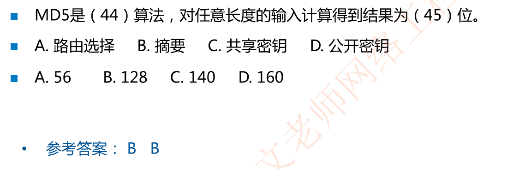
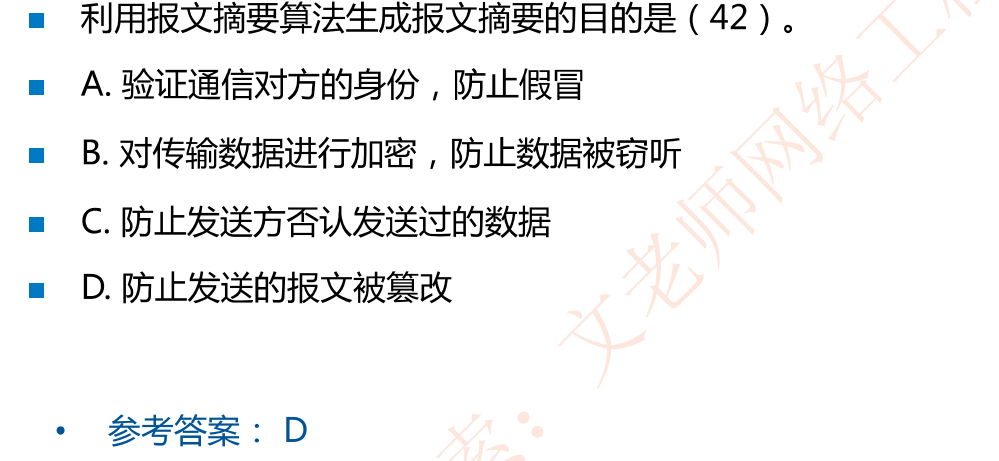

# 报文摘要 哈希 散列

## 哈希(散列函数)   MD5 SHA

将一段数据（任意长度)经过一道计算，转换为一段**定长**的数据

http://www.fileformat.info/tool/hash.htm

### 哈希的特性

**不可逆性(单向)**：几乎无法通过Hash结果推导出原文，即无法通过x的Hash推导出X

**无碰撞性**：几乎没有可能找到一个y，使得y的Hash值等于x的Hash值

**雪崩效应**：输入轻微变化，Hash输出值产生巨大变化

### 哈希适用场景

- 发布文件的完整性验证，如发布一个炒股软件加上MD5进行哈希验证

  

http://download.cs.ecitic.com MD5: 608756CEA9639AD5514E3E6014B623B1

- 服务器中保存用户的密码

  1. 明文存储，无安全防护

     

  2. 哈希存储(Rinbow Table Attack,可能遭遇彩虹表攻击即常用密码有其哈希值字典，可以用其获取弱密码)

     

  3. (盐+哈希)存储(彩虹表攻击失效)

     

     HMAC简介

     1. 增加一个key做哈希      HMAC = Hash (文件+key )

     2. 需要双方预先知道这个key

     3. HMAC:消除中间人攻击，源认证+完整性校验（数字签名也能实现)

     

     **这样做的好处是密码及密码的哈希值从来没有进行传输，从而避免中间人攻击**

- 数字签名

## 两种报文摘要算法  MD5和SHA

MD5:对任意长度报文进行运算，先把报文按**512位**分组，最后得到**128位**报文摘要。

SHA:也是对**512位**长的数据块进行复杂运行，最终产生**160位**散列值，比MD5更安全，计算比MD5慢。考试只考查SHA-1

## 例题

