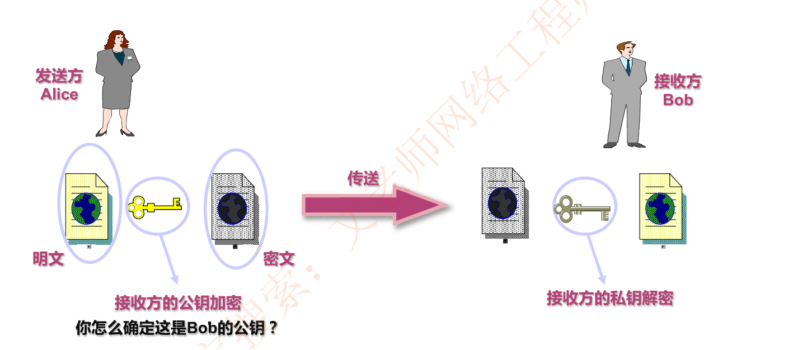
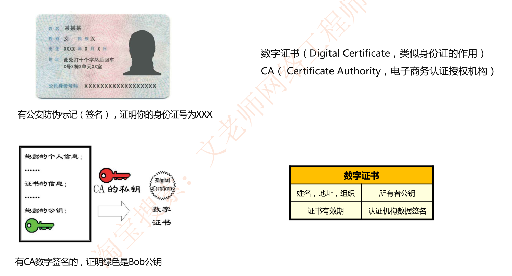
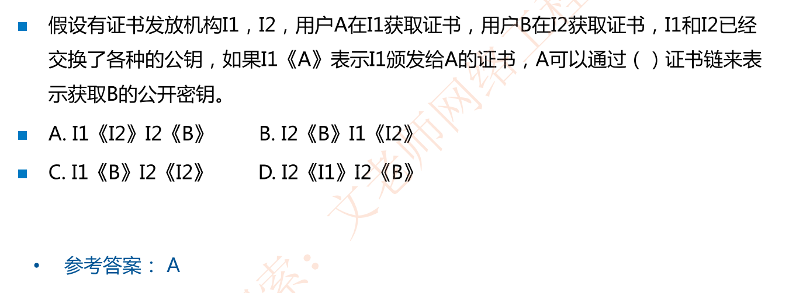
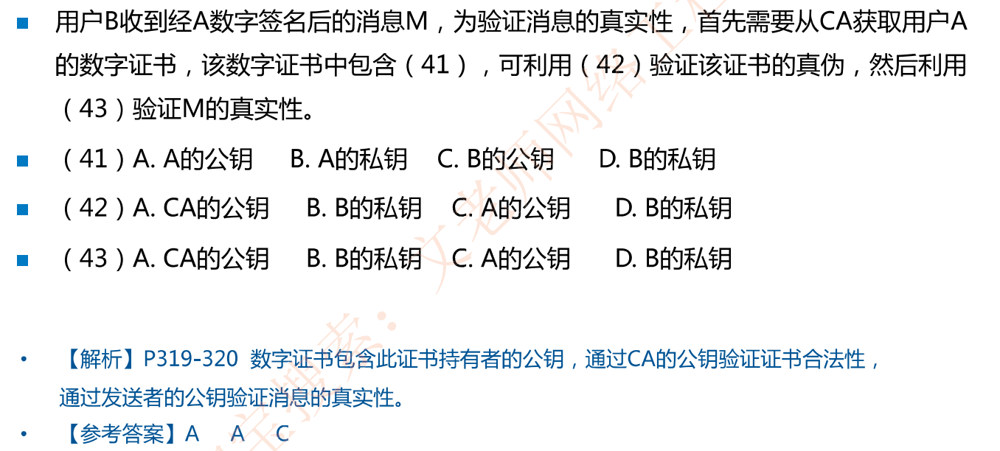
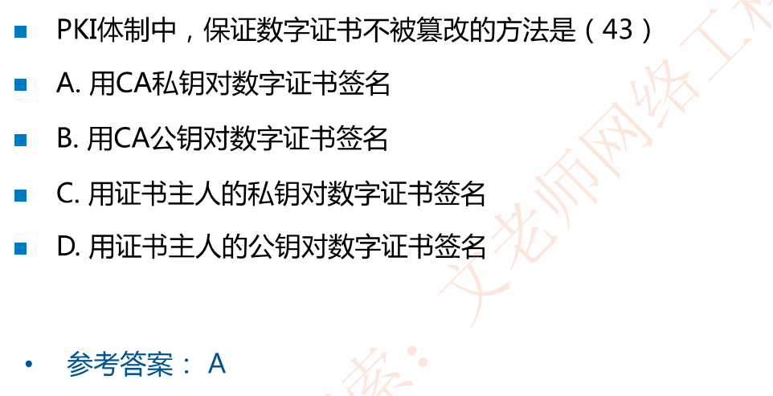

# 8-6 数字证书与CA(偶尔考)

## 数字证书与CA简介

数据通信中，使用数字证书证明某个人的公钥确实属于该人，**使用CA的私钥为所有者的公钥进行签名**

## 证书链及其表示

如果用户数量很多，通常由多个CA，每个CA为一部分用户发行和签署证书

如果有两个CA，X1和X2，假设用户A从CA机构X1获得了证书，用户B从X2获得证书

如果两个证书发放机构**X1和X2彼此间安全交换了公钥，彼此信任**，那么他们的证书可以形成证书链，则A和B就可以互相信任。

A通过一个证书链来获取B的公钥，证书链表示为:**X1《X2》X2《B》**

**解释：A欲拿到B的公钥——拿到B的证书——拿到X2私钥为B的签名证书X2《B》——欲验签此证书则需拿到X2的验签公钥(X2)——用X1私钥为X2的验签公钥(X2)签名X1《X2》——A使用自己手上的X1验签公钥验签[X1《X2》]得到X2的验签公钥(X2)——使用X2的验签公钥X2验签[X2《B》]得到B的公钥**

浏览器接收到服务器证书后，为了验证证书是不是合法的，首先需要拿到签发该证书的私钥对应的公钥，**这个公钥也是以证书的形式存在，俗称CA证书**，最顶级的CA证书也称为根证书（自签名证书），这些证书都是由浏览器内置在发行包， 或者内置在操作系统的发行包作为信任链的终点。

**通过上述解释过程可知：X1和X2彼此间安全交换了公钥，本质上需要彼此为对方CA的公钥进行签名，于是得到的证书链为：X1《X2》X2《B》其中X1《X2》表示X1为X2的公钥进行签名，X2《B》表示X2为B自己的公钥进行签名**

B也能通过相反的证书链来获取A的公开密钥:**X2《X1》 X1《A》**

## 例题

