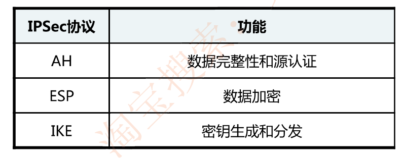
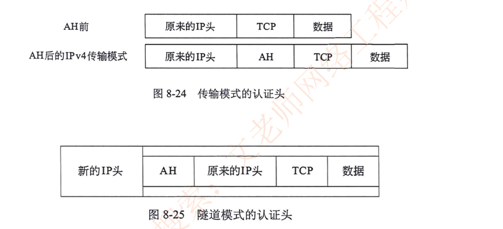
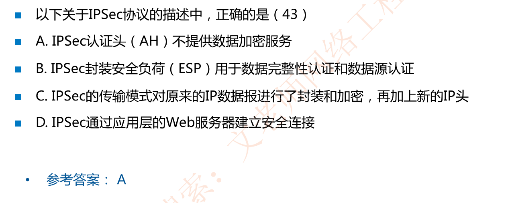

# IPSEC原理

## IPSEC

IPSec (IP Security)是**IETF定义的一组协议**，用于增强IP网络的安全性

IPSec协议集提供如下安全服务:

数据完整性(Data Integrity)

认证(Autentication)：认证算法灵活选择

保密性(Confidentiality)

应用透明安全性(Application-transparent Security)

## IPSec原理(背下)

lPSec功能分为三类:**认证头（(AH)、封装安全负荷(ESP)、 Internet密钥交换协议（IKE)**

认证头（AH)︰**提供数据完整性和数据源认证**，但不提供数据保密服务，使用的算法时哈希如MD5、SHA

封装安全负荷(ESP)︰**提供数据加密功能**，加密算法有DES、3DES、AES等

Internet密钥交换协议(IKE):用于**生成和分发**在ESP和AH中使用的密钥

## IPSec的两种封装模式(知道AH在哪里插即可)

### 例题

