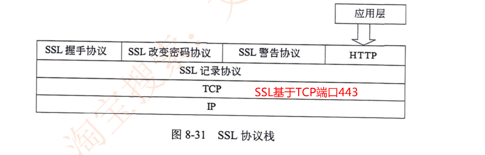
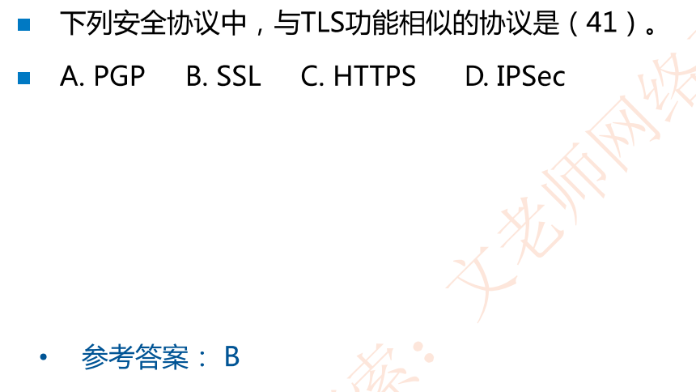
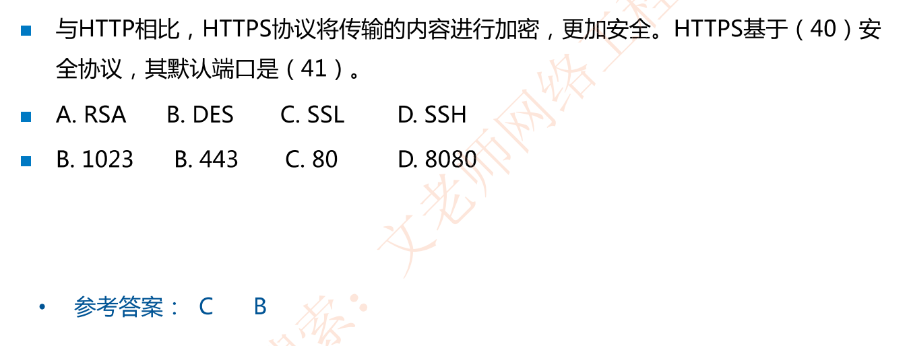
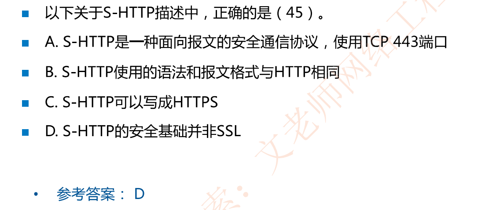
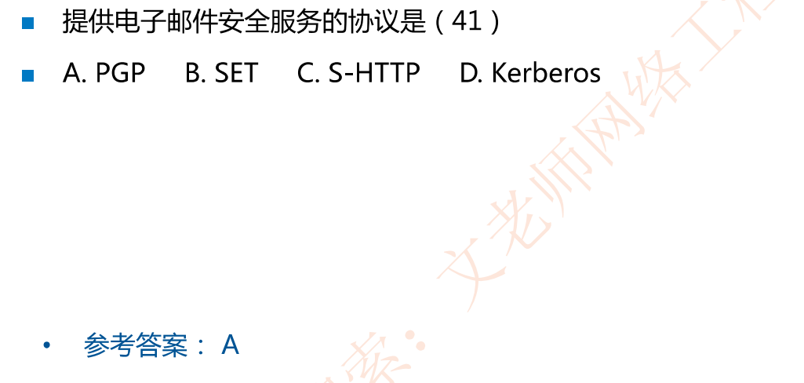
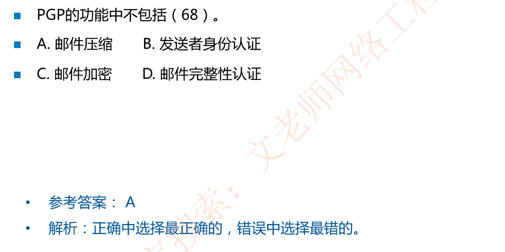
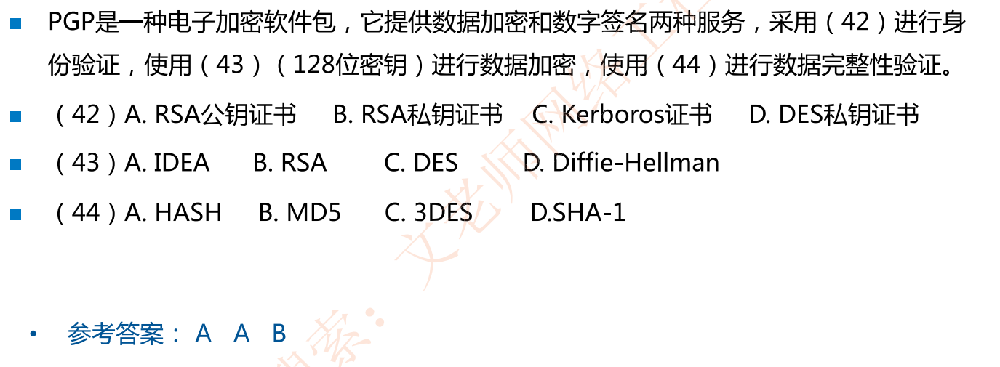
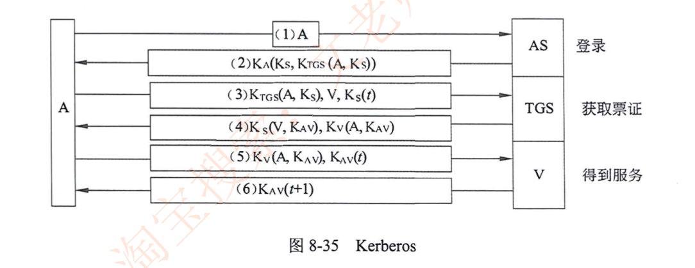
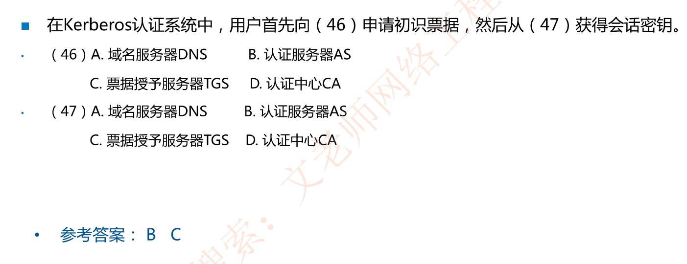

# SSL和HTTPS

## SSL安全套接层

安全套接层(Secure Socket Layer，SSL)是Netscape于1994年开发的**传输层(4层)安全协议**，面向用于实现Web安全通信。

1999年，IETF基于SSL3.0版本，制定了传输层安全标准TLS ( Transport LayerSecurity)

SSL/TLS在Web安全通信中被称为**HTTPS**。

记忆以下两个点↓

1. HTTPS基于TCP端口443

2. HTTP + SSL就成为了HTTPS

   

### 例题

## 应用层协议安全协议

### S-HTTP

对于一个不安全的HTTP，

打补丁的思路为HTTP头引入SSL，就成为了HTTPS；

重新开发的思路为HTTP重新开发协议，就成为S-HTTP

S-HTTP安全的超文本传输协议( Security HTTP)

S-HTTP**语法与HTTP一样，而报文头有所区别，进行了加密**

#### 例题

### PGP

PGP (Pretty Good Privacy)是一个完整的电子邮件安全软件包，PGP提供**数据加密和数字签名**两种服务。采用**RSA公钥证书**进行**身份验证**，使用**IDEA**进行**数据加密**，使用**MD5**进行数据**完整性验证**。

#### PGP应用广泛的原因

- 支持多平台(Windows，Linux，MacOS)上免费使用，得到许多厂商支持

- 基于比较安全的算法（(RSA，IDEA，MD5)

- 既可以加密文件和电子邮件，也可以用于个人通信，应用集成PGP

#### 例题

### S/MIME，SET和Kerberos认证

S/MIME ( Security/Multipurpose Internet Mail Extensions )提供电子邮件安全服务

SET ( Secure Electronic Transation )安全的电子交易，用于保障电子商务安全

Kerberos是用于进行身份认证的安全协议，支持AAA:**认证、授权和审计**。

#### 例题

