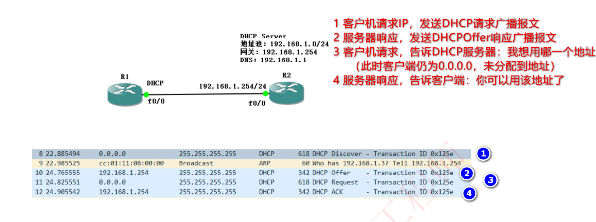
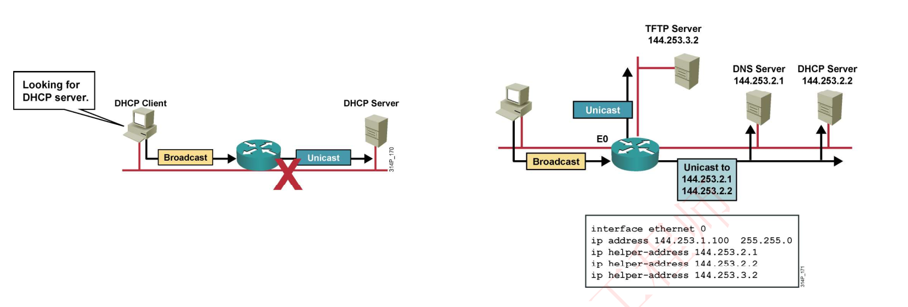
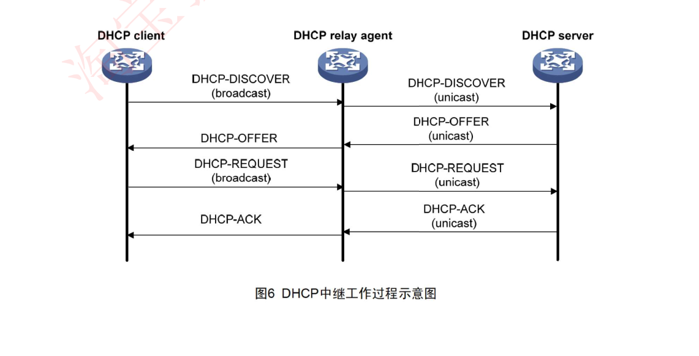
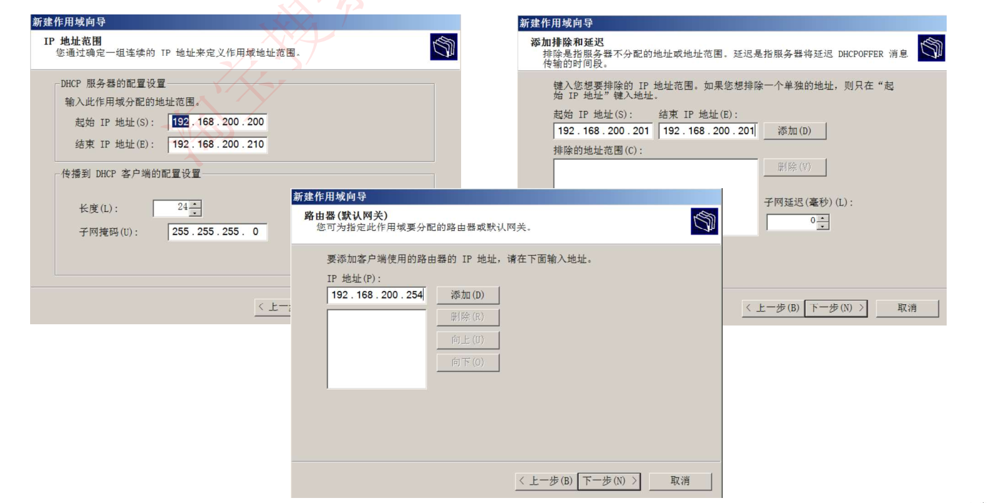
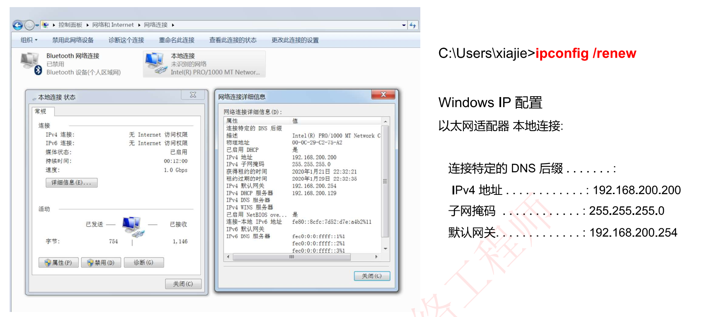
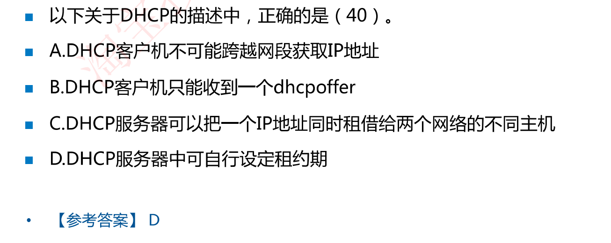
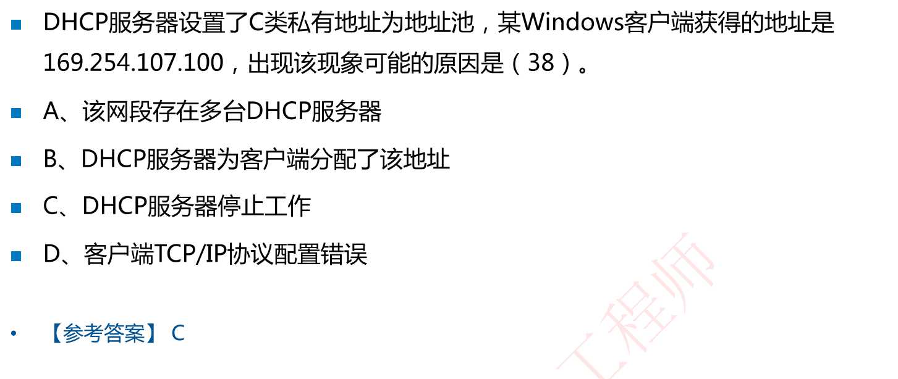
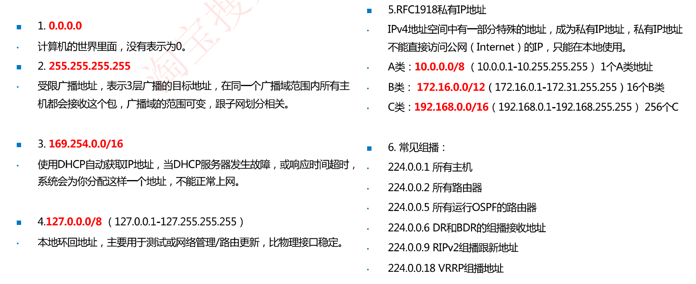

# 9-14 Windows Server 2008R2 DHCP服务器1（非常重要，3D1I）

## DHCP简介

DHCP (Dynamic Host Configuration Protocol，动态主机配置协议)：即动态配置IP地址

Linux系统DHCP服务配置文件为`/etc/dhhcpd.conf`

### DHCP租约过程

即DHCP客户机动态获取IP地址的过程，**这4个都是广播包**


抓包分析DHCP过程



## DHCP租期

DHCP租约默认8天，当租期超过一半时(4天），进行续约。

续约完后还是8天

不论何种原因，当我们客户端分配到IP为`169.254.0.0/16`，DHCP获取失败，该地址不能用于正常通信

## DHCP中继

DHCP报文是广播包，不能穿透三层（即网络层，路由器层），这时候客户端发送DHCP请求时，DHCP服务器无法收到。这是可以启用DHCP中继，在路由器接口上配置一个DHCPRelay（DHCPR）即DHCP中继（也叫做*DHCP中继*代理），能够把该广播包封装成单播，再转发给DHCP服务器



存在DHCP中继的DHCP工作流程



## DHCP服务器配置

1. 配置服务器静态IP地址
2. 关闭Vmware DHCP功能
3. 安装配置DHCP
4. 验证测试

### Windows Server DHCP配置

#### 新建DHCP地址池



#### 客户端DHCP



#### Windows下DHCP相关命令

- 通过DHCP获取IP地址的命令为：`ipconfig /renew`

- 释放DHCP获得的IP地址的命令为：`ipconfig /release`

### Linux的DHCP配置

使用`dhcpd.conf`的配置文件例子进行说明

```bash
subnet 192.168.0.0 netmask 255.255.255.0 { # 为某一个子网进行配置
range 192.168.0.200 192.168.0.254;  # 地址范围
ignore client-updates;  
default-lease-time 3600;
max-lease-time 7200;
option routers 192.168.0.1;  # 默认网关
option domain-name"test.org" ;  # 默认域名
option domain-name-servers 192.168.0.2; # 默认域名服务器
host test1 { hardware ethernet 00:E0:4C:70:33:65;fixed-address 192.168.0.8;} 
# 为某一个MAC地址的主机固定一个IP地址192.168.0.8
}
```

### 华为路由器DHCP配置

华为路由器/三层交换机DHCP配置

```bash
[dhcp]dhcp enable       //开启DHCP功能
[dhcp]ip pool vlan10    //为vlan10配置DHCP地址池
[dhcp-ip-pool-vlan10]network 192.168.10.0 mask 24
[dhcp-ip-pool-vlan10]gateway-list 192.168.10.254   //指定网关地址
[dhcp-ip-pool-vlan10]dns-list 8.8.8.8      //指定DNS地址
[dhcp-ip-pool-vlan10]q
[dhcplip pool vlan20//DHCP地址池vlan10
[dhcp-ip-pool-vlan20]network 192.168.20.0 mask 24
[dhcp-ip-pool-vlan20]gateway-list 192.168.20.254[dhcp-ip-pool-vlan20]dns-list 8.8.8.8
[dhcp-ip-pool-vlan20]q
```

## 例题



解析：A、DHCP中继可以跨网段；B、一个网段内有多个DHCP服务器时，就能收到多个DHCPOffer



## 举一反三：计算机网络中的6类特殊IP地址——记忆


