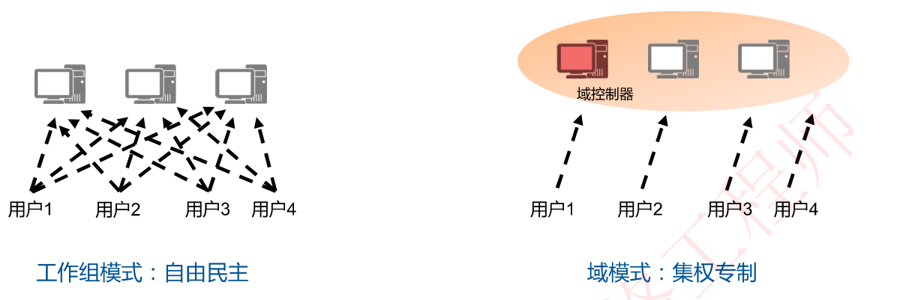
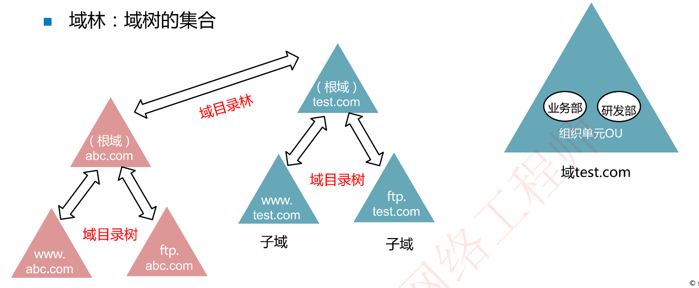
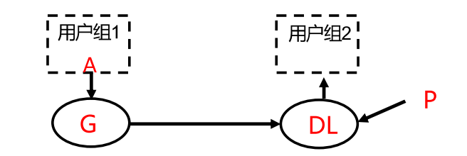
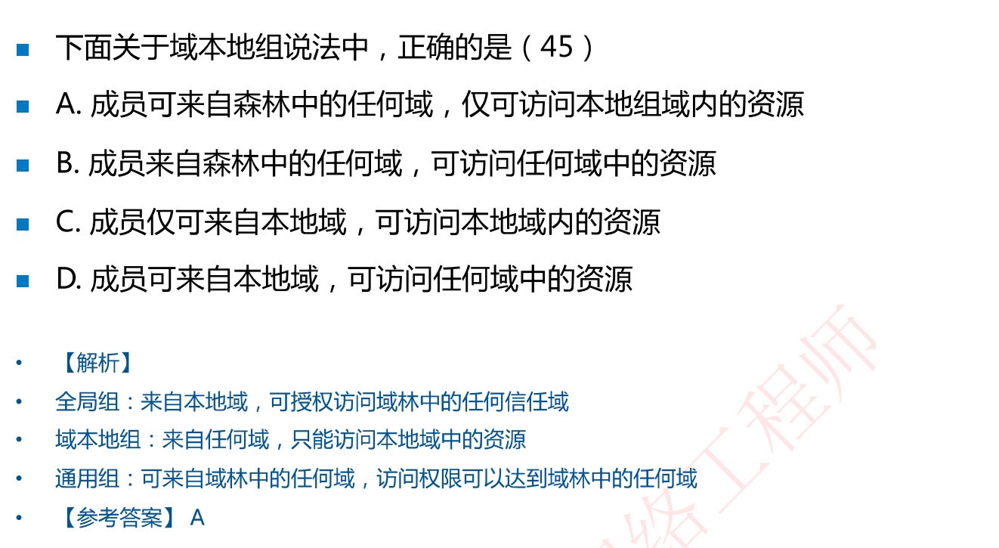
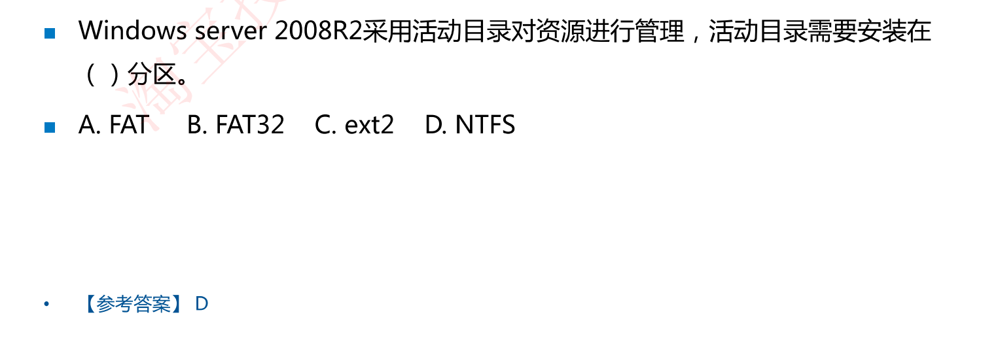
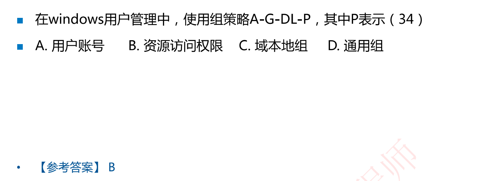

# 9-4 活动目录(重点，非常重要)

## 工作组模式和域模式

网络中计算机逻辑组织的两种模式︰工作组模式和域模式（活动目录AD )。

**工作组模式**：每台计算机都拥有自己的**本地安全账户管理数据库SAM(Security Account Manager)**，每天计算机保存其上所有用户的数据如账号密码信息

**域模式**：用户信息存储在域控制器，用户可以在域中漫游，访问域中任意一台服务器上的资源

>工作组模式：用户直接访问目标服务器开展认证等工作
>
>域模式：域控制服务器上存放所有用户名和密码，用户登录认证找域控制器即可

## 活动目录(Active Directory，AD)

活动目录：对域中的**账户和资源对象**进行存放并集中管理——笔者注：活动目录是一个文件系统，不是目录

活动目录是一个**动态的分布式文件系统**（分布式，一个域当中不止1台域控制器），包含了存储网络信息的目录结构和相关目录服务(高度依赖DNS服务)

域控制器(Domain Controller，DC)：域中安装了活动目录的计算机 

使用**dcpromo命令**用来把为一台服务器安装活动目录，即将这台服务器提升为域控制器

- **活动目录AD**存储的用户信息，分散在多个域**控制器DC**，操作系统对信息进行备份和选择性复制，维护信息一致性，提供容错能力

- 活动目录中，对象的名字采用**DNS域名结构**，所以**安装AD必须先安装DNS组件**，**活动目录高度依赖于DNS**

### 活动目录的安装

活动目录必须安装在**NTFS分区**，同时**必须安装DNS服务器**（而安装DNS服务又有一个限制，就是必须配置静态IP才可以安装DNS服务）。

- 命令安装∶开始→运行→dcpromo.exe命令，启动安装向导
- 图形化安装︰管理服务器→添加服务器角色

## 域的逻辑结构(了解)

组织单元OU：在域的内部来划分组织单元，组织单元是一组**管理对象**的容器，只能管理一个域中某些对象

域树：域的集合，多个域统一管理

域林：两棵或多棵域树的集合

## 活动目录工作组分类(重点考点)

活动目录中也有组的概念，分一下三个组，组的名字和能够访问的目的地相关

记住组的名字，记住来自什么地方，能够访问什么地方即可

**全局组(G)**：全局组的用户**来自本地域**，可授权访问域林中的**任何信任域**

**域本地组(DL)**：来自**任何域**，**只能访问本地域**中的资源

**通用组(U)**：可来自**域林中的任何域**，访问权限可以达到**域林中的任何域**

### 组策略（要记住）

#### A-G-DL-P策略：

用户组1中的用户A访问用户组2中的资源

第一步A-G：把用户组1中的账号A放入一个全局组，全局组能够访问任何信任域

第二步DL：在用户组2中创建一个域本地组（来自任何域，访问本地域），并且把G纳入本地域DL中

第三步：对DL组中的用户进行授权，使得DL组中所有用户都能访问本地域中的资源

这样就实现了用户组1中的用户A访问用户组2中的资源

比如1000个用户组1中的账户访问用户组2的内容，就不能直接赋用户权限

#### A-G-G-DL-P策略

无

前面策略理解即可，考试要考的记住：**A(Account)表示用户账号  G表示全局组 U表示通用组  DL表示域本地组 P表示资源权限**

https://blog.51cto.com/terryli/141686

#### 题目

