# SNMP(Simple Network Management Protocol)简单网络管理协议

## 网络管理协议五大标准

网络管理协议有很多中标准，TCP/IP的SNMP应用最多

- ISO制定：CMIS/CMIP公共管理信息服务规范

- 基于TCP/IP：简单网络管理协议**SNMPv1、SNMPv2、SNMPv3**

- 基于局域网的网络监控协议：远程监控网络**RMON : RMON-1和RMON-2**(下节)

- IEEE制定：基于物理层和数据链路层CMOL(不考，不用管)

- ITU-T：电信网络管理标准TMN，运营商使用，由国际电信联盟制定(一般不考)

## SNMPv1

### SNMPv1简介

- SNMP为**应用层协议**，通过**UDP**承载，客户端(即被监控端)端口161(SNMP协议可以理解为一个小程序，集成在网络设备的操作系统当中)

- 不可靠，但**效率高**，网络管理不会太多增加网络负载

- 每个代理进程(安装在被管理设备上的SNMP小程序)管理若干被管理对象，并且与某些管理站建立**团体(community)**(相当于管理过程中需要的密码)关系
  - 相当于简单的认证方式

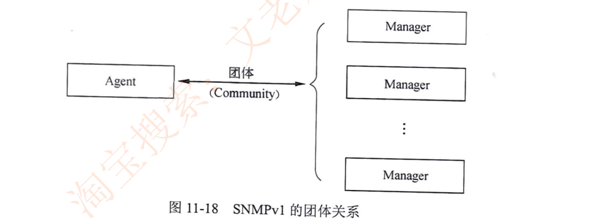

### SNMPv1协议的操作(极其重要，记住，要考)

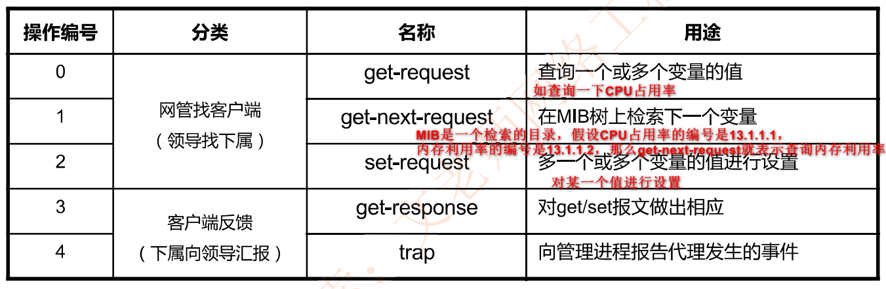

- 为了简化书写,前三个可以简写为:get、get-next和set。

- **SNMP双端口**：客户端用端口**161**来接收get/set，服务器端用端口**162**来接收trap

### SNMPv1的机制与问题

- SNMP网络管理中，管理站(即管理端)和代理站(即被管理端)之间可以是**一对多**关系，也可以是**多对一**关系

  意思是：一个网络设备可以由多个管理服务器管理，多个网络设备可以由一个管理服务器来管理

- RFC1157规定SNMP基本认知和控制机制，通过**团体名验证**实现

- SNMPv1团体名Community明文传输，不安全；v3改成了密文传输

## SNMPv2

SNMPv2增加定义了GetBulk和inform两个新协议操作

**GetBulk**：快速获取大块数据

**Inform**：允许一个NMS(网络管理服务器)向另一个NMS发送Trap信息/接收响应消息

则管理服务器和被管理端通信如下：

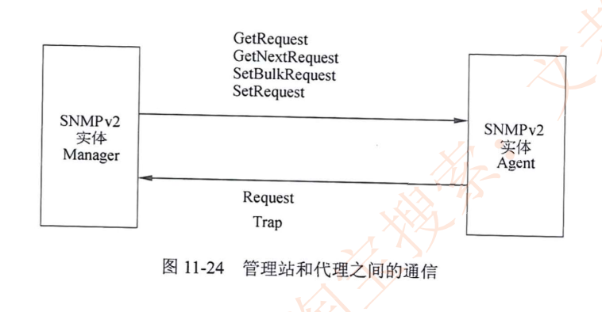

使用Inform报文进行管理服务器和管理服务器之间的通信

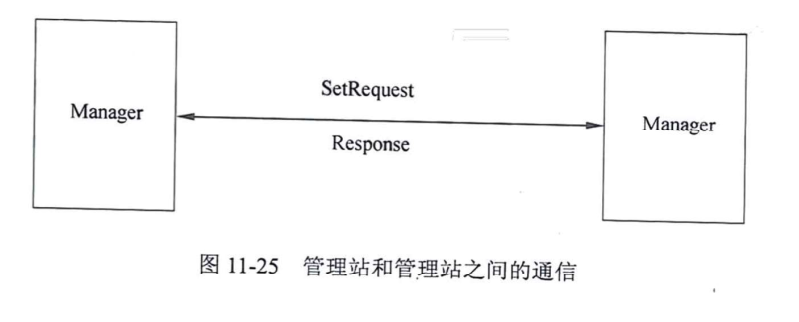

## SNMPv3

SNMPv3重新定义了**网络管理框架和安全机制**。

重新定义网络管理框架：将前两版中的管理站和代理统一叫做SNMP实体(entity)，就是换了以下名字

**安全机制:认证和加密传输**

- 时间序列模块，提供重放攻击防护，即增加时间戳[网络安全章节：防护重放攻击需为数据包增加时间戳]

- 认证模块：完整性和数据源认证，使用SHA或MD5

- 加密模块：防止内容泄露，使用DES算法

有两种威胁是SNMPv3没有防护的：**拒绝服务和通信分析**

## 例题

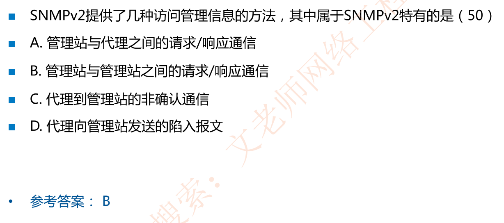

解析：D选项的陷入报文即trap，v1版本就已经有了

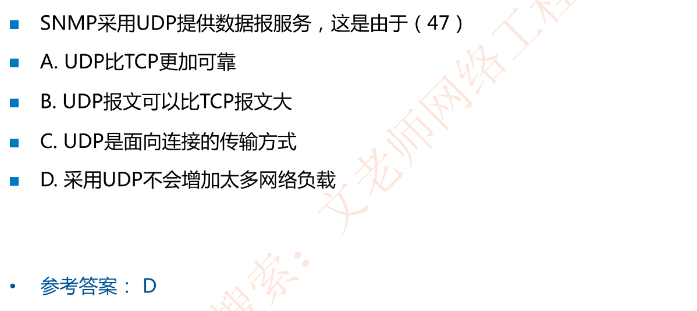

解析：TCP三次握手面向连接，UDP不是面向连接

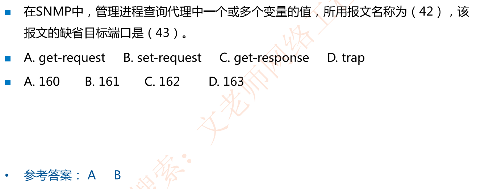

解析：get-request报文缺省的目标端口即指被管理的客户端的端口：161，客户端返回信息的目标端口是管理服务器的162端口

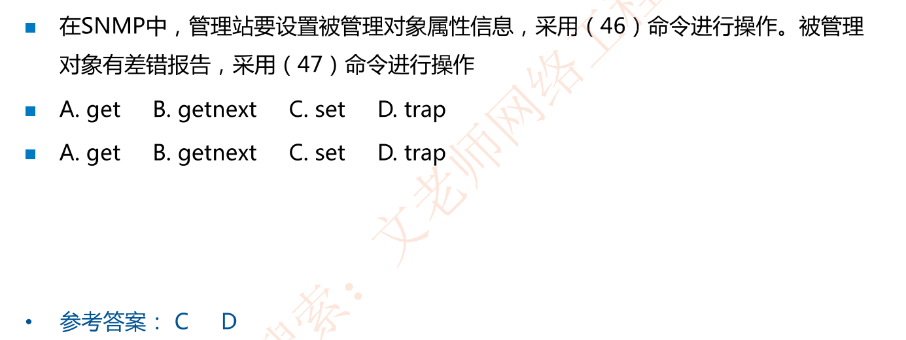

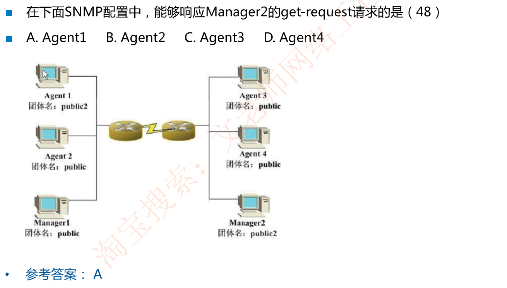

解析：团体名一样就可以。每个代理进程(安装在被管理设备上的SNMP小程序)管理若干被管理对象，并且与某些管理站建立**团体(community)**(相当于管理过程中需要的密码)关系，这是一种简单的认证关系

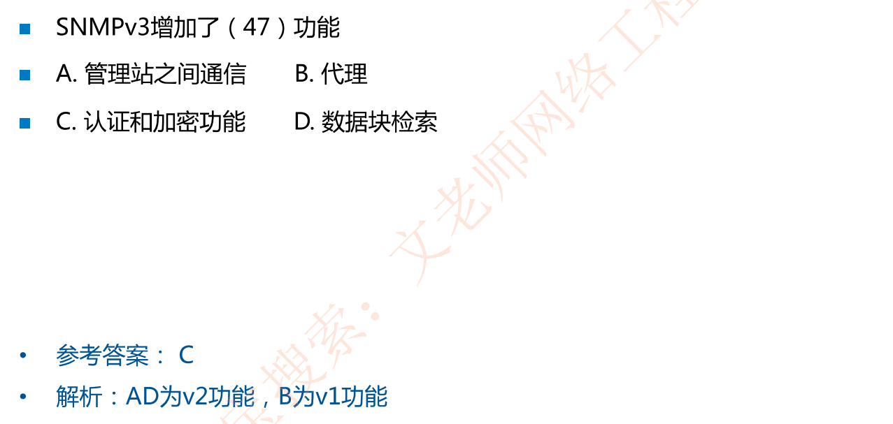

## 网络管理数据库 MIB-2

管理端查询客户端的信息，客户端的信息是树状结构，通过树的节点来确定查询的对象，这就是**被管理对象标识符OID**，OID的书写方式是以 . 分隔树的节点

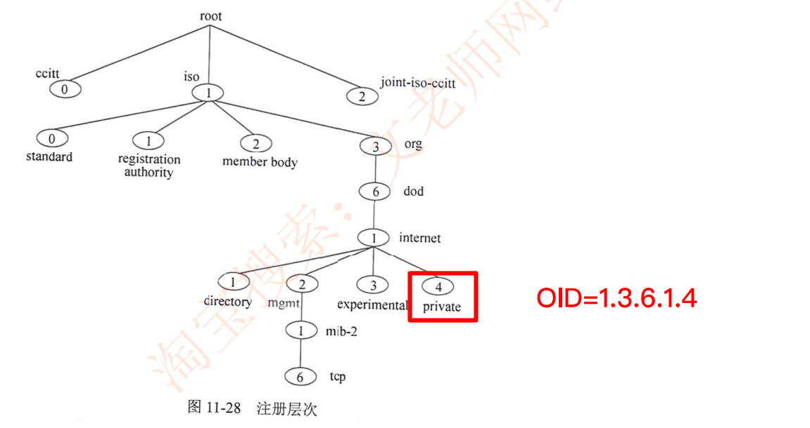

比如查询private值，就查1.3.6.1.4

### 例题

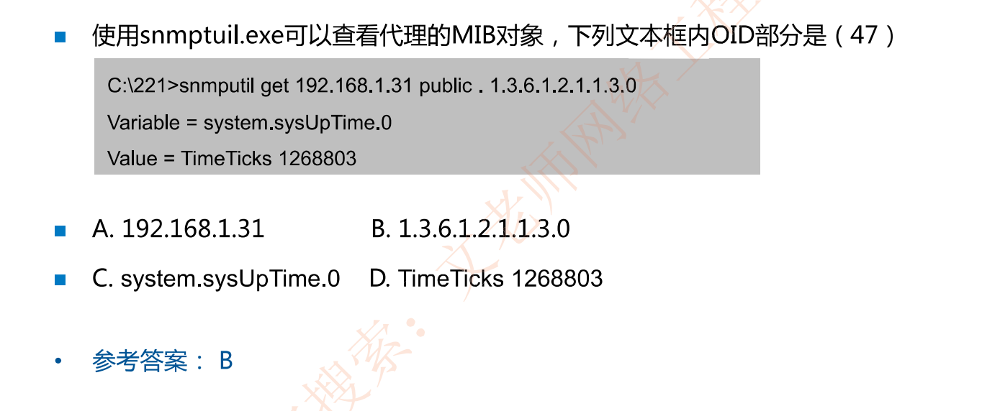