# 网络分析与设计

## 五阶段周期模型——瀑布模型，五阶段考的最多

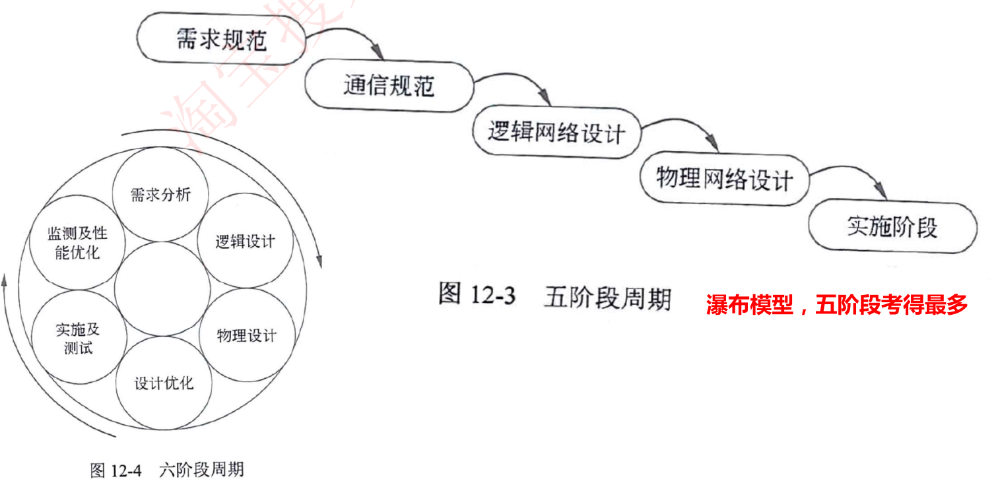

### 五阶段网络开发过程

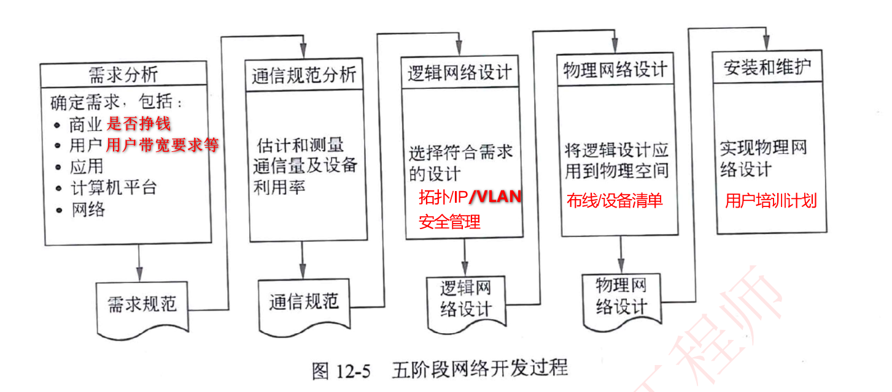

## 六阶段周期模型——圆形的循环往复模型

略

## 网络流量分析

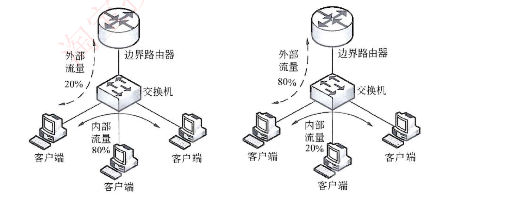

简单的网络流量分析↓

80/20原则：内部流量占到80%，外部流量占到20%，如上图1所示，说明网络中内部流量占比较大；

20/80原则：内部流量占到20%，外部流量占到80%，如上图2所示，说明网络中外部流量占比较大，目前此类网络居多。

## 例题

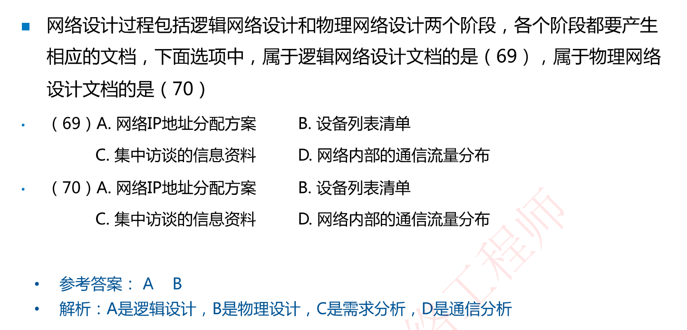

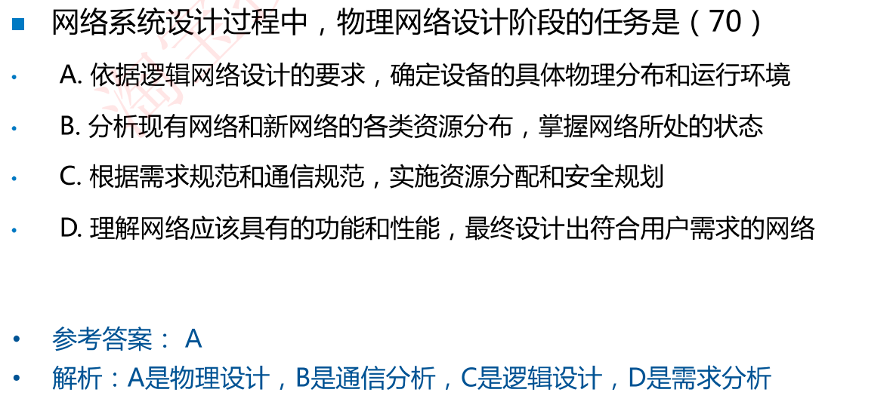

## 网络安全技术措施表(老三级等保要求)

注意各个项目的归类，数据库安全归到应用安全，漏洞发现和补丁管理归到系统安全

## 例题

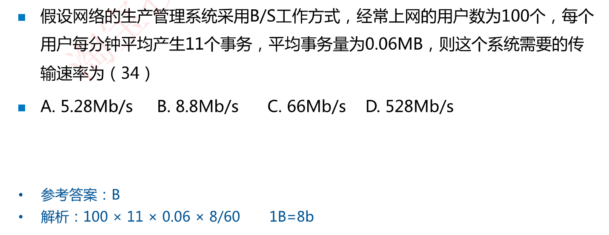

解析：注意B和b进制转换乘8

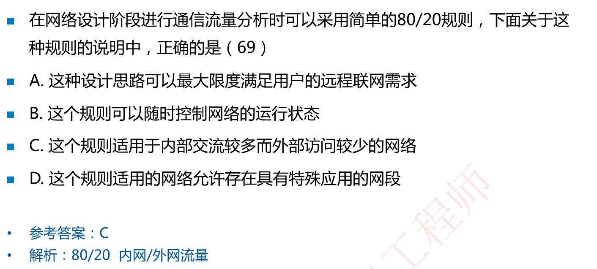

解析：80/20分别是内网/外网流量

## 技术评价

在进行网络技术选择时，考虑︰通信带宽、技术成熟性、连接服务类型、可扩展性、高投资产出比等因素

对于大型网络工程来说，**项目本身不能成为新技术的试验田**。尽量使用较成熟、拥有较多案例的技术。

## 例题

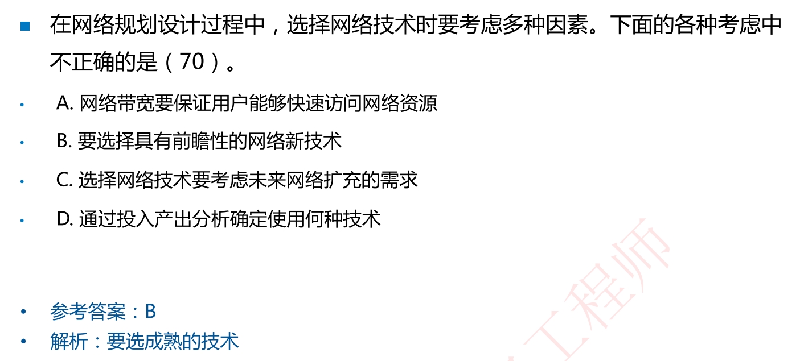

# 网络结构与功能

## 局域网结构类型

## 三层架构(各个层次功能)

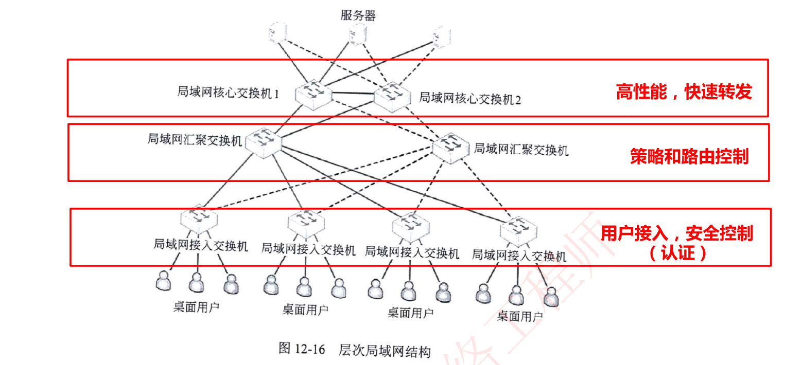

## 例题

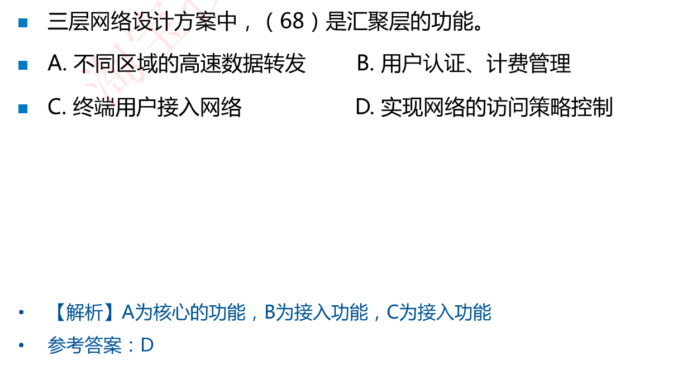

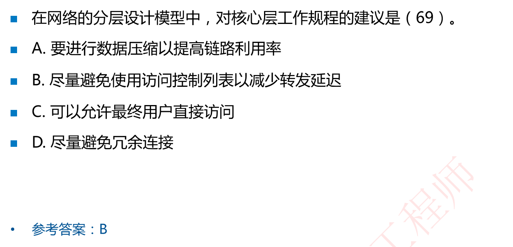