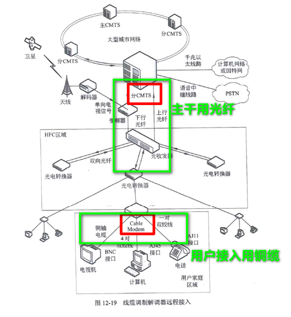
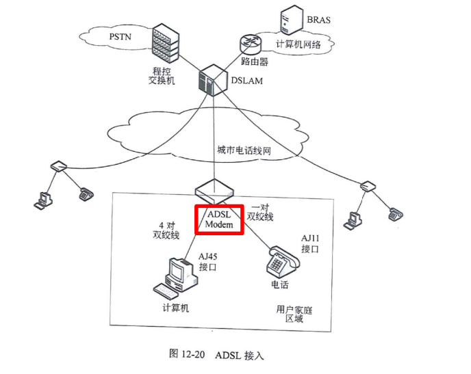
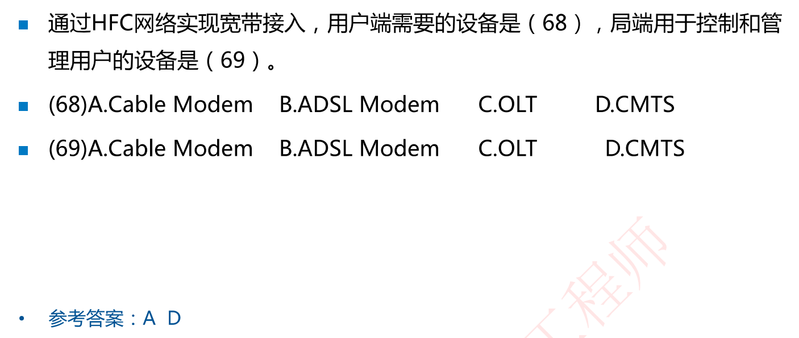
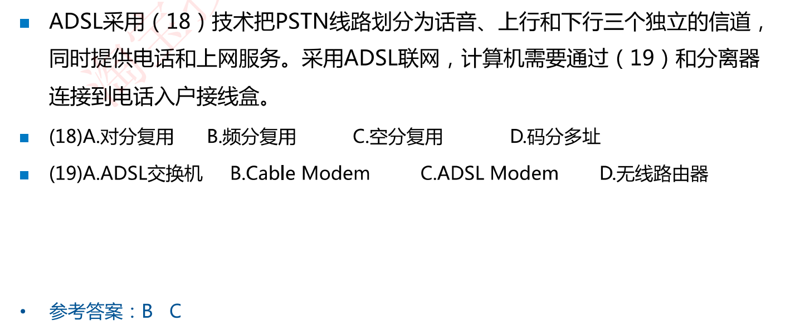
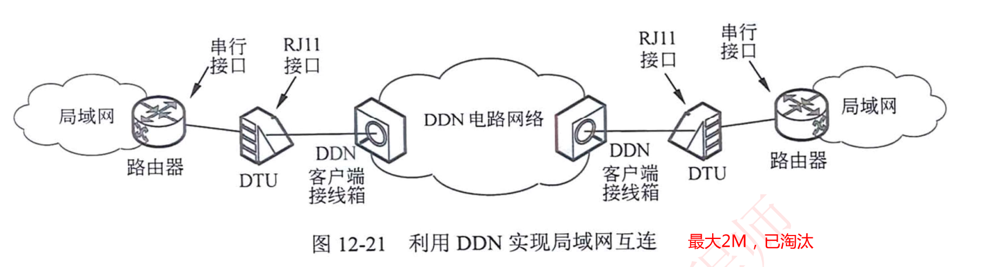
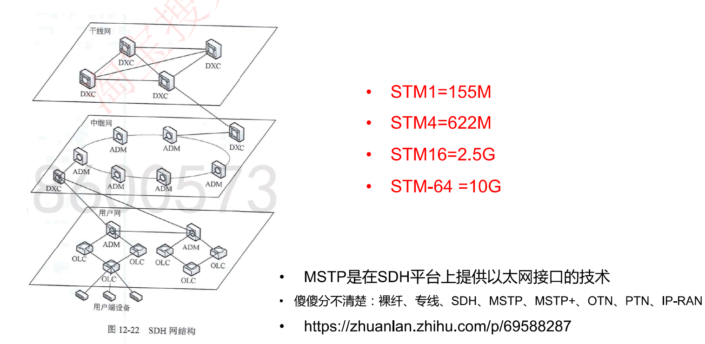

# 12-4 广域网接入技术

## 常见广域网接入技术

1. PSTN公用电话网络      56Kbps(已经淘汰)

2. ISDN：  BRI=2B+D=144K     PRI=30B+D=2.048M(已经淘汰)

3. 线缆调制解调器接入HFC   主干网络用光纤，用户接入用铜缆（常考)

   

4. 数字用户线路远程接入xDSL(常考)

## 例题

## 广域网互联技术DDN

两个局域网通过DDN电路网络实现互连，该技术已经淘汰

当前多使用：专线技术、VPN技术

## 广域网互联技术SDH

只需要记住 SDH提供四类接口，接口速率分别是多少即可

