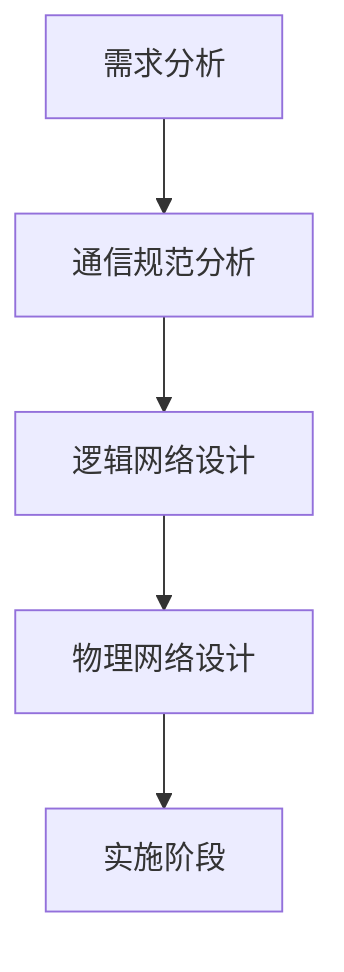
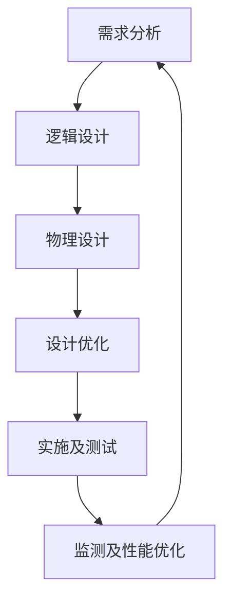

## 10-3 网络分析与设计

### 网络规划设计模型

#### 五阶段周期模型(瀑布模型)

#### 六阶段模型

### 重点掌握五阶段模型

- 需求分析是开发过程中：最关键的阶段，所有工程设计人员都清楚，如果在需求分析阶段没有明确需求，则会导致以后各阶段的工作严重受阻。
- 在形成需求说明书的同时，网络工程设计人员还必须与网络管理部门就需求的变化建立起需求变更机制，明确允许的变更范围。

### 网络设计的约束因素

- 在需求分析阶段，在确定用户需求的同时，也应对这些附加条件（约束因素）进行明确。
- 网络设计的约束因素主要来自于政策、预算、时间和应用目标等方面。
  - 政策约束：包括**法律、法规、行业规定、业务规范和技术规范**等。
  - 预算：决定网络设计的**关键因素**，预算不足，可以分多阶段实施。
  - 时间：对安排的计划与进度表的**时间进行分析**，对于存在疑问的地方及时与客户进行沟通。
  - 应用目标的检查和确认：在进行下一阶段的任务之前，需要确定是否了解了客户的应用目标和所关心的事项。通过应用目标检查，可以避免用户需求的缺失，检查形式包括设计小组内部的**自我检查和用户主管部门的确认检查**。【确认范围】

### 网络流量分析

### 例题

#### 例题1

#### 例题2

#### 例题3

#### 例题4

#### 例题5

#### 例题6

#### 例题7

### 技术评价

- 在进行网络技术选择时，考虑：**通信带宽、技术成熟性、连接服务类型、可扩展性、高投资产出比**等因素。
- 对于大型网络工程来说，项目本身不能成为新技术的试验田。尽量使用较成熟、拥有较多案例的技术。

### 例题

