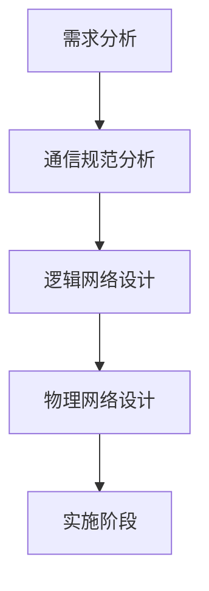
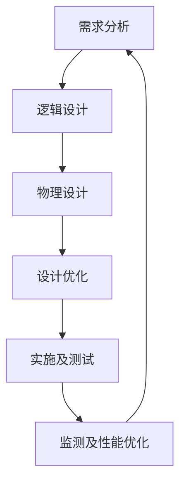

## 10-3 网络分析与设计

### 网络规划设计模型

#### 五阶段周期模型(瀑布模型)

#### 六阶段模型

主要添加了优化阶段，不断循环

- 设计优化：设计完成还要优化
- 监测及性能优化：实施完成还要监测优化

### 重点掌握五阶段模型

(考察要知道标记颜色的字段在那个阶段)

图中下方是各个阶段形成的成果

重点掌握五阶段模型下表

可能考察选择题的点：

- 需求分析是开发过程中：最关键的阶段，所有工程设计人员都清楚，如果在需求分析阶段没有明确需求，则会导致以后各阶段的工作严重受阻。
  - 需求分析一般包括以下内容(下图是网络规划师考点，可作了解)
  - 
- 在形成需求说明书的同时，网络工程设计人员还必须与网络管理部门就需求的变化建立起需求变更机制，明确允许的变更范围。
- 需求分析阶段明确项目**预算**；逻辑设计阶段对费用**初步估计**；物理设计阶段列出详细清单及**详细费用估算**
  - **需求分析：约束因素-预算是决定网络设计的关键因素，预算不足，可以分多阶段实施。**
  - **逻辑设计：对软/硬件费用、服务提供费用以及员工和培训费用的初步估计。**
  - **物理设计：软/硬件和安装费用的估算**
- 用户培训计划在物理设计阶段，其具体实施在实施阶段

#### 网络设计需求分析阶段的约束因素

在需求分析阶段，在确定用户需求的同时，也应对这些附加条件（约束因素）进行明确，下面是约束因素举例

网络设计的约束因素主要来自于政策、预算、时间和应用目标等方面：
- 政策约束：包括**法律、法规、行业规定、业务规范和技术规范**等，如等保2.0规范
- 预算：决定网络设计的**关键因素**，预算不足时可以分期分多阶段实施。
- 时间：对安排的计划与进度表的**时间进行分析**，对于存在疑问的地方及时与客户进行沟通，保证如期交付。
- 应用目标的检查和确认：在进行下一阶段的任务之前，需要确定是否了解了客户的应用目标和所关心的事项。通过应用目标检查，可以避免用户需求的缺失，检查形式包括设计小组内部的**自我检查和用户主管部门的确认检查**。【确认范围】

### 网络流量分析

初步的网络流量分析↓

早期内部网络访问互联网较少，遵循80/20原则；目前访问互联网流量已经很大，遵循20/80原则。

- 80/20原则：内部流量占到80%，外部流量占到20%，如上图1所示，说明网络中内部流量占比较大；

- 20/80原则：内部流量占到20%，外部流量占到80%，如上图2所示，说明网络中外部流量占比较大，目前此类网络居多。

#### 网络流量具体分析

如下图所示，园区网当中有2个VLAN，分别是VLAN10和VLAN20，通信流量有如下几种：

- VLAN10访问互联网：20M
- VLAN10访问文件服务器：10M
- VLAN20访问互联网：80M
- VLAN20访问文件服务器：20M
- VLAN10和VLAN20通信流量：30M

根据以上分析

- 可以设置出口流量至少为130M
- 文件服务器流量至少为30M
- 内部局域网至少30M

### 例题

#### 例题1

#### 例题2

#### 例题3

#### 例题4

解析：需求分析是最关键阶段，获取需求主要是跟客口**沟通**获取准确信息防止后期返工

#### 例题5

解析：需求不明确，很容易造成范围蔓延。

#### 例题6

#### 例题7

解析：

- 需求分析阶段主要包括网络功能需求分析、网络性能需求分析、网络应用需求分析等。
- 建网成本估算（III）主要是在物理网络设计阶段考虑的内容，根据所选设备、布线等情况来估算建设网络的成本。
- 通信规范设计（IV）文字描述有误，五阶段模型只有通信规范分析。

综上，在网络需求分析阶段的工作包括网络性能分析和网络流量分析，答案是D。

- **需求分析：约束因素-预算是决定网络设计的关键因素，预算不足，可以分多阶段实施。**
- **逻辑设计：对软/硬件费用、服务提供费用以及员工和培训费用的初步估计。**
- **物理设计：软/硬件和安装费用的估算**

### 技术评价

- 在进行网络技术选择时，考虑：**通信带宽、技术成熟性、连接服务类型、可扩展性、投入产出比**等因素。
- 对于大型网络工程来说，项目本身不能成为新技术的试验田。尽量使用较成熟、拥有较多案例的技术。

#### 例题

