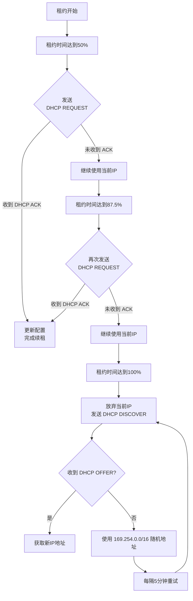

## 7-8 DHCP

动态主机配置协议DHCP（Dynamic Host Configuration Protocol）是一种网络管理协议，用于集中对用户IP地址进行动态管理和配置。

### DHCP工作原理

(记忆图片内容，尤其是这4个报文)

在华为设备上，一般DHCP客户端发送的是广播包，DHCP服务器回复的是单播包


为什么DHCP客户端收到Offer之后不直接使用该IP地址，还需要发送一个Request告知服务器端？

**因为网络中可能存在多个DHCP服务器，客户端可能收到多个Offer，需要使用DHCP Request报文来告知DHCP服务端**

#### DHCP Offer广播/单播？

注意图中有误，<font color="red">DHCP Offer可能是广播或单播报文，初次分配IP地址时，使用广播方式；续约或特定场景时，使用单播方式</font>，此时客户端还没有IP地址，怎么能回复单播报文呢

DHCP Offer报文的目的MAC地址和目的IP地址取决于客户端是否已经拥有一个有效的IP地址。以下是两种常见情况的分析：

**1. 客户端尚未分配IP地址（广播方式）**

在大多数情况下，客户端发送DHCP Discover时**还没有IP地址**，因此DHCP Offer报文会以广播形式发送。

- **目的MAC地址**：  广播地址`FF:FF:FF:FF:FF:FF`，表示该报文会被同一网络中的所有设备接收 。
  
- **目的IP地址**：  受限广播地址`255.255.255.255`，确保报文在同一子网内传播，而不会被路由器转发到其他网络 。

**2. 客户端已分配IP地址（单播方式）**

如果客户端在发送DHCP Discover时已经在报文中提供了自己的IP地址（例如在续约场景中），DHCP服务器可以选择以单播方式发送DHCP Offer。

- **目的MAC地址**：  客户端的MAC地址，即接收DHCP Offer报文的设备的硬件地址 。
  
- **目的IP地址**：  客户端的IP地址，这是DHCP服务器从DHCP Discover报文中获取的地址信息 。

总结：

- **广播方式**（常见于初次分配IP地址时）：  
  - 目的MAC地址：`FF:FF:FF:FF:FF:FF`  
  - 目的IP地址：`255.255.255.255`  

- **单播方式**（常见于续约或特定场景）：  
  - 目的MAC地址：客户端的MAC地址  
  - 目的IP地址：客户端的IP地址  

具体使用哪种方式取决于客户端的状态和DHCP服务器的实现 。

#### DHCP Request广播/单播？

DHCP Request报文的目的MAC地址和目的IP地址取决于具体的场景和客户端的状态。以下是两种常见情况的分析：

 **1. 客户端尚未分配IP地址（广播方式）**

在大多数情况下，客户端发送DHCP Request时可能**还没有有效的IP地址**，因此报文会以广播形式发送。

- **目的MAC地址**：  广播地址`FF:FF:FF:FF:FF:FF`，表示该报文会被同一网络中的所有设备接收 。
  
- **目的IP地址**：  受限广播地址`255.255.255.255`，确保报文在同一子网内传播，而不会被路由器转发到其他网络 。

**2. 客户端已分配IP地址（单播方式）**

如果客户端已经分配了IP地址（例如续约或确认已有地址），DHCP Request报文可以以单播方式发送。

- **目的MAC地址**：  DHCP服务器的MAC地址，即接收DHCP Request报文的目标设备的硬件地址 。
  
- **目的IP地址**：  DHCP服务器的IP地址，这是客户端从之前的DHCP交互中获取的服务器地址信息 。

总结：

- **广播方式**（常见于初次请求或确认分配时）：  
  - 目的MAC地址：`FF:FF:FF:FF:FF:FF`  
  - 目的IP地址：`255.255.255.255`  

- **单播方式**（常见于续约或特定场景）：  
  - 目的MAC地址：DHCP服务器的MAC地址  
  - 目的IP地址：DHCP服务器的IP地址  

具体使用哪种方式取决于客户端的状态和DHCP协议的具体实现 。

### DHCP租期更新


当客户机的租约期到<font color="red">50%</font>，会向DHCP服务器发送<font color="red">DHCP REQUEST</font>消息包。[一次续约]

如果客户机接收到该服务器回应的<font color="red">DHCP ACK</font>消息包，客户机就根据包中所提供的新的租期以及其它已经更新的TCP/IP参数，更新自己的配置，IP租用更新完成。

如果没有收到该服务器的回复，则客户机继续使用现有的IP地址，因为租期还剩50%。

如果在租期过去50%的时候没有更新，则客户机将在租期过去<font color="red">87.5%</font>的时候再次向为其提供IP的DHCP服务器联系。[二次续约]

如果还不成功，到租约的<font color="red">100%</font>时候，客户机必须放弃这个IP地址，发送<font color="red">DHCP DISCOVER</font>重新申请地址。

如果此时无DHCP可用，客户机会使用<font color="red">169.254.0.0/16</font>中随机的一个地址，并且每隔5分钟再进行尝试。[169.254.x.x这个IP地址可以进行局域网通信，但不能进行广域网通信如访问互联网]




#### DHCP报文格式


DHCP除了标准字段，还包含<font color="red">可选部分Option（可变，用户自定义)</font>

- Option 82：称为中继代理DHCP Relay信息选项。
- <font color="red">Option 43：用于为AP分配IP地址的同时，通告AC的地址。</font>相当于给AP分配一个地址，并且告诉该AP，我的AC地址是多少
  - FIT AP：瘦AP，必须接受AC管理和控制，没有AC自己无法干活，如企业用无线路由器
  - FAT AP：胖AP，不需要AC管理和控制，自己啥都能干如DHCP，如家用无线路由器


##### Option 43应用举例

在WLAN三层组网中，当AP上线时，需要获取AC的IP地址，并与AC之间<font color="red">建立CAPWAP隧道</font>。

CAPWAP报文封装在UDP协议中，使用UDP协议封装报文的优势在于，可以很好地穿透NAT

比如汉庭酒店总部位于上海，AC位于上海，全国酒店的AP都要接受AC管理，二者之间建立的就是CAP WAP隧道。

类似的协议还有vxlan协议，可以实现跨数据中心的虚拟机的迁移，可以通过vxlan构建大二层网络


AP的IP地址通过DHCP服务器分配，当AC的IP地址与AP不在同一个广播域，AP无法通过广播的方式获取AC的IP地址，则CAPWAP隧道无法建立成功。

AP通过DHCP报文中的<font color="red">Option 43选项字段获取AC的IP地址</font>，当AP获取AC的IP地址后，可以进一步完成CAP WAP隧道的建立，从而实现AP上线。


##### 华为DHCP Option43配置

DHCP常规配置，为AP分配IP地址。

```bash
[DHCP-HW] dhcp enable
[DHCP-HW] ip pool huawei
[DHCP-HW-ip-pool-huawei] network 192.168.100.0 mask 255.255.255.0
[DHCP-HW-ip-pool-huawei] gateway-list 192.168.100.1
[DHCP-HW-ip-pool-huawei] dns-list 114.114.114.14 8.8.8..8
```

配置Option43，使AP能够获得AC的IP地址，假设AC的IP地址是10.10.10.1。有如下三种命令配置方式：

- `dhcp server option 43 sub-option 1 hex c0a86401`：将AC的IP地址写成十六进制
- `dhcp server option 43 sub-option 2 ip-address 192.168.100.1`：直接写AC的IP地址
- `dhcp server option 43 sub-option 3 ascii 192.168.100.1`：将AC的IP地址写成ASCII码形式

一般地，就使用[DHCP-HW-ip-pool-huawei] <font color="red">option 43 sub-option 3 ascii 10.10.10.1</font>

##### 扩展：AP如何获取AC地址

第1步：首先<font color="red">AP获取IP地址</font>。（通过DHCP或者手动配置IP）

第2步：<font color="red">AP获取AC地址</font>。AP 获取AC 的IP 地址有多种方式，例如：**DNS解析、DHCP 的option 选项、配置静态IP地址、广播等**。

第3步：AP获取到AC的IP地址后，马上发出多个<font color="red">Discovery Request</font>报文，报文类型大致可以分为两种

- 广播的Discovery Request 报文
- 单播的Discovery Request 报文

Discovery Request报文信息中包括AP的型号，以及该AP的软硬件信息等。

第4步：AC回应<font color="red">Discovery Response</font>信息，包含AC型号、软硬件版本等信息。

第5步：当AP接收到AC发出的Discovery Response报文后，向AC发送<font color="red">Join Request</font>报文，请求加入。

###### AP发现AC的方式对比

| 发现方式                  | 适用场景                                | 典型缺点           |
| ------------------------- | --------------------------------------- | ------------------ |
| **静态配置**              | 小规模，固定网络                        | 维护复杂，手动配置 |
| **DHCP Option 43/60/138** | 大规模自动发现                          | 需要 DHCP 配置     |
| **DNS 解析**              | 适用于网络架构清晰、有 DNS 服务器的环境 | 依赖 DNS 解析      |
| L2 发现（广播/组播）      | AP 和 AC 在同一网段                     | 不支持跨网段       |
| **预配置 AC 地址**        | 预部署的厂商设备                        | 适用性有限         |

#### DHCP分配固定IP地址

实验要求：

- 采用基于全局地址池的方式为PC1分配IP地址。(常规配置，此处略去)
- 采用基于接口地址池的方式为PC2和PC3分配IP地址，且PC3获取固定的IP地址。


```bash
[R1] interface GigabitEthernet 0/0/1
[R1-GigabitEthernet0/0/1] ip address 192.168.2.1 24
[R1-GigabitEthernet0/0/1] DHCP select interface #选择接口地址池
[R1-GigabitEthernet0/0/1] DHCP server excluded-ip-address 192.168.2.254 #排除地址
[R1-GigabitEthernet0/0/1] DHCP server static-bind ip-address 192.168.2.2 mac-address 00e0-fc00-00aa # 为PC3分配固定的IP地址，可以用来为一些服务器分配固定IP地址
```

### DHCP中继(DHCP Relay)

随着网络规模的不断扩大，网络设备不断增多，企业内不同的用户可能分布在不同的网段，一台HCP服务器在正常情况下无法满足多个网段的地址分配需求。如果还需要通过DHCP服务器分配IP地址，则需要跨网段发送DHCP报文。

DHCP Relay即DHCP中继，它是为解决DHCP服务器和DHCP客户端不在同一个广播域而提出的，提供了对DHCP广播报文的中继转发功能，能够把DHCP客户端的广播报文“透明地”传送到其它广播域的DHCP服务器上，同样也能够把DHCP服务器端的应答报文“透明地”传送到其它广播域的DHCP客户端。


#### DHCP Relay工作原理

核心原理：当DHCP Discover广播报文经过DHC Relay交换机/路由器时，该交换机/路由器将该报文由广播转换为单播，并发给DHCP Server服务器

一般地，当终端和DHCP服务器不在同一网段时，都需要配置DHCP中继，使得DHCP广播报文能够跨网段传输


有中继场景时DHCP客户端首次接入网络的工作原理：

1. 发现阶段：DHCP中继接收到DHCP客户端广播发送的DHCP DISCOVER报文后，通过路由转发将DHCP报文单播发送到DHCP服务器或下一跳中继。
2. 提供阶段：
   1. DHCP服务器根据DHCP DISCOVER报文中的Giaddr字段选择地址池为客户端分配相关网络参数
   2. DHCP中继收到DHCP OFFER报文后，以单播或组播方式发送给DHCP Client。

3. 选择阶段：中继接收到来自客户端的DHCP REQUEST报文的处理过程同“发现阶段”
4. 确认阶段：中继接收到来自服务器的DHCP ACK报文的处理过程同“提供阶段”

#### DHCP Relay配置举例

配置要求：

- R1通过DHCP获取IP地址。
- <font color="red">R2的GE0/0/0接口开启DHCP Relay功能，并且指定DHCPSerVer的IP地址为10.1.1.2</font>
- R3创建地址池名字为"HW-1"，地址范围为192.168.10/24，网关为192.168.1.1。


R1配置如下：

```bash
[R1] interface GigabitEthernet0/0/0
[R1-GigabitEthernet0/0/0] ip address DHCP-alloc
[R1-GigabitEthernet0/0/0] quit
```

若存在单台DHCP服务器，R2配置如下：

```bash
[R2-GigabitEthernet0/0/0]dhcp select relay
[R2-GigabitEthernet0/0/0]dhcp relay server-ip 10.1.1.2   # 单台DHCP服务器，这是DHCP Relay关键配置
```

若存在多台DHCP服务器组成DHCP服务器组，R2配置如下

```bash
[R2]  dhcp server group HW     //配置DHCP服务器组
[R2-DHCP-server-group-HW]]dhcp-server 10.1.1.2    //第1台DHCP服务器
[R2-DHCP-server-group-HW]  dhcp-server 10.1.1.200    //第2台DHCP服务器
[R2-DHCP-server-group-HW] quit
[R2] interface GigabitEthernet 0/0/1
[R2-GigabitEthernet0/0/1] ip address 10.1.1.1 24
[R2-GigabitEthernet0/0/1] quit
[R2] interface GigabitEthernet 0/0/0
[R2-GigabitEthernet0/0/0] ip address 192.168.1.1 24
[R2-GigabitEthernet0/0/0] DHCP select relay  # DHCP Relay关键配置
[R2-GigabitEthernet0/0/0] DHCP relay server-select HW   # DHCP Relay关键配置
[R2-GigabitEthernet0/0/0]quit
```

### DHCP Snooping

DHCP Snooping防止私接DHCP服务器

[笔者注：比如在企业网络中私自接入家用路由器，该路由器开启DHCP功能，能够自动分配IP地址，那么当线网中DHCP请求广播到达该私接路由器时，该路由器也会响应请求并分配错误的IP地址，造成IP地址分配混乱，为防止这种现象，可以在交换机上配置DHCP Snooping]


在上图中，开启DHCP Snooping，可以将交换机直连DHCP Server的接口配置为Trust接口，只有从这个接口进入的DHCP Offer才能传回客户端，其他接口进入的DHCP Offer报文就丢弃不认

#### DHCP Snooping配置

使能DHCP Snooping功能

```bash
[Huawei] dhcp enable    #开启DHCP功能，所有接口默认为untrusted
[Huawei] dhcp snooping enable    #全局开启DHCP snooping功能
```

可信接口配置

```bash
[Huawei] int GigabitEthernet0/0/1
[Huawei-GigabitEthernet0/0/1] dhcp snooping enable   #接口下开启DHCP Snooping功能
[Huawei-GigabitEthernet0/0/1] dhcp snooping trusted   #把接口g0/0/1设置为信任接口，其他接口默认是untrust接口
```

注意：不仅要全局开启DHCP Snooping，涉及的接口下也需要开启DHCP Snooping

### 例题

#### 例题1


解析：

- 向DHCP服务器请求IP地址发送DHCP Discover报文
- 接受DHCP Offer时应当发送DHCP Request报文，没有答案

#### 例题2


解析：A。DHCP option 43来获得AC的IP地址

#### 例题3


解析：

- A。用于跨网段传输DHCP广播报文

- B。显然是私接路由器DHCP功能分配了错误地址，可以在接入交换机上配置DHCP Snooping，当选
- C。Mac地址绑定，在交换机上配置，将**[接口-VLAN-接口所连终端MAC地址]**绑定，使该接口只能学习这一个MAC地址，防止MAC地址泛洪攻击，将交换机的MAC地址表撑爆
- D。ARP静态绑定，在PC或网关(路由器、三层交换机)上配置，将**[IP地址-MAC地址]**绑定，防止ARP欺骗攻击或ARP泛洪攻击，影响设备的ARP表

#### 例题4


解析：送分题。DHCP客户端首先发送Dhcp discover报文请求IP地址，如果地址获取失败，客户端可能是用169.254.0.0/16的IP地址端。

#### 例题5


解析：DHCP Discover报文

- 源IP地址为`0.0.0.0`，源MAC地址为`本机MAC地址`；
- 目的IP地址为`255.255.255.255`，目的MAC地址为`FF:FF:FF:FF:FF:FF`

#### 例题6


解析：客户机会在租期过去**50%**时，客户端发起续约申请，如果没有收到服务回复，则**87.5%**时再次发起续约请求，如果还不成功，到租约100%时，客户机必须放弃这个IP地址，重新申请。如果此时无DHCP可用，客户机会使用169.254.0.0/16中随机的一个地址，并且每隔5分钟再进行尝试。

#### 例题7


#### 例题8


#### Z例题9


解析：

- 私接路由器导致DHCP分配错误地址，应当在交换机配置DHCP Snooping
- 为防止伪造MAC地址攻击网关(ARP欺骗攻击)，应当在网关上配置IP-MAC地址绑定功能，ARP Detection功能即DAI动态ARP检测，其在DHCP分配IP地址时，会记录分配的IP地址及关联的MAC地址，相当于动态的IP-MAC绑定
- “接入交换机配置限制每个端口只能学习1个终端设备的MAC地址”以及下面的命令补全部分是配置交换机的端口安全功能，6填`enable`，7填`1`，这样可以防止MAC地址泛洪即MAC Flood攻击，也可以在接入交换机上配置MAC地址绑定

#### Z例题10


解析：存在私接路由器/DHCP服务器，交换机上配置dhcp snooping功能，将连接DHCP Server的接口设置为trust，其他接口设置为untrust。

#### Z例题11


#### Z例题12


解析：

- 第2个包即DHCP服务器的DHCP Offer报文，<font color="red">可能是广播或单播报文，初次分配IP地址时，使用广播方式；续约或特定场景时，使用单播方式</font>

- 第1个包即主机DHCP Discover广播报文源目地址和端口是`0.0.0.0:68`->`255.255.255.255:67`，DHCP客户端使用UDP的68端口，DHCP服务器使用UDP的67端口
