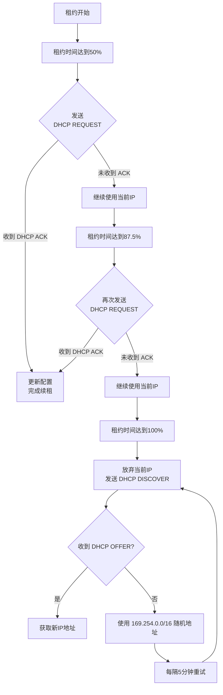

## 7-8 DHCP

### DHCP工作原理

(记忆图片内容)

在华为设备上，一般DHCP客户端发送的是广播包，DHCP服务器回复的是单播包


为什么DHCP客户端收到Offer之后不直接使用该IP地址，还需要发送一个Request告知服务器端？

**因为网络中可能存在多个DHCP服务器，客户端可能收到多个Offer，需要使用DHCP Request报文来告知DHCP服务端**

### DHCP租期更新


当客户机的租约期到<font color="red">50%</font>，会向DHCP服务器发送<font color="red">DHCP REQUEST</font>消息包。

如果客户机接收到该服务器回应的<font color="red">DHCP ACK</font>消息包，客户机就根据包中所提供的新的租期以及其它已经更新的TCP/IP参数，更新自己的配置，IP租用更新完成。

如果没有收到该服务器的回复，则客户机继续使用现有的IP地址，因为租期还剩50%。

如果在租期过去50%的时候没有更新，则客户机将在租期过去<font color="red">87.5%</font>的时候再次向为其提供IP的DHCP服务器联系。

如果还不成功，到租约的<font color="red">100%</font>时候，客户机必须放弃这个IP地址，发送<font color="red">DHCP DISCOVER</font>重新申请地址。

如果此时无DHCP可用，客户机会使用<font color="red">169.254.0.0/16</font>中随机的一个地址，并且每隔5分钟再进行尝试。




#### DHCP报文格式


DHCP除了标准字段，还包含可选部分Option（用户自定义)

- Option 82：称为中继代理DHCP Relay信息选项。
- Option 43：为AP分配IP地址的同时，通告AC的地址。

##### Option 43应用举例

在WLAN三层组网中，当AP上线时，需要获取AC的IP地址，并与AC之间建立CAPWAP隧道。

AP的IP地址通过DHCP服务器分配，当AC的IP地址与AP不在同一个广播域，AP无法通过广播的方式获取AC的IP地址，则CAPWAP隧道无法建立成功。

AP通过DHCP报文中的<font color="red">Option 43选项字段获取AC的IP地址</font>，当AP获取AC的IP地址后，可以进一步完成CAP WAP隧道的建立，从而实现AP上线。


##### 华为DHCP Option43配置

DHCP常规配置，为AP分配IP地址。

```bash
[DHCP-HW] dhcp enable
[DHCP-HW] ip pool huawei
[DHCP-HW-ip-pool-huawei] network 192.168.100.0 255.255.255.0
[DHCP-HW-ip-pool-huawei] gateway-list 192.168.100.1
```

配置Option43，使AP能够获得AC的IP地址，假设AC的IP地址是10.10.10.1。

`[DHCP-HW-ip-pool-huawei] option 43 sub-option 3 ascii 10.10.10.1`

以及下面三种命令方式：

- `dhcp server option 43 sub-option 1 hex c0a86401`
- `dhcp server option 43 sub-option 2 ip-address 192.168.100.1`
- `dhcp server option 43 sub-option 3 ascii 192.168.100.1`

#### DHCP分配固定IP地址

实验要求：

- 采用基于全局地址池的方式为PC1分配IP地址。
- 采用基于接口地址池的方式为PC2和PC3分配IP地址，且PC3获取固定的IP地址。


```bash
[R1] interface GigabitEthernet 0/0/1
[R1-GigabitEthernet0/0/1] ip address 192.168.2.1 24
[R1-GigabitEthernet0/0/1] DHCP select interface //选择接口地址池
[R1-GigabitEthernet0/0/1] DHCP server excluded-ip-address 192.168.2.254
[R1-GigabitEthernet0/0/1] DHCP server static-bind ip-address 192.168.2.2 mac-address 00e0-fc00-00aa # 为PC3分配固定的IP地址
```

### DHCP中继(DHCP Relay)

随着网络规模的不断扩大，网络设备不断增多，企业内不同的用户可能分布在不同的网段，一台HCP服务器在正常情况下无法满足多个网段的地址分配需求。如果还需要通过DHCP服务器分配IP地址，则需要跨网段发送DHCP报文。

DHCP Relay即DHCP中继，它是为解决DHCP服务器和DHCP客户端不在同一个广播域而提出的，提供了对DHCP广播报文的中继转发功能，能够把DHCP客户端的广播报文“透明地”传送到其它广播域的DHCP服务器上，同样也能够把DHCP服务器端的应答报文“透明地”传送到其它广播域的DHCP客户端。


#### DHCP Relay工作原理


有中继场景时DHCP客户端首次接入网络的工作原理：

1. 发现阶段：DHCP中继接收到DHCP客户端广播发送的DHCPDISCOVER报文后，通过路由转发将DHCP报文单播发送到DHCP服务器或下一跳中继。
2. 提供阶段：DHCP服务器根据DHCPDISCOVER报文中的Giaddr字段选择地址池为客户端分配相关网络参数DHCP中继收到DHCPOFFER报文后，以单播或组播方式发送给DHCP Client。
3. 选择阶段：中继接收到来自客户端的DHCPREQUEST报文的处理过程同“发现阶段确认阶段：中继接收到来自服务器的DHCPACK报文的处理过程同“提供阶段”

#### DHCP Relay配置举例

配置要求：

- R1通过DHCP获取IP地址。
- R2的GEO/O/0接口开启DHCPRelay功能，并且指定DHCPSerVer的IP地址为10.1.1.2。
- R3创建地址池名字为"HW-1"，地址范围为192.168.10/24，网关为192.168.1.1。


R1、R2配置如下：

```bash
[R1] interface GigabitEthernet0/0/0
[R1-GigabitEthernetO/O/O] ip address DHCP-alloc
[R1-GigabitEthernet0/0/0] quit
[R2] DHCP server group HW
[R2-DHCP-server-group-HW] DHCP-server 10.1.1.2
[R2-DHCP-server-group-HW] quit
[R2] interface GigabitEthernet 0/0/1
[R2-GigabitEthernet0/0/1] ip address 10.1.1.1 24
[R2-GigabitEthernet0/0/1] quit
[R2] interface GigabitEthernet 0/0/0
[R2-GigabitEthernet0/0/0] ip address 192.168.1.1 24
[R2-GigabitEthernetO/0/0] DHCP select relay
[R2-GigabitEthernetO/O/O]DHCPrelayserver-selectHW
[R2-GigabitEthernet0/0/0]quit
```

### DHCP Snooping

DHCP Snooping防止私接DHCP服务器


#### DHCP Snooping配置

```bash
[Huawei] dhcp enable    //开启DHCP功能，所有接口默认为untrusted
[Huawei] dhcp snooping enable    //开启DHCP snooping功能
```


```bash
[Huawei] int GigabitEthernet0/0/1
[Huawei-GigabitEthernet0/0/1] dhcp snooping enable    //接口下开启DHCPSnooping功能
[Huawei-GigabitEthernet0/0/1] dhcp snooping trusted   //把接口g0/0/1设置为信任接口
```

### 例题

#### 例题1


#### 例题2


#### 例题3


#### 例题4


#### 例题5


#### 例题6


#### 例题7


#### 例题8


