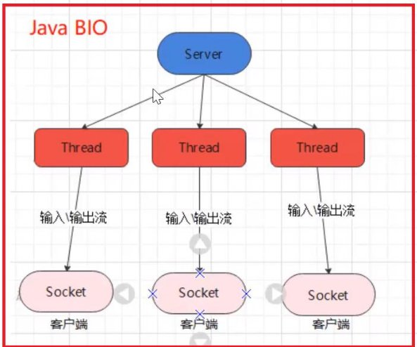
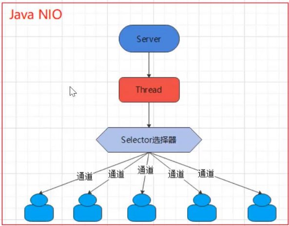
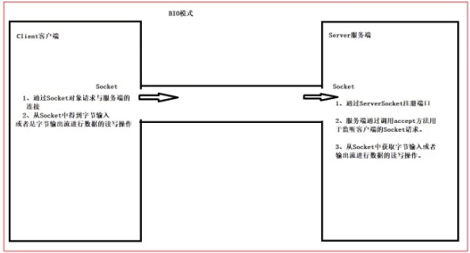
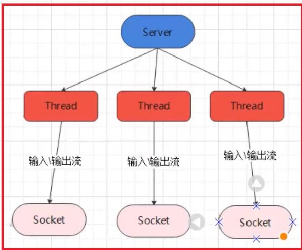
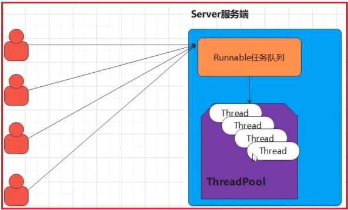
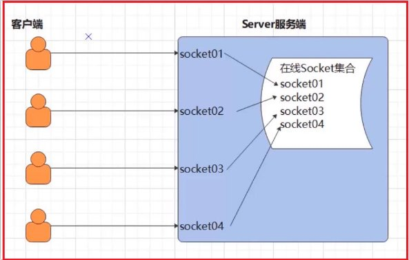
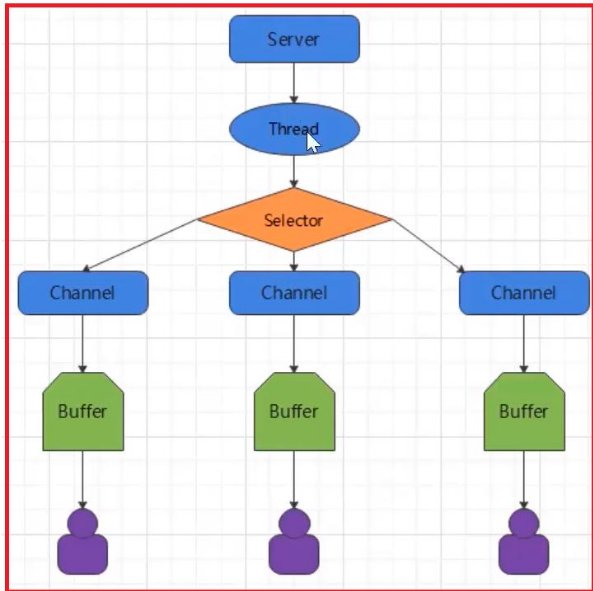
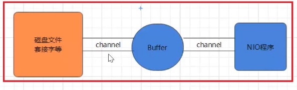
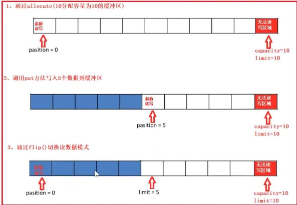
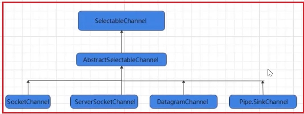

# **第一章 BIO、NIO、AIO课程介绍**

## 1. 课程说明

在java的软件设计开发中，通信架构是不可避免的，我们在进行不同系统或者不同进程之间的数据交 互，或 者在高并发下的通信场景下都需要用到网络通信相关的技术，对于一些经验丰富的程序员来说， Java早期的网络通 信架构存在一些缺陷，**其中最令人恼火的是基于性能低下的同步阻塞式的I/O通信 （BIO)**，随着互联网开发下通 信性能的高要求，Java在2002年开始支持了非阴塞式的I/O通信技术 （NIO)。大多数读者在学习网络通信相关技术的 时候，都只是接触到零碎的通信技术点，没有完整的技 术体系架构，以至于对Java的通信场景总是没有清晰的解 决方案。本次课程将通过大量清晰直接的案例 从最基础的BlO式通信开始介绍到NIO、AIO，读者可以清晰的了解到 阻塞、同步、异步的现象、概念和 特征以及优缺点。本课程结合了大量的案例让读者可以快速了解每种通信架构的 使用。 

## 2. 本课程学习要求

- 本课程不太适合完全0基础学员
- 至少需要掌握：java SE基础编程，如java多线程，java IO流编程，java网络基础知识（如：IP，端 口，协议），常用的Java设计模式要有一定的了解。
- 能熟练掌握Java OOP编程，有一定的编程思维。

## 3. 通信技术整体解决的问题

- 局域网内的通信要求
- 多系统间的底层消息传递机制
- 高并发下，大数据量的通信场景需要，如netty
- 游戏行业，无论是手游服务端，还是大型的网络游戏，java语言都得到越来越广泛的应用

# 第二章 Java的I/O演进之路

## 1. I/O模型基本说明

I/O模型：就是用什么样的通道或者说是通信模式和架构进行数据的传输和接收，很大程度上决定了程序 通信的性能 , Java共支持3种网络编程的I/O模型：**BlO. NIO. AlO** 

实际通信需求下，要根据不同的业务场景和性能需求决定选择不同的I/O模型 

## 2. I/O模型

### Java BIO

同步并阻塞（传统阻塞型），服务器实现模式为**一个连接一个线程**，即客户端有连接请求时服务器 端就 需要启动一个线程进行处理，如果这个连接不做任何事情会造成不必要的线程开销【简单示意图 】



### java NIO

Java NIO：同步非阻塞，服务器实现模式为一个线程处理多个请求（连接），即客户端发送的连接请求 都会注 册到多路复用器上，多路复用器轮询到连接有I/O请求就进行处理【简单示意图】



### java AIO

java AIO(NIO 2.0)：异步异步非阻塞，服务器实现模式为一个**有效**请求一个线程，客户端的I/O请求都是**由操作系统先完 成了再通知服务器应用去启动线程进行处理**，一般适用于连接数较多且连接时间较长的应用

## 3. **BIO、NIO、AIO适用场景分析**

1、 **BIO**方式适用于连接数目比小且固定的架构，这种方式对服务器资源要求比较高，并发局限于应用 中， jDK1.4以前的唯一选择，但程序简单易理解。

2、 **NIO**方式适用于连接数目多且连接比较短（轻操作）的架构，比如聊天服务器，弹幕系统，服务器 间通讯等。 编程比较复杂，jDK1 .4开始支持。

3、 **AIO**方式使用于连接数目多且连接比较长（重操作）的架构，比如相册服务器，充分调用OS参与并 发操作， 编程比较复杂，JDK7开始支持。

# 第三章 JAVA BIO深入剖析

## 1. Java BIO基本介绍

- Java BlO就是传统的Java IO编程，其相关的类和接口在Java.io 包中
- BIO(blocking I/O)同步阻塞，服务器实现模式为一个连接一个线程，即客户端有连接请求时服务器 端就需要启动一个线程进行处理，**如果这个连接不做任何事情会造成不必要的线程开销**，可以通过 线程池机制改善 （实现多个客户连接服务器）

## 2.Java BIO工作机制



## 3. 传统的BIO编程实例回顾

网络编程的基本模型是Client/Server模型，也就是两个进程之间进行相互通信，其中服务端提供位置信 （绑定IP地址和端口），客户端通过连接操作向服务端监听的端口地址发起连接请求，基于TCP协议下 进行三次握手连接，连接成功后，双方通过网络套接字（Socket）进行通信。

` `传统的同步阻塞模型开发中，服务端ServerSocket负责绑定IP地址，启动监听端口；客户端Socket负责 发起 连接操作。连接成功后，双方通过输入和输出流进行同步阻塞式通信。

基于BIO模式下的通信，客户端-服务端是完全同步，完全藕合的。 

**客户端案例如下**

```java
package BIODemo01;

import java.io.IOException;
import java.io.OutputStream;
import java.io.PrintStream;
import java.net.Socket;
import java.net.UnknownHostException;

public class Client {
    public static void main(String[] args) {
        try {
            // 1.创建Socket对象请求服务端的连接
            Socket socket = new Socket("127.0.0.1", 9999);
            // 2.从Socket对象中获取一个字节输出流
            OutputStream os = socket.getOutputStream();
            // 3.把字节输出流包装成一个打印流
            PrintStream ps = new PrintStream(os);
            // ps.print("hello World! 服务端，你好");
            ps.println("hello World! 服务端，你好");//此处发送一行消息
            ps.flush();
        } catch (IOException e) {
            e.printStackTrace();
        }
    }
}
```

**服务端案例如下**

```java
package BIODemo01;

import java.io.BufferedReader;
import java.io.IOException;
import java.io.InputStream;
import java.io.InputStreamReader;
import java.net.ServerSocket;
import java.net.Socket;

/*
* 目标：实现客户端发送信息，服务端接收消息
* */
public class Server {
    public static void main(String[] args) {
        try {
            System.out.println("===服务端启动===");
            // 1.定义一个ServerSocket对象进行服务端的端口注册
            ServerSocket ss = new ServerSocket(9999);
            // 2. 监听客户端的Socket连接请求
            Socket socket = ss.accept();
            // 3.从socket管道中得到一个字节输入流对象
            InputStream is = socket.getInputStream();
            // 4.把字节输入流包装成一个缓存字符输入流
            BufferedReader br = new BufferedReader(new InputStreamReader(is));
            String msg;

//            while ((msg = br.readLine()) != null){//此处循环读取一行数据，但是客户端只发送一行之后就挂机了，因此循环读不到第二行数据，连接就断开了
//                System.out.println("服务端接收到：" + msg);
//            }

            if ((msg = br.readLine()) != null) {//由于客户端只发送一行信息，因此服务端只接收一行数据即可，即服务端需要一行，客户端必须严格地发送一行，从而实现同步阻塞
                System.out.println("服务端接收到：" + msg);
            }
        } catch (IOException e) {
            e.printStackTrace();
        }
    }
}

```

**输出**

```
==服务端启动===
服务端接收到：hello World! 服务端，你好
```

**小结**

- 在以上通信中，服务端会一直等待客户端的消息，如果客户端没有进行消息的发送，服务端将一直 进入阻塞状态
- 同时服务端是**按照行获取消息**的，这意味着客户端也必须按照行进行消息的发送，否则服务端将进入等待消息的阻塞状态！任何一方先挂机，都会触发另一方的异常机制
## 4. **BIO模式下多发和多收消息**

在上面的案例中，只能实现**客户端发送消息，服务端接收消息**， 并不能实现反复的收消息和反复的发消 息，我们只需要在客户端案例中，加上反复按照行发送消息的逻辑即可！ 案例代码如下：

**客户端代码如下**

```java
package BIODemo02;

import java.io.IOException;
import java.io.OutputStream;
import java.io.PrintStream;
import java.net.Socket;
import java.util.Scanner;

//目标：客户端实现反复发送消息——扫描器机制实现
public class Client {
    public static void main(String[] args) {
        try {
            // 1.创建Socket对象请求服务端的连接
            Socket socket = new Socket("127.0.0.1", 9999);
            // 2.从Socket对象中获取一个字节输出流
            OutputStream os = socket.getOutputStream();
            // 3.把字节输出流包装成一个打印流
            PrintStream ps = new PrintStream(os);
            // 4.创建扫描器接收键盘输入
            Scanner sc = new Scanner(System.in);
            while (true) {//读取一行键盘输入就发送，实现多发
                System.out.print("请说:");
                String msg = sc.nextLine();
                ps.println(msg);
                ps.flush();
            }

        } catch (IOException e) {
            e.printStackTrace();
        }
    }
}
```

**服务端代码如下**

```java
package BIODemo02;

import java.io.BufferedReader;
import java.io.IOException;
import java.io.InputStream;
import java.io.InputStreamReader;
import java.net.ServerSocket;
import java.net.Socket;

/*
 * 目标：实现服务端可反复接收消息，客户端可以反复发送消息
 * 即多发多收的通信
 * 注意：此时只能实现一个服务端处理一个客户端，无多线程机制
 * */
public class Server {
    public static void main(String[] args) {
        try {
            System.out.println("===服务端启动===");
            // 1.定义一个ServerSocket对象进行服务端的端口注册
            ServerSocket ss = new ServerSocket(9999);
            // 2. 监听客户端的Socket连接请求
            Socket socket = ss.accept();
            // 3.从socket管道中得到一个字节输入流对象
            InputStream is = socket.getInputStream();
            // 4.把字节输入流包装成一个缓存字符输入流
            BufferedReader br = new BufferedReader(new InputStreamReader(is));
            String msg;

            while ((msg = br.readLine()) != null) {//循环接收每一行socket输入，实现多收
                System.out.println("服务端接收到：" + msg);
            }

        } catch (IOException e) {
            e.printStackTrace();
        }
    }
}

```

**输出**

```
客户端：
请说：hello
请说：what are you doing? 
请说：
```

服务端：

```
===服务端启动=== 
服务端接收到：hello 
服务端接收到：what are you doing?
```


## 5. BIO模式下接收多个客户端

**概述**

在上述的案例中，一个服务端只能接收一个客户端的通信请求，**那么如果服务端需要处理很多个客户端 的消 息通信请求应该如何处理呢**，此时我们就需要在服务端引入线程了，也就是说客户端每发起一个请 求，服务端就创 建一个新的线程来处理这个客户端的请求，这样就实现了一个客户端一个线程的模型， 图解模式如下：



**客户端案例代码**

```java
package BIODemo03;

import java.io.IOException;
import java.io.PrintStream;
import java.net.Socket;
import java.util.Scanner;

/*
 * 引入多线程时，通信客户端的实现
 * */
public class Client {
    public static void main(String[] args) {
        try {
            //1. 请求与服务端与socket对象连接，即新建客户端socket并指定连接的IP和端口
            Socket socket = new Socket("127.0.0.1", 9999);
            //2. 得到一个打印流，向socket的输出流打印字符
            PrintStream ps = new PrintStream(socket.getOutputStream());
            //3. 使用循环不断发送信息给服务端接收
            Scanner sc = new Scanner(System.in);
            while (true) {
                System.out.print("请说:");
                String msg = sc.nextLine();
                ps.println(msg);
                ps.flush();
            }
        } catch (IOException e) {
            e.printStackTrace();
        }
    }
}

```

**服务端案例代码**

```java
package BIODemo03;

import java.io.IOException;
import java.net.ServerSocket;
import java.net.Socket;

/*
 * 目标：实现服务端可以接收多个客户端的Socket通信需求--引入线程
 * 思路：服务端每接收到一个客户端socket请求之后都交给一个独立的线程来处理客户端数据交互请求
 * */
public class Server {
    public static void main(String[] args) {
        try {
            //1. 注册端口
            System.out.println("==服务端启动==");
            ServerSocket ss = new ServerSocket(9999);
            //2. 定义一个死循环，不断接收socket的连接请求
            while (true) {
                Socket socket = ss.accept();
                //3.创建独立线程对象来处理与这个客户端的socket通信需求，线程run方法内处理通信数据
                new ServerThreadReader(socket).start();
            }
        } catch (IOException e) {
            e.printStackTrace();
        }
    }
}

```

**线程类**

```java
package BIODemo03;

import java.io.BufferedReader;
import java.io.IOException;
import java.io.InputStream;
import java.io.InputStreamReader;
import java.net.Socket;

public class ServerThreadReader extends Thread {
    private Socket socket;

    public ServerThreadReader(Socket socket) {
        this.socket = socket;
    }

    @Override
    public void run() {
        try {
            //从socket对象中得到一个字节输入流
            InputStream is = socket.getInputStream();
            //使用缓冲字符输入流包装字节输入流
            BufferedReader br = new BufferedReader(new InputStreamReader(is));
            String msg;
            while ((msg = br.readLine()) != null) {
                System.out.println(msg);
            }
        } catch (IOException e) {
            e.printStackTrace();
        }
    }
}

```

**输出**

```
==服务端启动==
我是client1
我是client2

请说:我是client1
请说:

请说:我是client2
请说:
```

**小结**

- 每个Socket接收到，都会创建一个线程，线程的竞争、切换上下文影响性能； ・
- 每个线程都会占用栈空间和CPU资源；
- 并不是每个socket都进行lO操作，无意义的线程处理；
- 客户端的并发访问增加时。服务端将呈现1:1的线程开销，访问量越大，系统将发生线程栈溢出， 线程创建失败，最终导致进程宕机或者僵死，从而不能对外提供服务。
## 6. 伪异步I/O编程

**概述**

在上述案例中：客户端的并发访问增加时。服务端将呈现1:1的线程开销，访问量越大，系统将发生线程 栈溢出，线程创建失败，最终导致进程宕机或者僵死，从而不能对外提供服务。

接下来我们采用一个伪异步I/O的通信框架，采用**线程池和任务队列**实现，当客户端接入时，将客户端的 Socket封装成一个Task(该任务实现Java. lang. Runnable 线程任务接口）交给后端的线程池中进行处理。JDK的线程池维护一个消息队列和N个活跃的线程，对消息队列中Socket任务进行处理，由于线程池可以设置消息队列的大小和最大线程数，因此，它的资源占用是可控的，无论多少个客户端并发访问， 都不会导致资源的耗尽和宕机。

如下图所示：



**客户端源码分析**

```java

```

**线程池处理类**
```java

```

**Socket任务类**

```java

```


**服务端源码分析**

```java

```


**输出**

```

```


**小结**

- 伪异步旧采用了线程池实现，因此避免了为每个请求创建一个独立线程造成线程资源耗尽的问题， 但由于底层 依然是采用的同步阻塞模型，因此无法从根采上解决问题。
- 如果单个消息处理的缓慢，或者服务器线程池中的全部线程都被阻塞，那么后续socket的I/O消息 都将在队列 中排队。新的Socket请求将被拒绝，客户端会发生大量连接超时。
## 7. 基于BIO形式下的文件上传

**目标** 支持任意类型文件形式的上传

**客户端开发**

```java
package BIODemo05_file;

import java.io.DataOutputStream;
import java.io.FileInputStream;
import java.io.IOException;
import java.io.InputStream;
import java.net.Socket;

/*
 * 目标：客户端上传任意类型的文件数据给服务端保存起来
 * 注意：任意类型文件包括文件数据和文件类型
 * */
public class Client {
    public static void main(String[] args) {
        try {
            //1. 请求与服务端的socket连接
            Socket socket = new Socket("127.0.0.1", 8888);
            //2. 把字节输出流包装成一个特殊数据输出流DataOutputstream--可以做数据的分段发送：先发送字符串如 .jpg ，再发送一段数据
            DataOutputStream dos = new DataOutputStream(socket.getOutputStream());
            //3. 先发送上传文件的后缀给服务器
            dos.writeUTF(".jpg");//发送文件后缀
            //4. 把文件数据发送给服务端进行接收
            //读取本地数据
            FileInputStream fis = new FileInputStream("d:/a.jpg");
            byte[] buffer = new byte[1024];
            int readLen;
            while ((readLen = fis.read(buffer)) > 0) {
                dos.write(buffer, 0, readLen);//发送本分段文件数据
            }
            dos.flush();//同步阻塞：客户端向socket的输出流中写完一个文件数据就关闭socket连接了
            socket.shutdownOutput();//改善：通知服务端，数据发送完毕；服务端就不会一直等待接收数据了
        } catch (IOException e) {
            e.printStackTrace();
        }
    }
}

```

**服务端开发**
```java
package BIODemo05_file;

import java.io.IOException;
import java.net.ServerSocket;
import java.net.Socket;

/*
 * 目标：服务端接收客户端发来的任意类型文件，并保存到服务端磁盘
 * 注意：任意类型文件包括文件数据和文件类型
 * */
public class Server {
    public static void main(String[] args) {
        try {
            ServerSocket ss = new ServerSocket(8888);
            while (true) {
                Socket socket = ss.accept();
                //监听到连接之后交给独立线程来处理客户端交互的文件通信需求
                new ServerReaderThread(socket).start();
            }
        } catch (IOException e) {
            e.printStackTrace();
        }


    }
}

```


**Socket线程处理类**
```java
package BIODemo05_file;

import java.io.DataInputStream;
import java.io.FileOutputStream;
import java.io.IOException;
import java.io.OutputStream;
import java.net.Socket;
import java.util.UUID;

public class ServerReaderThread extends Thread {
    private final Socket socket;

    public ServerReaderThread(Socket socket) {
        this.socket = socket;
    }

    @Override
    public void run() {
        //线程读取socket的数据输入
        try {
            //1. 得到一个数据输入流来读取客户端发送来的数据
            DataInputStream dis = new DataInputStream(socket.getInputStream());
            //2. 读取客户端发送来的文件类型
            String suffix = dis.readUTF();
            System.out.println("服务端成功接收到了文件类型" + suffix);
            //3. 定义一个字节输出流，负责把客户端发来的文件数据写出到文件中
            FileOutputStream fos = new FileOutputStream("D:/JayCode/Java/JavaIOMode/JavaBIO/src/BIODemo05_file/uploads/" + UUID.randomUUID().toString() + suffix);
            //4. 从数据输入流中读取客户端发送来的文件数据，写出到字节输出流中
            byte[] buffer = new byte[1024];
            int readLen;
            while ((readLen = dis.read(buffer)) > 0) {
                fos.write(buffer, 0, readLen);
                // 同步阻塞：
                //此循环哪怕读完一个文件，还是会继续等待下一个消息或数据，会一直等待发来的数据，而此时客户端已经下线，触发异常
                //客户端那边认为图片发完了，已经下线
                //服务端读数据会一直等待收到传输结束信号
                //改善时可以在发完文件后跟一个关闭连接的信号shutdownOutput()给服务端
                //当服务端接收到客户端发来的关闭连接请求，就不再继续循环读取socket输入流中的数据了
            }
            fos.close();
            System.out.println("服务端接收文件保存成功");
        } catch (IOException e) {
            e.printStackTrace();
        }
    }
}

```


**输出**

服务端已经成功接收到了文件类型：.jpg 服务端接收文件保存成功！

**小结**

- 同步阻塞模式下（BIO)，客户端怎么发，服务端就必须对应的怎么收。如客户端用的是 DataOutputStream，那么服务端就该用DataInputStream，客户端dos.writeUTF(".jpg");服务端 就该String suffix = dis.readUTF();
- 客户端发完数据后必须通知服务端自己已经发完socket.shutdownOutput()，否则服务端会一直等 待。

## 8. Java BIO模式下的端口转发思想——群聊

需求：需要实现一个客户端的消息可以发送给所有的客户端去接收。（群聊实现）



**客户端开发**

```java

```

**客户端线程处理类**

```java

```

**服务端开发**

```java

```

**服务端线程处理类**

```java

```

**输出**

```
服务端 

服务器收到消息：大家好，我是客户端一 

服务器收到消息：哈哈哈哈 

服务器收到消息：大家好，我是client2 

服务器收到消息：嘻嘻嘻嘻 

服务器收到消息：hello everyone 

服务器收到消息：i am client3

#客户端一

大家好，我是客户端一   --发送 哈哈哈哈        --发送 大家好，我是client2   --接收

嘻嘻嘻嘻        --接收 hello everyone     --接收 i am client3      --接收

#客户端二

大家好，我是客户端一   --接收 哈哈哈哈        --接收 大家好，我是client2   --发送 嘻嘻嘻嘻        --发送 hello everyone     --接收 i am client3      --接收

#客户端三

大家好，我是客户端一   --接收 哈哈哈哈        --接收 大家好，我是client2   --接收 嘻嘻嘻嘻        --接收 hello everyone     --发送 i am client3      --发送
```


## 9. 基于BIO模式下即时通讯

基于BIO模式下的即时通信，我们需要解决客户端到客户端的通信，也就是需要实现客户端与客户端的 端口消息转发逻辑。

**项目功能演示 项目案例说明**

本项目案例为即时通信的软件项目，适合基础加强的大案例，具备综合性。学习本项目案例至少需要具 备如下java SE技术点：

 1.java面向对象设计，语法设计

 2.多线程技术

 3.IO流技术

 4.网络通信相关技术

 5.集合框架

 6.项目开发思维

 7.java常用api使用

......

**功能清单简单说明：**

**1.客户端登录功能**

 可以启动客户端进行登录，客户端登录只需要输入用户名和服务端IP地址即可。

**2.在线人数实时更新**

 客户端用户登录后，需要同步更新所有客户端的联系人信息栏。

**3.离线人数更新**

 检测到有客户端下线后，需要同步更新所有客户端的联系人信息栏。

**4.群聊**

 任意一个客户端的消息，可以推动给当前所有的客户端接收。

**5.私聊**

 任意一个客户端消息，可以推动给当前所有客户端接收。

**6.@消息**

 可以选择某个员工，然后发出的消息可以@该用户，但是其他所有人都能收到消息。

**7.消息用户和消息时间点**

 服务端可以实时记录该用户的消息时间点，然后进行消息的多路转发或则选择。

**项目的启动与演示**

**项目代码结构演示**


**技术选型分析** Java GUI，BIO

**服务端设计 服务端接收多个客户端逻辑** 服务端需要接收多个客户端的接入

1. 服务端需要接收多个客户端，目前我们采取的策略是一个 客户端对应一个服务端线程
1. 服务端除了要注册端口以外，还需要为每个客户端分配 一个独立线程处理与之通信

服务端主体代码，主要进行端口注册，和接收客户端，分配线程处理该客户端请求 **服务端接收登陆消息以及监测离线**

在上面我们实现了服务端可以接收多个客户端，然后服务端可以接收多个客户端连接，接下来我们要接 收客户端的登陆消息。

我们需要在服务端处理客户端线程的登陆消息。需要注意的是，服务端需要接收客户端的消息可能有很 多种,分别是登陆消息，群聊消息，私聊消息和@消息。这里需要约定如果客户端发送消息之前需要先发 送消息的类型，类 型我们使用信号值标志（1，2，3）。

- 1代表接收的是登陆消息
  - 代表群发| @消息
    - 3代表了私聊消息

服务端的线程中有异常校验机制，一旦发现客户端下线会在异 常机制中处理，然后移除当前客户端用 户，把最新的用户列表 发回给全部客户端进行在线人数更新。

**服务端接收群聊消息**

在上面实现了接收客户端的登陆消息，然后提取当前在线的全部的用户名称和当前登陆的用户名称，发 送给全部在线用户更新自己的在线人数列表。接下来要接收客户端发来的群聊消息，然后推送给当前在 线的所有客户端。

**服务端接收私聊消息**

解决私聊消息的推送逻辑，私聊消息需要知道推送给某个具 体的客户端。我们可以接收到客户端发来的 私聊用户名称，根据用户名称定 位该用户的Socket管道，然后单独推送消息给该Socket管道。

**代码实现 Constants:**


**客户端设计**

**启动客户端界面，登录，刷新在线**

启动客户端界面，登陆，刷新在线人数列表 客户端界面主要是GUI设计，主体页面分为登陆界面和聊 天窗口，以及在线用户列表。

登陆输入服务端ip和用户名后，要请求与服务端的登 陆，然后立即为当前客户端分配一个读线程处理客 户端 的读数据消息。因为客户端可能随时会接收到服务端那 边转发过来的各种即时消息信息。 客户端 登陆完成，服务端收到登陆的用户名后，会立即发 来最新的用户列表给客户端更新。

**客户端发送消息逻辑**

**目标**

` `客户端发送群聊消息，@消息，以及私聊消息。

**实现步骤** 

客户端启动后，在聊天界面需要通过发送按钮推送群 聊消息，@消息，以及私聊消息。 **代码实现**

**ClientChat**:


# 第四章 JAVA NIO深入剖析

在讲解利用NIO实现通信架构之前，我们需要先来了解一下NIO的基本特点和使用

## 1.Java NIO基本介绍

- java NlO (New lO）也有人称之为java non-blocking IO是脚ava  1.4版本开始引入的一个新的IO API，可以 替代标准的Java lO API。 NIO与原来的IO有同样的作用和目的，但是使用的方式完全不 同，NIO支持**面向缓冲区**的、**基于通道**的IO操作。NIO将以更加高效的方式进行文件的读写操作。 NIO可以理解为非阻塞IO，传统的IO 的read和write只能阻塞执行，线程在读写期间不能干其他事 倩，比如调用socket. read(）时，如果服务器一 直没有数据传输过来，线程就一直阻塞，而NIO中 可以配置socket为非阻塞模式。
- NIO相关类都被放在java.nio包及子包下，并且对原」ava.io包中的很多类进行改写。
- NIO有三大核心部分：**Channel（通道）,Buffer(缓冲区）,Selector（选择器）**
- Java NIO的非阻塞模式，使一个线程从某通道发送请求或者读取数据，但是它仅能得到目前可用的 数据；如 果目前没有数据可用时，就什么都不会获取，而不是保持线程阻塞，所以直至数据变的可 以读取之前，该线程 可以继续做其他的事情。非阻塞写也是如此，一个线程请求写入一些数据到某 通道，但不需要等待它完全写 入，这个线程同时可以去做别的事情。

- 通俗理解：NIO是可以做到用一个线程来处理多个操作的。假设有1000个请求过来，根据实际情 况，可以分酉己 20或者80个线程来处理。不像之前的阻塞IO那样，非得分配1000个。 

## 2. NIO和BIO的比较

- BlO以**流**的方式处理数据，而NIO以**块**的方式处理数据，**块I/O**的效率比**流I/O**高很多

  

  

- BlO是阻塞的，NIO则是非阻塞的

- BlO基于字节流和字符流进行操作，而NIO基于Channel(通道）和Buffer(缓冲区）进行操作，数据 总是从通道 读取到缓冲区中，或者从缓冲区写入到通道中。Selector(选择器）用于监听多个通道 的事件（比如：连接请 求，数据到达等），因此使用单个线程就可以监听多个客户端通道

|**NIO**|**BIO**|
| - | - |
|面向缓存区（Buffer)|面向流（Stream)|
|非阻塞（Non Blocking IO)|阻塞IO(Blocking IO)|
|选择器（Selector)||
## 3. NIO三大核心原理示意图

NIO有三大核心部分：**Channel(通道)，Buufer(缓存区)，Selector(选择器) Buffer缓存区**

缓冲区本质上是**一块可以写入数据，然后可以从中读取数据的内存**。这块内存被包装成NIO Buffer对 象，并提供了 一组方法，用来方便的访问该块内存。相比较直接对数组的操作，Buffer API更加容易操作和管理。

**Channel通道**

Java NIO的通道类似流，但又有些不同：既可以从通道中读取数据，又可以写数据到通道。但流的 （(input或 output)读写通常是单向的。通道可以非阻塞读取和写入通道，通道可以支持读取或写入缓冲 区，也支持异步地读写。

**Selector选择器(多路复用器)**

Selector是一个Java NIO组件，可以能够检查一个或多个NIO通道，并确定哪些通道已经准备好进行读取或写入。这样，一个单独的线程可以管理多个channel，从而管理多个网络连接，提高效率



- 每个Channel都会对应一个Buffer
- 一个线程对应Selector，一个Selector对应多个Channel（连接） 
- 程序切换到哪个Channel是由事件决定的
- Selector会根据不同的事件，在各个通道上切换
- Buffer就是一个内存块，底层是一个数组
- 数据的读取写入是通过Buffer完成的，BIO中要么是输入流，或者是输出流，不能双向，但是NIO 的Buffer是可以读也可以写。
- Java NIO系统的核心在于：通道（Channel）和缓存区（Buffer)。通道表示打开到IO设备（例如： 文件、套接字） 的连接。若需要使用NlO系统，需要获取用于连接IO设备的通道以及用于容纳数据 的缓冲区。然后操作缓 冲区，对数据进行处理。简而言之，Channel负责传输，Buffer负责存取数 据 

## 4. NIO核心一：缓存区（Buffer)

**缓存区（Buffer）**

一个用于特定基本数据类型的容器。由Java.nio包定义的，所有缓冲区都是Buffer抽象类的子类．Java NIO中 的Buffer主要用于与NIO通道进行交互，数据是从通道读入缓冲区，从缓冲区写入通道中的



**Buffer类及其子类 Buffer**就像一个数组，可以保存多个相同类型的数据。根据数据类型不同，有以下Buffer常用子类：

- ByteBuffer
- CharBuffer
- ShortBuffer
- IntBuffer
- LongBuffer
- FloatBuffer
- DoubleBuffer

上述Buffer类 他们都采用相似的方法进行管理数据，只是各自管理的数据类型不同而已。都是通过如下 方法获取一个Buffer对象：

```java
static XxxBuffer allocate(int capacity)//创建一个容量为capacity的XxxBuffer对象
```

**缓存区的基本属性** Buffer中的重要概念：

- **容量（capacity)**：作为一个内存块，Buffer具有一定的固定大小，也称为”容量”，缓冲区容量不能 为负，并且 创建后不能更改。
- **限制（limit)**：表示缓冲区中可以操作数据的大小（limit后数据不能进行读写）。缓冲区的限制不 能为负，并且不能大于其容量**。写入模式，限制等于buffer的容量。读取模式下，limit等于写入的数据量。**
- **位置(position)**：下一个要读取或写入的数据的索引。缓冲区的位置不能为负，并且不能大于其限制 
- **标记(mark)与重置（reset)**：标记是一个索弓l，通过Buffer中的mark(）方法指定Buffer中一 个特定的 position，之后可以通过调用reset(）方法恢复到这个position。
- **标记、位置、限制、容 量遵守以T不变式  0<=mark<=position<=limit<=capacity**
- **图示**： 



**Buffer常见方法**

```java
Buffer clear(）//清空缓冲区并返回对缓冲区的引用 

Buffer flip(）//为将缓冲区的界限设置为当前位置，并将当前位置重置为0

int capacity(）//返回Buffer的capacity大小 

boolean hasRemaining(）//判断缓冲区中是否还有元素 

int limit(）//返回Buffer的界限（limit）的位置 

Buffer limit(int n）//将设置缓冲区界限为n，并返回一个具有新limit的缓冲区对象 Buffer mark(）对缓冲区设置标记 

int position(）//返回缓冲区的当前位置position 

Buffer position(int n）//将设置缓冲区的当前位置为n，并返回修改后的Buffer对象 int remaining()返回position和limit之间的元素个数 

Buffer reset(）//将位置position转到以前设置的mark所在的位置 

Buffer rewind()  //将位置设为为0．取消设置的mark 
```

**缓存区的数据操作**

```java
Buffer 所有子类提供了两个用于数据操作的方法：get() put()方法 取获取Buffer中的数据 

get()   //读取单个字节 

get (byte［〕dst)//批量读取多个字节到dst中 

get(int index)//读取指定索引位置的字节（不会移动position) 放到 入数据到Buffer中

put(byte b)//将给定单个字节写入缓冲区的当前位置

put (byte[] src)//将src中的字节写入缓存区的当前位置

put(int index,byte b)//将指定字节写入缓存区的索引位置（不会移动position）
```

**使用Buffer读写数据一般遵循以下四个步骤：**

1. 写入数据到Buffer

2. 调用flip()方法，转换为读取模式

3. 从Buffer中读取数据

4. 调用buffer.clear()方法或则buffer.compact()方法清除缓存区

**案例演示**

```java
package NIOBuffer;

import org.testng.annotations.Test;

import java.nio.ByteBuffer;

public class BufferTest {
    public static void main(String[] args) {

    }

    @Test
    public void test01(){
        //1. 分配一个缓冲区，容量为10
        ByteBuffer buffer = ByteBuffer.allocate(10);
        System.out.println(buffer.position());  //0
        System.out.println(buffer.limit());  //10
        System.out.println(buffer.capacity());  //10

        //2. put()往缓冲区中添加数据
        String name = "Tony";
        buffer.put(name.getBytes());
        System.out.println("=====================================================================================================");
        System.out.println("position:"+buffer.position()+"\nlimit:"+buffer.limit()+"\ncapacity:"+buffer.capacity());//4  10  10

        //3. 为将缓冲区的界限设置为当前位置，并将当前位置重置为0 --> 可读模式
        buffer.flip();
        System.out.println("=====================================================================================================");
        System.out.println("position:"+buffer.position()+"\nlimit:"+buffer.limit()+"\ncapacity:"+buffer.capacity());//0  4  10

        //4. get()读取缓冲区数据
        char ch = (char) buffer.get();  //gat()读取单个字节
        System.out.println(ch);
        System.out.println("=====================================================================================================");
        System.out.println("position:"+buffer.position()+"\nlimit:"+buffer.limit()+"\ncapacity:"+buffer.capacity());//1  4  10
    }

    @Test
    public void test02(){
        //1. 分配一个缓冲区，容量为10
        ByteBuffer buffer = ByteBuffer.allocate(10);
        System.out.println("=====================================================================================================");
        System.out.println("position:"+buffer.position()+"\nlimit:"+buffer.limit()+"\ncapacity:"+buffer.capacity());//0  10  10

        //2. 向缓冲区写入数据
        buffer.put("Tony".getBytes());
        System.out.println("=====================================================================================================");
        System.out.println("position:"+buffer.position()+"\nlimit:"+buffer.limit()+"\ncapacity:"+buffer.capacity());//4  10  10

        //3. clear 清除缓冲区中的数据
        buffer.clear();
        System.out.println("=====================================================================================================");
        System.out.println("position:"+buffer.position()+"\nlimit:"+buffer.limit()+"\ncapacity:"+buffer.capacity());//0  10  10

        System.out.println("=====================================================================================================");
        System.out.println((char) buffer.get());
        System.out.println("position:"+buffer.position()+"\nlimit:"+buffer.limit()+"\ncapacity:"+buffer.capacity());//1  10  10

        //4. 定义一个缓冲区
        ByteBuffer buf = ByteBuffer.allocate(10);
        String n = "woaini";
        buf.put(n.getBytes());

        //4.1 使用字节数组读取数据而非默认按字节读取
        buf.flip();
        byte[] b = new byte[2];
        buf.get(b);//将buf内容读到字节数组中
        String rs = new String(b);
        System.out.println("=====================================================================================================");
        System.out.println(rs);
        System.out.println("position:"+buf.position()+"\nlimit:"+buf.limit()+"\ncapacity:"+buf.capacity());//2  6  10

        //4.2 mark()标记此时position位置
        buf.mark();
        byte[] b2 = new byte[3];
        buf.get(b2);
        String rs2 = new String(b2);
        System.out.println("=====================================================================================================");
        System.out.println(rs2);
        System.out.println("position:"+buf.position()+"\nlimit:"+buf.limit()+"\ncapacity:"+buf.capacity());//5  6  10

        //4.3 reset()回到标记位置
        buf.reset();  //从5位置回到2位置
        while (buf.hasRemaining()){
            System.out.print((char) buf.get());
        }
    }
}
```

**直接与非直接缓存区** 什么是直接内存与非直接内存 根据官方文档的描述：

byte buffer。可以是两种类型，一种是基于直接内存（也就是非堆内存）；另一种是非直接内存（也就 是堆内 存）。对于直接内存来说，JVM将会在IO操作上具有更高的性能，因为它直接作用于本地系统的 IO操作。而非直接 内存，也就是堆内存中的数据，如果要作IO操作，会先从本进程内存复制到直接内 存，再利用本地IO处理。 

从数据流的角度，非直接内存是下面这样的作用链：

```
本地IO--->直接内存--->非直接内存--->直接内存--->本地IO
```

而直接内存是：

```
本地IO--->直接内存--->本地IO
```

很明显，在做IO处理时，比如网络发送大量数据时，直接内存会具有更高的效率。直接内存使用 allocateDirect创建，但是它比申请普通的堆内存需要耗费更高的性能。不过，这部分的数据是在JVM之 外的，因此它不会占用应用 的内存。所以呢，当你有很大的数据要缓存，并且它的生命周期又很长，那 么就比较适合使用直接内存。只是一般 来说，如果不是能带来很明显的性能提升，还是推荐直接使用堆 内存。字节缓冲区是直接缓冲区还是非直接缓冲区 可通过调用其isDirect()方法来确定。

**使用场景**

- 1 有很大的数据需要存储，他的生命周期又很长
- 2 适合频繁的IO操作，比如网络并发场景

## 5. BIO核心二：通道（Channel）

**通道Channel概述**

通道（Channel)：由java.nio.channels包定义的。Channel表示IO源与目标打开的连接。Channel类似 于传统的“流”。只不过Channel本身不能直接访问数据，Channel只能与Buffer进行交互。 

1、NIO的通道类似于流，但有些区别如下

- 通道可以同时进行读写，而流只能读或者只能写
- 通道可以实现异步读写数据
- 通道可以从缓冲读数据，也可以写数据到缓冲

2、BlO中的stream是单向的，例如FilelnputStream对象只能进行读取数据的操作，而NIO中的通道 （Channel)  是双向的，可以读操作，也可以写操作。

3、Channel在NIO中是一个接口

```
public interface Channel extends Closeable()
```

**常用的Channel实现类**

- FileChannel：用于读取、写入、映射和操作文件的通道
- DatagramChannel：通过UDP读写网络中的数据通道
- SocketChannel：通过TCP读写网络中额数据
- ServerSocketChannel：可以监听新进来的TCP连接，对每一个新进来的连接都会创建一个 SocketChannel。【ServerSocketChannel类似ServerSocket，SocketChannel类似Socket】

**FileChannel类-文件通道**

 获取通道的一种方式是对支持通道的对象调用getChannel()方法。支持通道的类如下：

- FileInputStream
- FileOutputStream
- RandomAccessFile
- DatagramSocket
- Socket
- ServerSocket

获取通道的其他方式是使用Files类的静态方法newByteChannel()获取字节通道。或通过通道的静态方法 open()打开并返回指定通道

**FileChannel的常用方法**

```java
int read(ByteBuffer dst)     //从Channel当中读取数据至ByteBuffer 

long read(ByteBuffer[] dsts）     //将channel当中的数据“分散”至ByteBuffer[] int write(Bytesuffer src)将ByteBuffer当中的数据写入到Channel 

long write(ByteBuffer[] srcs）     //将Bytesuffer[]当中的数据“聚集”到Channel long position(）返回此通道的文件位置 

FileChannel position(long p）     //设置此通道的文件位置 

long size(）     //返回此通道的文件的当前大小 

FileChannel truncate(long s）     //将此通道的文件截取为给定大小 

void force(boolean metaData）     //强制将所有对此通道的文件更新写入到存储设备中 
```

**案例1-本地文件写数据**

```java

```

**案例2-本地文件读数据**
```java

```


**案例3-使用Buffer完成文件复制**

```java

```

**案例4-分散（Scatter)和聚集（Gatter)** 

分散读取（Scatter)：是指把Channel通道的数据读取入到多个Buffer缓存区中去 

聚集写入（Gathering)：是指将多个Buffer中的数据聚集到Channel。

```java

```

**案例5-transferForm()** 

从目标通道中去复制原通道数据

```java

```

**案例6-transferTo()**

把原通道数据复制到目标通道

```java

```


## 6. NIO核心三：选择器（Selector)

**选择器（Selector）概述**

选择器（Selector）是SeIectabIeC hannIe对象的多路复用器，Selector可以同时监控多个 SelectableChannel 的IO状况，也就是说，利用Selector可使一个单独的线程管理多个Channel。 Selector是非阻塞IO的核心 



- java的NIO，用非阻塞的IO方式。可以用一个线程，处理多个的客户端连接，就会使用到Selector （选择器）
- Selector能够**检测多个注册的通道上是否有事件发生**（注意：多个Channel以事件的方式可以注册 到同一个 Selector)，如果有事件发生，便获取事件然后针对每个事件进行相应的处理。这样就可 以只用一个单线程去管 理多个通道，也就是管理多个连接和请求。
- **只有在连接/通道真正有读写事件发生时，才会进行读写**，就大大地减少了系统开销，并且不必为 每个连接都 创建一个线程，不用去维护多个线程 避免了多线程之间的上下文切换导致的开销

**选择器（Selector）的应用** 

创建Selector：通过Selector.open()方法创建一个Selector。

```java
Selector selector = Selector.open(); 
```

向选择器注册通道：SelectableChannel.register(Selector sel,int ops);

```java
//1.获取通道
ServerSocketChannel ssChannel = ServerSocketChannel.open(); 

//2.切换为非阻塞模式
ssChannel.configureBlocking(false);

//3.注册端口，绑定连接
ssChannel.bind(new InetSocketAddress(9898));

//4.获取选择器
Selector selector = Selector.open();

//5.将通道注册到选择器上，并且指定“监听接收事件” 
ssChannel.register(select,SelectionKey.OP_ACCEPT);
```

当调用register(Selector sel, mt ops)将通道注册选择器时，选择器对通道的监听事件，需要通过第二个参数。ops指定。可以监听的事件类型（用可使用Selection Key的四个常量表示）: 

- 读：SelectionKey.OP\_READ (1) 
- 写：SelectionKey.OP\_WRITE  (4) 
- 连接：SelectionKey.OP\_CONNECT (8) 
- 接收：SelectionKey.OP\_ACCEPT (16) 
- 若注册时不止监听一个事件，则可以使用‘位或”操作符连接。

```java
int interestSet = selectionKey.OP_READ | SelectionKey.OP_WERITE
```


## 7. NIO非阻塞式网络通信原理分析

**Selector示意图和特点说明**

Selector可以实现：一个I/O线程可以并发处理N个客户端连接和读写操作，这从根本上解决了传统同步 阻塞I/O一连接一线程模型，架构的性能、弹性伸缩能力和可靠性都得到了极大的提升。


**服务端流程**

1. 当客户端连接服务端时，服务端会通过ServerSocketChannel得到SocketChannel。ServerSocketChannel是一个可以[监听](https://so.csdn.net/so/search?q=监听&spm=1001.2101.3001.7020)新进来的TCP连接的通道, 就像标准IO中的ServerSocket一样。所以不难想象ServerSocketChannel是运行在服务端的。

1. 获取通道 ，负责接收客户端的连接

```java
ServerSocketChannel ssChannel = ServerSocketChannel.open();  //调用ServerSocketChannel.open()方法来打开ServerSocketChannel通道
```

2. 切换非阻塞模式

```java
ssChannel.configureBlocking(false);
```

3. 绑定连接

```java
ssChannle.bind(new InetSocketAddress(9999))
```

4. 获取选择器

```java
Selector selector = Selector.open()
```

5. 将通道注册到选择器上，并且指定“监听接收事件” 

```java
ssChannel.register(selector,SelectionKey.OP_ACCEPT);
```

5. 轮询式的获取选择器上已经“准备就绪”的事件

```java
//6. 轮询式的获取选择器上已经“准备就绪”的事件
while(selector.select() > 0){
	System.out.println("轮一轮");
	//7.  获取当前选择器中所有注册的“选择键”（已就绪的监听事件）
	Iterator<SelectionKey> it = selector.selectedKeys().iterator();//使用迭代器访问集合
    while(it.hasNext()){
        //8. 获取准备”就绪“的事件
        SelectionKey sk = it.next();
        //9. 判断具体是什么事件准备就绪
        if(sk.isAcceptable()){//判断是否为接入事件
            //10. 若”接收就绪“，获取客户端连接
            SocketChannel sChannel = ssChannel.accept();
            //11. 切换非阻塞模式
            sChannel.configure Blocking(fales);
            //12. 将该通道注册到选择器上
            sChannel.register(selector,SelectionKey.OP_READ);
        }else if(sk.isReadable()){//判断是否为读事件
            //13. 获取当前选择器上”读就绪“状态的通道
            SocketChannel sChannel = (SocketChannel)sk.channel();
            //14. 读取数据
            ByteBuffer buf = ByteBuffer.allocate(1024);
            int len = 0;
            while((len = sChannel.read(buf)) > 0){
                buf.flip();
                System.out.println()new String(buf.array(),0,len);
                buf.clear();
                }
        } 
    //15.取消选择键SelectionKey
    it.remove();
    }
}
```


**客户端流程**

1、获取通道

```java
SocketChannel sChannel = SocketChannel.open(new InetSocketAddress("127.0.0.1",9999));
```

2、切换非阻塞模式 

```java
sChannel.configureBlocking(false);
```

3、分配指定大小的缓存区

```java
ByteBuffer buf = ByteBuffer.allocate(1024);
```

4、发送数据给服务端

```java
Scanner scan = new Scanner(System.in);

while(scan.hasNext()){
	String str = scan.nextLine();
	buf.put((new SimpleDateFormat("yyyy/MM/dd HH:mm:ss").format(System.currentTimeMillis()) + "\n" + str).getByte());  //向缓冲区写入时同时封装日期事件信息
    buf.flip();
	sChannel.write(buf);
	buf.clear();
}
//关闭通道
sChannel.close();
```


## 8. NIO非阻塞式网络通信入门案例

需求：服务端接收客户端的连接请求，并接收多个客户端发送过来的事件 

**代码案例**

**服务端代码实现**

```java

```
**客户端代码实现**
```java

```

输出：

```

```

## 9. NIO网络编程应用实例-群聊系统

**目标 需求：进一步理解NIO非阻塞网络编程机制，实现多人群聊**

- 编写一个NIO群聊系统，实现客户端与客户端的通信需求（非阻塞）
- 服务器端：可以监测用户上线，离线，并实现消息转发功能
- 客户端：通过channel可以无阻塞发送消息给其他所有客户端用户，同时可以接受其它客户端用户 通过服务端转发来的消息

**服务端代码实现**

```java

```
**客户端代码实现**

```java

```
**输出**

```

```

# 第五章 JAVA AIO深入剖析

## 5.1 AIO 编程

- Java AIO(NIO.2)：异步非阻塞，服务器实现模式为一个有效请求一个线程，客户端的I/O请求都是 由OS先完成了再通知服务器应用去启动线程进行处理。

- AIO是异步非阻塞，基于NIO，可以称之为NIO2.0


|**BIO**|**NIO**|**AIO**|
| - | - | - |
|Socket|SocketChannel|AsynchronousSocketChannel|
|ServerSocket|ServerSocketChannel|AsynchronousServerSocketChannel|
与NIO不同，当进行读写操作时，只须直接调用API的read或write方法即可，这两种方法均为异步的， 对于读操作而言，当有流可读时，操作系统会将可读的流传入read方法的缓冲区，对于写操作而言，当 操作系统将 write方法传递的流写入完毕时，操作系统主动通知应用程序 。

即可以理解为，read/write方法都是异步的，完成后会主动调用回调函数。在JDK1.7中，这部分内容被 称作 NIO.2，主要在java.nio.channel包下增加了下面四个异步通道：

- AsynchronousSocketChannel
  - AsynchronousServerSocketChannel
    - AsynchronousFileChannel
      - AsynchronousDatagramChannel

# 第六章 BIO、NIO、AIO课程总结

**BIO、NIO、AIO：**

- Java BlO：同步并阻塞，服务器实现模式为一个连接一个线程，即客户端有连接请求时服务器端就 需要启动 一个线程进行处理，如果这个连接不做任何事情会造成不必要的线程开销，当然可以通过 线程池机制改善。
  - Java NIO：同步非阻塞，服务器实现模式为一个请求一个线程，即客户端发送的连接请求都会注册 到多路复用器上，多路复用器轮询到连接有I/O请求时才启动一个线程进行处理。
    - Java AIO(N 10.2)：异步非阻塞，服务器实现模式为一个有效请求一个线程，客户端的I/O请求都是 由OS先完成了再通知服务器应用去启动线程进行处理。

**BIO、NIO、AIO适用场景分析：**

- BlO方式适用于连接数目比较小且固定的架构，这种方式对服务器资源要求比较高，并发局限于应 用中， JDK1.4以前的唯一选择，但程序直观简单易理解。
  - NIO方式适用于连接数目多且连接比较短（轻操作）的架构，比如聊天服务器，并发局限于应用 中，编程比较 复杂，JDK1 .4开始支持。

 AlO方式使用于连接数目多且连接比较长（重操作)的架构，比如相册服务器，充分调用OS参与并 发操作，编 程比较复杂，JDK7开始支持。
