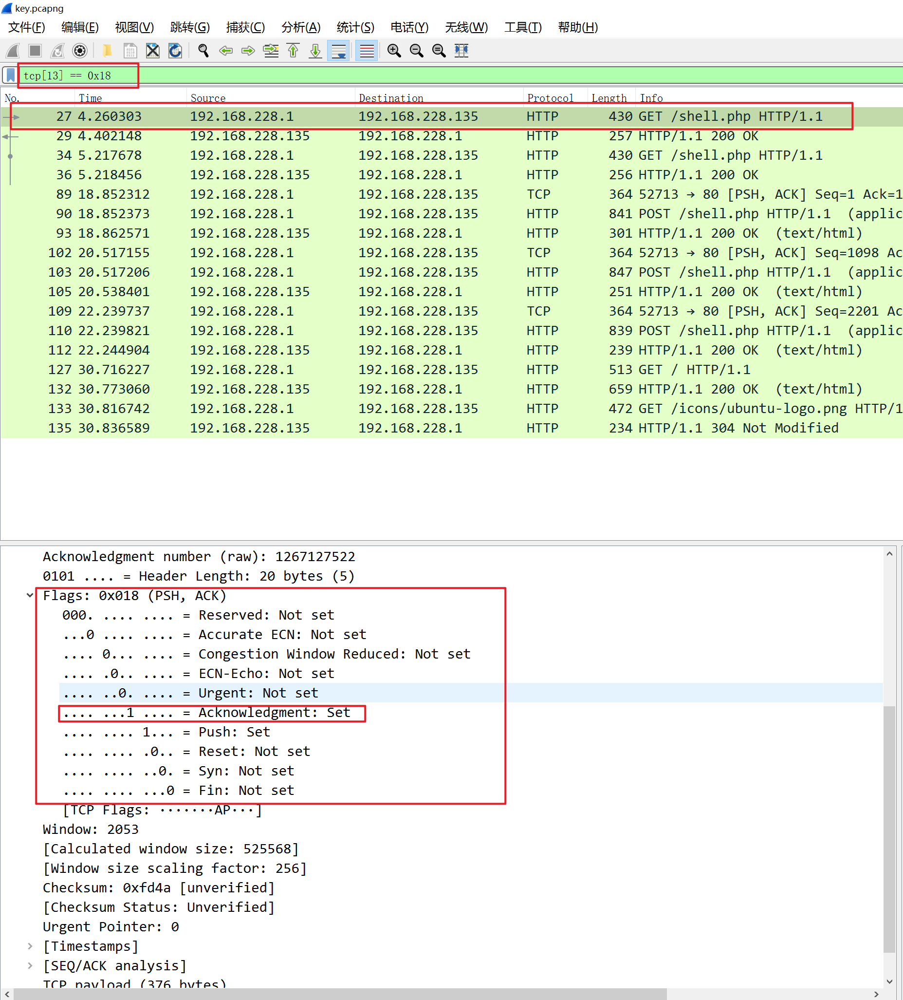
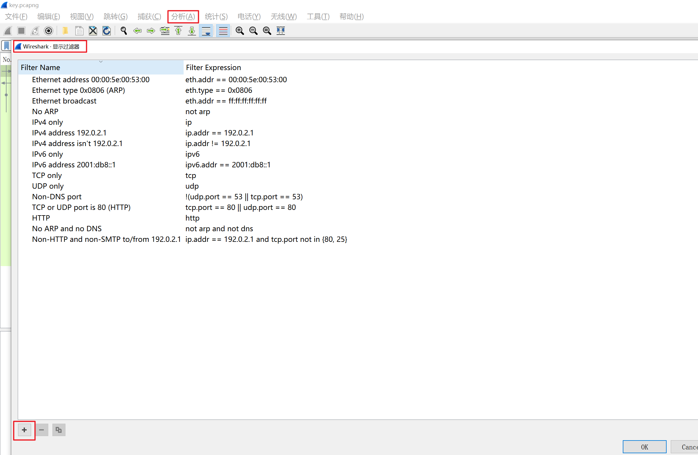

# 课时1 认识Wireshark的界面

## Wireshark的界面

标题栏：显示不活的抓包文件的名称、Wireshark的版本号等

菜单栏

工具栏：常用功能的快捷按钮

Filter：筛选器

PackageList面板：显示每个数据帧的摘要，这里捕获到的实际上是数据帧。使用表格形式列出当前捕获到的数据包

PackageDetails：分析数据包的详细信息，分层次显示一个数据包里的内容

PackageBytes：以十六进制和ASCII码显示数据包的内容，这是数据包未经处理的样子，也就是在链路上传播时的样子

状态栏：最下面，包含专家信息、注释、包的数量

## 识别数据包的方法

一旦开始捕获，所获得的二进制数据就会根据不同协议结构进行规范，并显示在PackageDetail中

Wireshark中关于数据包的叫法主要有3个术语：帧、包、段

帧：起始点和终止点都是数据链路层

包：起始和目的地都是网络层

段：起始和目的地都是传输层

| WiresharkPackageDetail项      | 协议层     | 备注             |
| ----------------------------- | ---------- | ---------------- |
| Frame                         | 物理层     | 物理层数据层情况 |
| Ethernet II                   | 数据链路层 | 以太网帧         |
| Internet Protocol Version 4   | 网络层     | 网络层IP包       |
| Transmission Control Protocol | 传输层     | 传输层数据段     |
| Hypertext Transfer Protocol   | 应用层     | 应用层信息       |

## 一个数据包的PackageDetails详解

第一层：

```shell
Frame 27: 430 bytes on wire (3440 bits), 430 bytes captured (3440 bits) on interface \Device\NPF_{02EC3CA0-E377-4309-8C57-BDF695F3784D}, id 0  ## 该线路上共有430B的数据，实际捕获到430B数据
    Section number: 1
    Interface id: 0 (\Device\NPF_{02EC3CA0-E377-4309-8C57-BDF695F3784D})  ##接口ID
    Encapsulation type: Ethernet (1)  ## 封装类型
    Arrival Time: Sep 12, 2017 20:14:16.839488000 中国标准时间  ## 捕获的日期时间
    [Time shift for this packet: 0.000000000 seconds]
    Epoch Time: 1505218456.839488000 seconds
    [Time delta from previous captured frame: 0.000298000 seconds]  ## 当前数据包与前一个数据包的时间间隔
    [Time delta from previous displayed frame: 0.000000000 seconds]  ## 当前数据包与第一个数据包的时间间隔
    [Time since reference or first frame: 4.260303000 seconds]
    Frame Number: 27  ## 帧序号
    Frame Length: 430 bytes (3440 bits)  ## 帧长度
    Capture Length: 430 bytes (3440 bits)  ## 捕获的帧长度
    [Frame is marked: False]  ## 当前帧是否做了标记
    [Frame is ignored: False]  ## 当前帧是否被忽略
    [Protocols in frame: eth:ethertype:ip:tcp:http]  ## 帧内封装的协议层次结构
    [Coloring Rule Name: HTTP]  ## 着色标记的协议名称
    [Coloring Rule String: http || tcp.port == 80 || http2]  ## 着色规则显示的字符串
Ethernet II, Src: VMware_c0:00:08 (00:50:56:c0:00:08), Dst: VMware_35:f9:e5 (00:0c:29:35:f9:e5)
Internet Protocol Version 4, Src: 192.168.228.1, Dst: 192.168.228.135
Transmission Control Protocol, Src Port: 52711, Dst Port: 80, Seq: 1, Ack: 1, Len: 376
Hypertext Transfer Protocol
```

第二层：数据链路层

```shell
Ethernet II, Src: VMware_c0:00:08 (00:50:56:c0:00:08), Dst: VMware_35:f9:e5 (00:0c:29:35:f9:e5)
    Destination: VMware_35:f9:e5 (00:0c:29:35:f9:e5)  ##目标MAC地址，会显示MAC地址前3字节表示的厂商名称，此处是虚拟网卡
        Address: VMware_35:f9:e5 (00:0c:29:35:f9:e5)
        .... ..0. .... .... .... .... = LG bit: Globally unique address (factory default)
        .... ...0 .... .... .... .... = IG bit: Individual address (unicast)
    Source: VMware_c0:00:08 (00:50:56:c0:00:08)  ## 源MAC地址
        Address: VMware_c0:00:08 (00:50:56:c0:00:08)
        .... ..0. .... .... .... .... = LG bit: Globally unique address (factory default)
        .... ...0 .... .... .... .... = IG bit: Individual address (unicast)
    Type: IPv4 (0x0800)

```

第三层：网络层

```shell
Internet Protocol Version 4, Src: 192.168.228.1, Dst: 192.168.228.135
    0100 .... = Version: 4  ## IPv4
    .... 0101 = Header Length: 20 bytes (5)  ## IP包头部长度
    Differentiated Services Field: 0x00 (DSCP: CS0, ECN: Not-ECT)  ## 差分服务字段
    Total Length: 416  # IP包总长度
    Identification: 0x4060 (16480)  ## 标志字段
    010. .... = Flags: 0x2, Don't fragment  ## 标志字段
    ...0 0000 0000 0000 = Fragment Offset: 0  ## 分片偏移
    Time to Live: 64  ## 生存期
    Protocol: TCP (6)  ## 封装的上层协议类型为TCP
    Header Checksum: 0xaf1d [validation disabled]  ## 头部数据校验和
    [Header checksum status: Unverified]
    Source Address: 192.168.228.1  ## 源IP地址
    Destination Address: 192.168.228.135  ## 目的IP地址
```

第四层：传输层

```shell
Transmission Control Protocol, Src Port: 52711, Dst Port: 80, Seq: 1, Ack: 1, Len: 376
    Source Port: 52711  ## 源端口号
    Destination Port: 80  ## 目的端口号
    [Stream index: 0]
    [Conversation completeness: Complete, WITH_DATA (31)]
    [TCP Segment Len: 376]
    Sequence Number: 1    (relative sequence number)   ## 序列号，是一个相对序列号
    Sequence Number (raw): 1799850937  
    [Next Sequence Number: 377    (relative sequence number)]  ## 下一个序列号
    Acknowledgment Number: 1    (relative ack number)  ## 确认序列号
    Acknowledgment number (raw): 1267127522
    0101 .... = Header Length: 20 bytes (5)  ## 头部长度
    Flags: 0x018 (PSH, ACK)  ## TCP标记字段
    Window: 2053  ## 流量控制的窗口大小
    [Calculated window size: 525568]
    [Window size scaling factor: 256]
    Checksum: 0xfd4a [unverified]  ## TCP数据段的校验和
    [Checksum Status: Unverified]
    Urgent Pointer: 0
    [Timestamps]
    [SEQ/ACK analysis]
    TCP payload (376 bytes)
```

## 筛选器的用法

一个筛选器定义了一定条件，用来包含或者排除一些数据包的表达式

主要在处理大量数据时使用

筛选器支持and or等逻辑运算符

指定IP地址：`ip.addr == 180.97.34.134`

指定端口号：`tcp.port == 80`

查看所有非TCP协议的数据包：`!tcp`

查看长度小于等于100的数据包：`frame.len <= 150`

### Wireshark的协议域筛选器

- 帮助我们检查协议头部中的某一个字节，来创建筛选条件
- 匹配一个数据包中从某一特定位置开始，一定数量的字节

例：捕获带有PSH和ACK标志的TCP数据包，那么可以筛选TCP协议中偏移为13的标志位的情况

`tcp[13] == 0x18`

可见ACK标志位已经被设定，说明筛选条件生效



### 保存频繁使用的筛选条件

菜单栏——分析——显示筛选器——点击新建按钮——创建常用筛选条件并为筛选条件起一个名字——应用——保存

