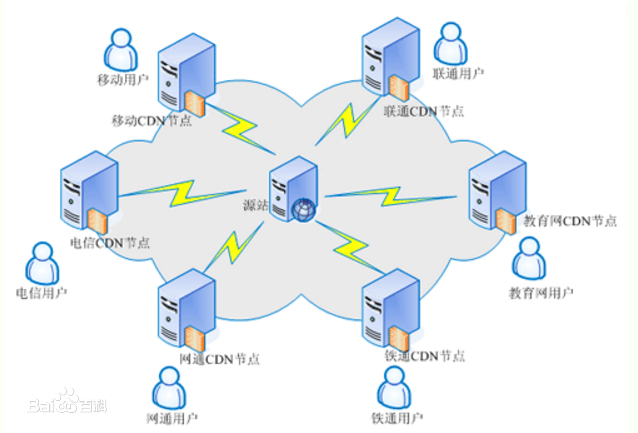

# 1.1 域名

## 域名

**域名**：由一串用点分隔的名字组成的Internet上某一台计算机或计算机组的名称，用于在数据传输时对计算机的定位标识（有时也指地理位置）。

## 二级域名和多级域名

### 二级域名分类

1. 在国际顶级域名下的二级域名

国际顶级域名下二级域名， 二级域名一般是指域名注册人选择使用的网上名称，如“[yahoo.com](http://yahoo.com)”；上网的商业组织通常使用自己的商标、商号或其他商业标志作为自己的网上名称，“[microsoft.com](http://microsoft.com)”。

2. 国家顶级域名下二级域名

在国家顶级域名之下二级域名一般是指类似于国际顶级域名的表示注册人类别和功能的标志。例如，在“.[com.cn](http://com.cn)”域名结构中，“.com”此时是置于国家顶级域名“.cn”下的二级域名，表示商业性组织，以此类推。

## 域名发现对于安全测试意义

可以给安全测试提供更多的测试点，方便获取更多相关信息

# 1.2 DNS

## DNS定义

**域名系统(Domain Name System)**:是一个域名和IP地址相互映射的一个分布式数据库，能够使人更方便地访问互联网。DNS使用UDP协议，端口53。对于每一级域名长度的限制是63个字符，域名总长度则不能超过253个字符。

## 本地 HOSTS 与 DNS 的关系

Hosts在本地将一些**常用的网址域名与其对应的IP地址建立一个关联“数据库”**，当我们访问域名时，系统会**首先**自动从Hosts文件中寻找对应的IP地址，一旦找到，系统会立即打开对应网页，如果没有找到，则系统会再将网址提交DNS域名解析服务器进行IP地址的解析。

hosts文件地址：C:\Windows\System32\drivers\etc\hosts

## CDN 及其与 DNS 的关系

### CDN

是构建在数据网络上的一种分布式的内容分发网。 可以提高系统的响应速度，也可以一定程度的拦截/防御攻击。

### 对照实验

#### 实验1

**实验1**：使用[超级ping](https://ping.chinaz.com/)对某个域名进行解析

**现象**：发现不同地点解析到的IP地址不同。访问域名时会寻找**网络最好、通信最快的CDN节点并访问该CDN节点而不是直接访问源站**，CDN节点存放着源站的缓存，由此提高响应速度。

**安全意义**：网站的真实数据、核心内容在源站，而不在节点处，若对该域名进行扫描，实际扫描的是CDN的内容，而不能触及网站核心。

#### 实验2

**实验2**：修改DNS服务器地址是否会影响域名解析结果

**实验过程：**

1. 修改配置：设置——网络设置——更改适配器选项——以太网(网络2)——属性——IPv4协议——使用下面的DNS服务器地址

2. 刷新DNS缓存命令：命令行窗口，输入ipconfig /flushdns.

3. 重新ping：发现解析到的IP地址不变

**实验结论：**

**DNS服务器解析到的CDN节点一般根据所在位置就近选择，跟DNS服务器的更换没有关系**

## 常见的 DNS 安全攻击

### 缓存投毒

它是利用虚假Internet地址替换掉域名系统表中的地址，进而制造破坏。

### DNS劫持

是指在劫持的网络范围内拦截域名解析的请求，分析请求的域名，把审查范围以外的请求放行，否则返回假的IP地址或者什么都不做使请求失去响应，其效果就是对特定的网络不能访问或访问的是假网址。（针对面较广）

### 域名劫持

域名劫持就是在劫持的网络范围内拦截域名解析的请求，分析请求的域名，把审查范围以外的请求放行，否则直接返回假的IP地址或者什么也不做使得请求失去响应，其效果就是对特定的网址不能访问或访问的是假网址。（针对面窄一点）

### DNS DDOS攻击

通过控制大批僵尸网络利用真实DNS协议栈发起大量域名查询请求，利用工具软件伪造源IP发送海量DNS查询，发送海量DNS查询报文导致网络带宽耗尽而无法传送正常DNS查询请求。

# 1.3 脚本语言

## 常见的脚本语言类型

asp **php** aspx jsp **javaweb** pl py cgi 等

## 不同脚本类型与安全漏洞的关系

不同脚本可能爆发漏洞的可能性有所不同

不同脚本漏洞的存在机制可能不同，因为不同语言的适用范围不同

# 1.4 后门

## 什么是后门？

通常指那些**绕过安全性控制而获取对程序或系统访问权的程序方法**。

在软件的开发阶段，程序员常常会在软件内创建后门程序，以便可以修改程序设计中的缺陷。

## 后门在安全测试中的实际意义

可以更方便的链接到主机

在获取到主机权限的时候，后门可以充当命令控制台的角色

# 1.5 WEB

## WEB 的组成架构模型

**网站源码**：分脚本类型(如java易出现反序列化、代码执行漏洞；php易出现上传漏洞)，分应用方向(博客、论坛、服务)

**操作系统**：Windows  Linux

**中间件（即搭建平台）**：Apache iis Tomcat Nginx 等

**数据库**：Access Mysql Mssql Oracle sybase db2 postsql 等

**因此漏洞的挖掘从以上4个方面入手去判别**

## 为什么首先要从 WEB 层面漏洞为主

- web使用的比较广

- web网站了漏洞相对较多，比操作系统漏洞(一年一两个)多

- web 作为跳板深入到其他资源相对容易

# 1.6 WEB 相关安全漏洞

找漏洞即根据以下各种层面去寻找漏洞

**WEB 源码类对应漏洞**

SQL 注入，文件上传，XSS，代码执行，变量覆盖，逻辑漏洞，反序列化等

**WEB 中间件对应漏洞**

未授权访问，变量覆盖...

**WEB 数据库对应漏洞**

弱口令(账号密码)，权限提升...

**WEB 系统层对应漏洞**

提权，远程代码执行

**其他第三方对应漏洞**

**APP 或 PC 应用结合类**

# 附：本节资源

[逍遥安卓模拟器](http://www.xyaz.cn/)

[进程抓包工具WSExplorer](http://www.downcc.com/soft/11196.html)

https://github.com/quasar/QuasarRAT/releases

https://pan.baidu.com/s/13_i1ExwEaA59GfMt1Rp0Hg提取码: 0b7b