# 2.1 https与http

## http/s数据包请求与响应

### 图示

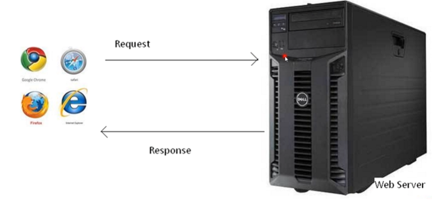

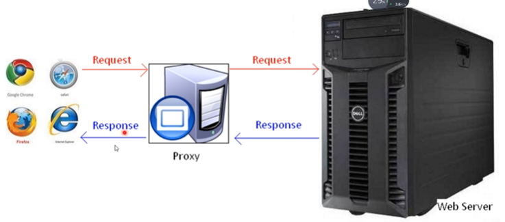

**注：**

- Request 请求数据包

- Proxy 代理服务器——如burpsuite

- Response 返回数据包

## http与https具体区别

1. 结构层数不同：http三层，https四层：HTTP协议运行在TCP之上，所有传输的内容都是明文；HTTPS运行在SSL/TLS之上，SSL/TLS运行在TCP之上，所有传输的内容都经过加密的。
	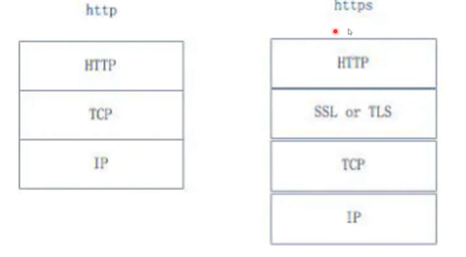
2. 访问速度不同：http明文传输，没有加密；https明文传输，要加密，从而访问速度比http慢一些
3. 访问端口不同：HTTP和HTTPS使用的是完全不同的连接方式，用的端口也不一样，前者是80，后者是443。
4. 是否需要证书：HTTPS协议需要到CA申请证书，一般免费证书很少，需要交费。
5. 防止运营商劫持：HTTPS可以有效的防止运营商劫持，解决了防劫持的一个大问题。

## http简要通信过程

建立连接→发送请求数据包→返回响应数据包→关闭连接

1. 浏览器建立与web服务器之间的连接
2. 浏览器将请求数据打包(生成请求数据包)并发送到web服务器
3. web服务器将处理结果打包(生成相应数据包)并发送给浏览器
4. web服务器关闭连接

## https简要通信过程

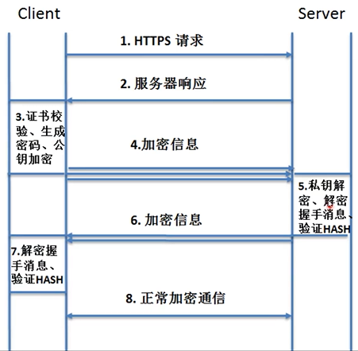	

# 2.2 Request 请求数据包数据格式

1. **请求行：请求行由三个标记组成：请求方法、请求 URL 和 HTTP 版本，它们用空格分隔。如：GET / HTTP/1.1 。** **HTTP 规定了 8 种可能的请求方法：**
   1. **GET**：检索 URL 中标识资源的一个简单请求
   2. **HEAD**：与 GET 方法相同，服务器只返回状态行和头标，并不返回请求文档
   3. **POST**：服务器接受被写入客户端输出流中的数据的请求
   4. PUT：服务器保存请求数据作为指定 URL 新内容的请求
   5. DELETE：服务器删除 URL 中命令的资源的请求
   6. OPTIONS：关于服务器支持的请求方法信息的请求
   7. TRACE：web服务器反馈 Http 请求和其头标的请求
   8. CONNECT ：已文档化，但当前未实现的一个方法，预留做隧道处理
2. **请求头：由关键字/值对组成，每行一对，关键字和值用冒号分开。请求头标识服务器、客户端的功能和标识**
   1. **HOST**: 主机或域名地址
   2. **Accept**：指浏览器或其他客户可以接爱的 MIME 文件格式。Servlet 可以根据它判断并返回适当的文件格 式。
   3. **User-Agent**：是客户浏览器名称
   4. **Host**：对应网址 URL 中的 Web 名称和端口号。
   5. **Accept-Langeuage**：指出浏览器可以接受的语言种类，如 en 或 en-us，指英语。
   6. **connection**：用来告诉服务器是否可以维持固定的 HTTP 连接。HTTP 是无连接的，HTTP/1.1 使用
   7. **Keep-Alive**：为默认值，这样，当浏览器需要多个文件时(比如一个 HTML 文件和相关的图形文件)，不需要每次都建立连接
   8. **Cookie**：浏览器用这个属性向服务器发送 Cookie。Cookie 是在浏览器中寄存的小型数据体，它可以记载 和服务器相关的用户信息，也可以用来实现会话功能。
   9. **Referer** ： 表明产生请求的网页URL(判断点击来源，从其它网站点击过来的就有这个值，直接访问时一般为空) 。比如从 网 页/icconcept/index.jsp 中 点击一个链接到页/icwork/search，在向服务器发送的GET/icwork/search中的请求中，Referer是http://hostname:8080/icconcept/index.jsp。这个属性可以用来跟踪Web 请求是从什么网站来的。
   10. **Content-Type**：用来表明 Request 的内容类型。可以用 HttpServletRequest 的getContentType()方法取得。
   11. **Accept-Charset**：指出浏览器可以接受的字符编码。英文浏览器的默认值是 ISO-8859-1.
   12. **Accept-Encoding**：指出浏览器可以接受的编码方式。编码方式不同于文件格式，它是为了压缩文件并加速文件传递速度。浏览器在接收到 Web 响应之后先解码，然后再检查文件格式。
3. **空行：最后一个请求头标之后是空行，发送回车符和退行，通知服务器以下不再有头标。**
4. **请求体：要发送的数据(一般post提交会使用)，如搜索时提交的参数**

```http
GET /eams/home.action HTTP/1.1
Host: jwgl-cuit-edu-cn.webvpn.cuit.edu.cn:8118
Connection: keep-alive
Cache-Control: max-age=0
Upgrade-Insecure-Requests: 1
User-Agent: Mozilla/5.0 (Windows NT 10.0; Win64; x64) AppleWebKit/537.36 (KHTML, like Gecko) Chrome/96.0.4664.110 Safari/537.36
Accept: text/html,application/xhtml+xml,application/xml;q=0.9,image/avif,image/webp,image/apng,*/*;q=0.8,application/signed-exchange;v=b3;q=0.9
Referer: <http://jwgl-cuit-edu-cn.webvpn.cuit.edu.cn:8118/eams/;jsessionid=456A0792FB95F1E29885E4934D94FE8F>
Accept-Encoding: gzip, deflate
Accept-Language: zh-CN,zh;q=0.9
Cookie: JSESSIONID=456A0792FB95F1E29885E4934D94FE8F; UM_distinctid=17d953d573319c-06e63c14755e8b-978183a-144000-17d953d5734662; TWFID=5e0fb9aa79719f3b; GSESSIONID=456A0792FB95F1E29885E4934D94FE8F
```

# 2.3 Response返回数据包数据格式

## 响应的组成

一个响应由四个部分组成；状态行、响应头标、空行、响应数据。

1. **状态行**：协议版本、数字形式的状态代码和状态描述，个元素之间以空格分隔
2. **响应头**：像请求头一样，它们指出服务器的功能，标识出相应数据的细节。包含服务器类型、日期、长度、内容类型等
3. **空行**：最后一个响应头标之后是一个空行，发送回车符和退行符，表示服务器头标结束。即响应头与响应体之间用空行隔开
4. **响应数据**：浏览器会将实体内容中的数据取出来，生成相应的页面，即返回的HTML文档和图像，也就是HTML本身

```http
HTTP/1.1 200 OK              //状态行
//响应头标如下所示
Content-Type: text/html;charset=UTF-8
Transfer-Encoding: chunked
Connection: keep-alive
Server: Apache-Coyote/1.1
X-UA-Compatible: IE=edge
vary: accept-encoding,origin,accept-encoding
Date: Wed, 05 Jan 2022 04:34:27 GMT
```

## HTTP响应码(状态码)

- **1xx：收到信息，请求，正在处理**，网络极慢时可以看到
- **2xx：成功，请求被成功地接受、理解和采纳**
  - 200 存在文件
- **3xx：重定向**，为了完成请求，必须进一步执行的动作，服务器为客户端重定向到另一个URL
  - 302 重定向
  - 304 缓存：目前已经访问过，存在缓存，服务器返回304说明没有改动，不作处理
  - 3xx 均可能存在文件
- **4xx：客户端错误**
  - 403 存在文件夹
  - 404 不存在文件及文件夹
- **5xx：服务器错误**
  - 503 服务器的服务不可达如服务器服务崩溃
  - 500 均可能存在文件

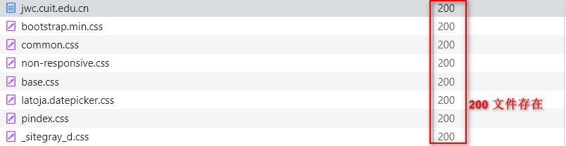

即可以通过Response响应包的状态码，判断访问的文件或文件夹是否存在，**这即是扫描工具的实现原理**

# 2.4 演示案例

## Burpsuite抓包修改测试

### 原理

Burpsuite类似一个代理服务器，浏览器的数据包(请求和响应)都要先经过Burpsuite，设置Burpsuite监听端口和浏览器使用的代理端口一致

### 结论

在修改数据包后提交到网站时，不能只修改提交内容(如修改后的SQL语句来测试SEQ注入漏洞)，而且要注意修改HTTP的头部信息，比如APP访问网站的漏洞，在Burpsuite构造的数据包就要符合APP访问网站的数据包格式，否则访问会出错。在对网站渗透测试时要先确定正常访问能够进行，再考虑修改数据包以及修改提交内容。

## 敏感文件扫描工具简要实现

## 第三方检测修改实现XSS攻击

## 数据报相关检测对比(APP与直接访问)

## CTF或实际应用中部分考题解析(mozhe)

资源：www.mozhe.cn

### 来源页伪造——HTTP头部的Referer字段

墨者学院——在线靶场——网络安全——来源页伪造——支付墨币——点击访问

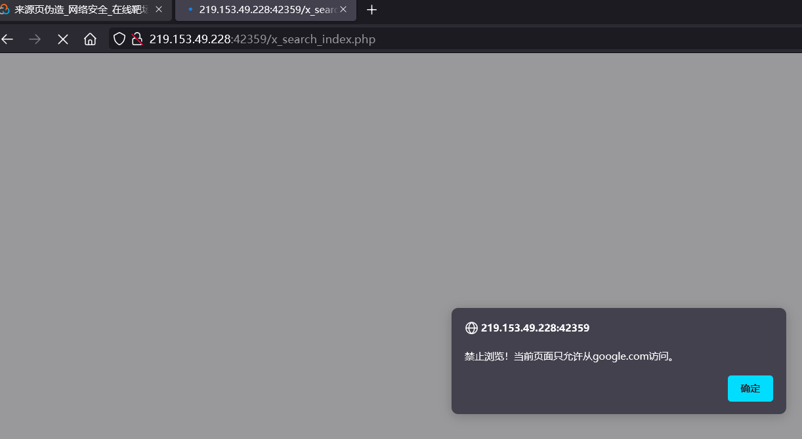

提示只允许从谷歌访问，启动Burpsuite进行抓包如下

```http
GET /x_search_index.php HTTP/1.1
Host: 219.153.49.228:42359
User-Agent: Mozilla/5.0 (Windows NT 10.0; Win64; x64; rv:96.0) Gecko/20100101 Firefox/96.0
Accept: text/html,application/xhtml+xml,application/xml;q=0.9,image/avif,image/webp,*/*;q=0.8
Accept-Language: zh-CN,zh;q=0.8,zh-TW;q=0.7,zh-HK;q=0.5,en-US;q=0.3,en;q=0.2
Accept-Encoding: gzip, deflate
Connection: close
Referer: http://219.153.49.228:42359/index.html  //当前的Referer：说明当前是从此地址过来的。此字段不符合访问要求
Upgrade-Insecure-Requests: 1
```

注意HTTP头部的Referer字段：**Referer** ： 表明产生请求的网页URL(判断点击来源，从其它网站点击过来的就有这个值，直接访问时一般为空) 。比如从网页/icconcept/index.jsp中点击一个链接到页/icwork/search，在向服务器发送的GET/icwork/search中的请求中，Referer是http://hostname:8080/icconcept/index.jsp。**这个属性可以用来跟踪Web 请求是从什么网站来的**。因此只需要修改此字段为www.google.com

```http
GET /x_search_index.php HTTP/1.1
Host: 219.153.49.228:42359
User-Agent: Mozilla/5.0 (Windows NT 10.0; Win64; x64; rv:96.0) Gecko/20100101 Firefox/96.0
Accept: text/html,application/xhtml+xml,application/xml;q=0.9,image/avif,image/webp,*/*;q=0.8
Accept-Language: zh-CN,zh;q=0.8,zh-TW;q=0.7,zh-HK;q=0.5,en-US;q=0.3,en;q=0.2
Accept-Encoding: gzip, deflate
Connection: close
Referer: http://www.google.com/    //此字段修改
Upgrade-Insecure-Requests: 1

```

成功访问网站


### 浏览器信息伪造——User-Agent字段伪造

墨者学院——在线靶场——网络安全——浏览器信息伪造——支付墨币——点击访问

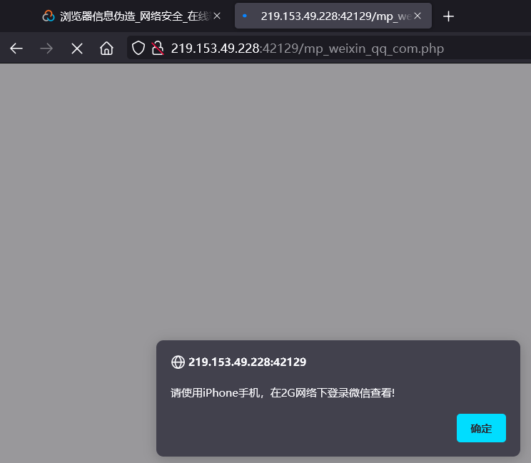

提示“请使用iPhone手机，在2G网络下登录微信查看!”，启动Burpsuite进行抓包如下

```http
GET /mp_weixin_qq_com.php HTTP/1.1
Host: 219.153.49.228:42129
User-Agent: Mozilla/5.0 (Windows NT 10.0; Win64; x64; rv:96.0) Gecko/20100101 Firefox/96.0
Accept: text/html,application/xhtml+xml,application/xml;q=0.9,image/avif,image/webp,*/*;q=0.8
Accept-Language: zh-CN,zh;q=0.8,zh-TW;q=0.7,zh-HK;q=0.5,en-US;q=0.3,en;q=0.2
Accept-Encoding: gzip, deflate
Connection: close
Referer: http://219.153.49.228:42129/index.html
Upgrade-Insecure-Requests: 1
```

这是一个我们自己浏览器的数据包，需要修改成和iPhone、2G网络下的数据包一致才可访问。又根据提示解题方向“根据页面提示,抓包分析除了判断浏览器类型还判断了微信特有的NetType”，百度这个NetType：[微信6.0内嵌浏览器User-Agent字符串增加了NetType字段](https://blog.csdn.net/lilin_emcc/article/details/40145113)。

从微信6.0开始，其内嵌的浏览器在User Agent字符串中增加了NetType字段用于标识客户端（手机）当前的网络环境，经测试，该字段至少有以下3个取值：

- NetType/WIFI
- NetType/2G
- NetType/3G+

分别对应于Wifi、2G、3G以上网络环境。因此，Web服务器可以据此识别客户端网络环境并提供有针对性的内容。

使用如下测试数据修改要提交的数据包的User Agent信息并提交，适用于iPhone 5 / iOS 8.0 / 2G：

```http
Mozilla/5.0 (iPhone; CPU iPhone OS 8_0 like Mac OS X) AppleWebKit/600.1.4 (KHTML, like Gecko) Mobile/12A365 MicroMessenger/6.0 NetType/2G
```

即

```HTTP
GET /mp_weixin_qq_com.php HTTP/1.1
Host: 219.153.49.228:42129
User-Agent: Mozilla/5.0 (iPhone; CPU iPhone OS 8_0 like Mac OS X) AppleWebKit/600.1.4 (KHTML, like Gecko) Mobile/12A365 MicroMessenger/6.0 NetType/2G  //此字段已修改
Accept: text/html,application/xhtml+xml,application/xml;q=0.9,image/avif,image/webp,*/*;q=0.8
Accept-Language: zh-CN,zh;q=0.8,zh-TW;q=0.7,zh-HK;q=0.5,en-US;q=0.3,en;q=0.2
Accept-Encoding: gzip, deflate
Connection: close
Referer: http://219.153.49.228:42129/index.html
Upgrade-Insecure-Requests: 1
```

成功访问

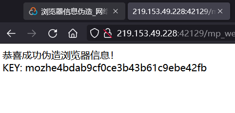


### HTTP动作练习

墨者学院——在线靶场——网络安全——HTTP动作练习——支付墨币——点击访问

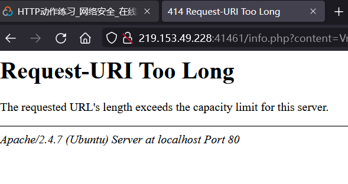

启动Burpsuite进行抓包如下

```http
GET /info.php?content=Vm0wd2QyUXlVWGxWV0d4V1YwZDRWMVl3WkRSV01WbDNXa1JTV0ZKdGVGWlZiVFZyVmxVeFYyTkljRmhoTWsweFZtcEdTMk15U2tWVWJHaG9UVmhDVVZadE1UUlRNazE1Vkd0c2FsSnRhRzlVVjNOM1pVWmFkR05GWkZSTmF6RTFWVEowVjFaWFNraGhSemxWVmpOT00xcFZXbUZrUjA1R1pFWlNUbFpYZHpGV1ZFb3dWakZhV0ZOcmFHaFNlbXhXVm0xNFlVMHhXbk5YYlVacVZtdGFNRlZ0ZUZOVWJVcEdZMFZ3VjJKVVJYZFpWRVpyVTBaT2NscEhjRk5XUjNob1YxZDRVMUl5VW5OWGJHUllZbFZhY2xWcVFURlNNWEJHVjJ4T1ZXSkdjRlpXYlhSM1ZqSktWVkpZWkZwV1JYQklWbXBHVDFkV2NFZGhSMnhUVFcxb1dsWXhXbXROUjFGNVZXNU9hbEp0VWxsWmJGWmhZMVphZEdSSFJrNVNiRm93V2xWYVQxWlhTbFpqUldSYVRVWmFNMVpxU2t0V1ZrcFpXa1p3YkdFelFrbFdiWEJIVkRKU1YxZHVUbFJpVjNoVVZGY3hiMWRzV1hoYVJGSnBUV3RzTTFSVmFHOVhSMHBJVld4c1dtSkhhRlJXTUZwVFZqSkdSbFJzVG1sU2JrSmFWMnhXWVZReFdsaFRiRnBZVmtWd1YxbHJXa3RUUmxweFUydGFiRlpzV2xwWGExcDNZa2RGZWxGcmJGaFhTRUpJVmtSS1UxWXhXblZVYkdocFZqTm9WVlpHWTNoaU1XUkhWMjVTVGxaRlNsaFVWM2hIVGxaYVdFNVZPVmhTTUZZMVZsZDRjMWR0U2toaFJsSlhUVlp3V0ZreFdrdGpiVkpIVld4a2FWSnRPVE5XTW5oWFdWWlJlRmRzYUZSaVJuQnhWV3hrVTFsV1VsWlhiVVpPVFZad2VGVXlkREJXUmtwelYyeHdXR0V4Y0hKWlZXUkdaVWRPU0U5V1pHaGhNSEJ2Vm10U1MxUXlVa2RUYmtwb1VqSm9WRmxZY0ZkbGJHUllaVWM1YVUxWFVraFdNalZUVkd4S1JsZHVTbFZXYkZwNlZHeGFZVmRGTlZaUFZtaFRUVWhDU2xac1pEUmpNV1IwVTJ0a1dHSlhhR0ZVVnpWdlYwWnNObEpzWkdwaVNFSklWMnRrYzFVeVNuSlRiVVpYVFc1b1dGZFdXbEpsUm1SellVWlNhRTFzU25oV1YzUlhXVlpaZUZkdVJsVmlWR3h6V1d0YWQyVkdWWGxrUjNSb1lsVndWMVp0Y0dGWGJGcFhZMGhLVjFaRldreFdNVnBIWTIxS1IyRkdhRlJTVlhCS1ZtMTBVMU14VlhoWFdHaFhZbXhhVjFsc2FFTldSbXhaWTBaa2EwMVdjREJaTUZZd1lWVXhXRlZyYUZkTmFsWlVWa2Q0WVZKc1RuTmhSbFpYWWtaWk1GWkhkR0ZaVm1SSVZXdG9hMUp0YUZSWmJGcExVMnhrVjFadFJtcE5WMUl3VlRKMGExZEhTbGhoUjBaVlZucFdkbFl3V25KbFJtUnlaRWR3YVZacmNFbFdiR1EwWVRKR1YxTnVVbEJXUlRWWVZGYzFiMWRHYkhGVGExcHNVbTFTV2xkclZURlhSa3BaVVd4c1dGWnRVVEJYVm1SSFVqRmFXVnBIYUZOV1ZGWlZWbGN4TkdReVZrZFdiR1JvVW5wc2IxUldXbmRsYkZsNVkwVmtWMDFFUmpGWlZXaExWakpHY2xkcmVGZGhhM0JRVldwS1IxSXlSa2hpUms1cFlUQndNbFp0TVRCVk1VMTRWVmhzVm1FeVVsVlpiWFIzWVVaV2RFMVhPV3BTYkhCNFZrY3dOVmRHV25OalJteGFUVVpWTVZsV1ZYaGpiVXBGVld4a1RtRnNXbFZXYTJRMFdWWktjMVJ1VG1oU2JGcFlXV3RhV2sxR1drZFZhMlJXVFZac05WVnRkR0ZWUmxsNVlVaENWbUpIYUVOYVJFWmhZekZ3UlZWdGNFNVdNVWwzVmxSS01HRXhaRWhUYkdob1VtMW9ZVlpyVm1GTk1WcHlWMjFHYWxacmNEQmFSV1F3VlRKRmVsRllaRmhpUmxwb1dWUktSMVl4VG5WVWJXaE9UVzFvV1ZaR1dtRlRNVlpIWTBWV1UyRXpRbk5WYlRGVFRWWlZlV042UmxkTlZuQjZXVEJhVjFkR1dYcFZia3BhWVd0YWVsWnFTa3RTTWtaSVkwZDRhRTFZUWpSV01XUXdXVmRSZVZaclpGZGliRXBQVm14a1UxWXhVbGhrU0dSWFRWZDRlVlpYTVVkWFJrbDNWbXBTV2sxSGFHaFdha3BIWTIxT1JtVkdXazVXYmtKSlYxaHdSMVl5VFhsU2EyaHBVbXMxY0ZVd1ZrdE5iRnB4VW0xR1ZrMVZNVFJXVnpWVFZqSkZlVlZ0YUZaTlJuQm9WbXBHYzJNeGNFVlZiR1JUWWxob1lWZFVRbUZoTWtWM1RWWmthbEpGU21GVVZWcGFaREZzVjFaWWFGaFNiRnA2V1ZWYWExUnNXWGxoUkVwWFRWWndhRlY2UmtwbFJsSjFWbXhLYVZKc2NGbFdSbEpIVXpBMWMxZHJaRlpoTWxKWFZGWmFkMDFHVm5Sa1J6bFdVbXhzTlZsVmFFTldiVXBJWVVWU1YwMXVhSEpXYWtaaFpFVTVWMVpyTlZkaWEwWXpWbXhqZDAxV1RYaFhhMmhVWWtkb2IxVnFRbUZXYkZwMFpVaGtUazFXY0hsV01qRkhZV3hhY2s1WWJGaGhNWEJRV1ZaYVMyTnRUa1ZYYkdScFVqQTBNRmRZY0VkV2JWRjNUVlprV0dKWGVITlpWRVozVjFaa1dHVkhPVkpOVlRFMFdUQmFZVll4WkVoaFJsSlZWbTFTVkZwWGVITldiR1J6Vkcxb1YyRXpRWGhXVm1NeFlqRlplRmRZY0doVFJYQllWbXRXWVdOc1ZuRlNiR1JxVFZoQ1NGbFZaRzlVYXpGV1kwWmtWMkpIVGpSVWEyUlNaVlphY2xwR1pHbGlSWEJRVm0xNGExVXhXbk5WYkdoclUwZFNWRlJXWkRCTk1WbDVUVlZrVjAxcmNFaFphMUpoVjJ4YVYxTnNRbGROYWtaSFdsWmFWMk5zY0VoU2JHUlhUVlZ3VWxac1VrZGhNVTE0VTFob2FsSlhVbWhWYkZKWFZERldjMkZGVGxSTlZuQjRWVzB4UjFack1WWk5WRkpYVm0xb2VsWnNXbXRUUjBaSlVteGFhVkl4UlhkV2JURTBZekpOZUdORmFGQldiVkpVV1d0V2QxZHNXa2hsUjNCUFZteHNORll5TlU5aGJFcFlZVVpvVjJGck5WTmFSRVp6VmpGYVdXRkhjR2xXV0VKSFZteGtOR0V4VW5OWFdHeG9Va1Z3V0ZSV1duZGhSbFkyVW10d2JGSnNTakZXUnpGSFZUSktSMk5HYkZoV00xSm9Xa2N4VjJNeFpISmFSbVJwVmxad2FGWnRjRWRUTVVsNFZXNU9XR0pWV2xkVmJYaHpUbFpzVm1GRlRsZGlWWEJKV1ZWV1QxbFdTa1pYYmtwWFlXdGFhRnBGVlRWV01WcHlUbFprYVdFd1dYcFdiWGhUVXpBMVNGUllhRmhpUjFKb1ZXeGtiMkl4Vm5GUmJVWlhZa1p3TUZwVmFHdFVhekZYWTBoc1YwMXFSa2haVjNoaFkyMU9SVkZ0UmxOV01VWXpWbTF3UzFNeVRuTlVia3BxVW0xb2NGVnRlSGRpTVZweVZXdDBVMDFXYkRSV1Z6VkxWMGRLUjFOdVFsZGlSbkF6VmpGYWExWXhWbkphUjNST1lURndTVmRYZEc5U01WcElVbGhvYWxORk5WZFpiRkpIVmtaU1YxZHNXbXhXTURReVZXMTRiMVV5UlhwUmJVWlhWbTFSTUZwRVJscGxWazV6WWtaYWFWSXlhRzlXVjNSWFdWZE9jMVp1UmxOaVdGSnlWbTE0WVdWV1VuTlhiWFJwVWpCd1dsbFZVbUZXTURGWVZWaGtXRlp0VWxOYVZscGhZMnh3UjFwR2FGTk5NbWcxVm14a2QxUXhWWGxUV0docFUwVTFXRmx0TVZOWFJsSlhXa1JDVGsxV2NEQlVWbFpyVmpBeFJWSnNhRnBoTVVwb1ZqSjRZVmRHVm5WWGJHUk9ZbTFvYjFacVFtRldNazV6WTBWb1UySkhVazlVVnpGdlUyeFplRlZyZEd4aVZscElWakZvYjJGc1NsaFZiV2hXWWtaS1dGWkVSbGRqTWtaR1ZHeFNUbFp1UWpSV1Z6QjRVakZhY2sxV1dtbFNSbHBYV1d0a2IyUnNXWGRYYlhSVVVqRmFTRll5ZUhkV01VcFhZak53VjJGcldtaFpla1pyVjBaU2NtSkdWbWxTTW1oVlYxZDRiMkl3TlZkWGJsSk9Va1ZhYjFSV1duTk9WbFY1WkVkMGFHSkZjREJhVldSdlZqSktSMk5FVGxwTmJtaDZWbXhhUjFkWFJrZGhSazVwVW01Qk1WWXhXbGRaVjBWNFZXNU9XRmRIZUc5VmExWjNWMFpzV0dSRmRHcGlSbGt5VlcweE1GWXdNVmRqUkVaWFlsaG9XRmxXV2s5U2JFNXpZMFprVjFKVmNGbFdXSEJIVkRGWmVGcElWbE5pUlRWd1ZteGFkMkZHV25SalJXUlVUVlZzTkZaWE5VOVhSMHBXVjJ4a1ZtSllhRE5VVlZwelZteGtjMVJzWkZkaVNFSlpWMVJDYTFJeFdsZFhiazVxVTBWd1dGbFhkR0ZoUm5CR1ZsUldWMDFXU25sVWJGcHJWR3N4ZEdGSFJsZGlWRVl6VldwS1NtVldWbGxoUm1ocFlrVndWbGRYZEd0aU1rbDRWbTVTVGxaNmJGaFphMXAzWld4WmVVNVhkRlZoZWtaYVZWZDRjMWxXV2xoaFJrSlhVa1Z3VEZWdE1VOVNWa1owVW14T1YwMVZXWHBXYlhoVFV6RktkRlp1VGxOaWExcFpXV3RrVTJOR1ZuRlJWRUpPVW0xU1dsa3dWbXRXTWtwWFYyeG9WMUo2Vmt4WlZscExZMjFPU1ZGc1pHbFNia0Y2Vm1wR1lWbFdTWGhpUkZwVFlrWndUMVpxUmt0VFZscHhVMnBTVjAxV1ZqVlZNblJyWVd4T1JrNVdhRnBpUjJoVVZGUkdkMWRIVmtoa1IzQnBVakZLTmxaclpEUmlNVlY1VWxoc2EyVnJTbGhXYTFaeVpVWnNjVkpzY0d4U2JWSmFXVEJrYjFaR1NsbFJiV2hZVm0xUmQxZFdaRmRqTVdSMVVteE9hVkl4U25oV1JscHJWVEF4UjFadVVteFNWR3h3VldwQ2QxZHNiRlpWYTNSWFRXdHdTVlpIY0ZOV1YwVjVWV3hPWVZac2NHaFpNbmgzVWpGd1IyRkdUazVOYldjeFZtMTRhMDFHV1hoVVdHaGhVbGRTV0ZsdGVFdGpiRlYzVmxSR1ZVMVdTbGhXTWpWUFZERmFkVkZyWkZoaE1WcHlWbXBCZUZKV1NuTmFSbkJvVFZWd2IxWnFTalJaVm1SSFZtNVdXR0pIVW05WlZFNURVMVprVlZOcVVsUk5helZZVmxjMVUxVXlTa1pPVmxKWFlrWndZVlJWV21Gak1YQkZWV3h3VjJFeWR6RldhMXB2WWpKR2MxTnNhR2hTZW14WFdWZDBkMlJzV2tWU2JGcHJUVlp3ZVZwRlZURmhWa3AxVVZoa1YxSnNjRlJXVkVaaFkyc3hWMWRyTlZkU2EzQlpWbTB3ZUdJeVZuTlhibEpPVmxad2MxWnRlR0ZsYkZsNVpVaGthRlp0VWtoVk1XaDNWMFpaZWxGcmFGZGhhM0JRVm1wR1UyUldTbk5YYld4VFRWVndWbFl4WkRSaU1rbDRZa1prWVZKc1dsTlpiRlpoWWpGU1YxZHVaR3hpUmxZMVZHeGFUMVl5U2xaalJXeGhWbFp3YUZacVNrdFRSbFoxVjIxR1UwMHlhRFpXYlhCSFdWWmtXRkpyWkdGU1ZGWllWRlpXYzA1R1dYaFZhMDVhVmpCV05GWlhOVk5WTWtweVRsWnNXbUV4Y0doV01WcGhaRVV4VjFOck5WTmlSbXQ1Vmxjd2VGSXlSblJTYWxwWFlrZG9XVmxVU2xOa2JGcFZVMnQwVTAxck5VaFphMXB2VmpBd2VGTnRPVmRoYTNBMldsVmFTbVZHY0VsVGJXaFRUVEpvVlZaR1ZtRmtNa1pIVjI1U1RsWkdTbkZVVlZKWFYwWmFkRTVXVG1oTlZXOHlXV3RhYTFadFNsbGhSRTVWVmxad2VsWnRlR3RqTVZKeldrWmthVk5GU2xwV01WSkRZVEZKZUZkc1pGaGlhelZ4VlRCV2QxbFdjRmhrUjBab1VtNUNSMVpzVWxkV01ERlhVMjVzVldKR2NISlpWbVJHWkRGa1dXTkdaR2xYUjJoVlZsaHdRazFXU1hoYVJteG9VbTFTV1ZWcVRtOVdiR1JYVld0MFZrMVdjRmhaYTJoUFZqSktWbGRzYUZwaE1YQXpWRlphY21ReFpIUmtSMmhPWVROQ1NWZFVRbTlqTVZsM1RWaFdhRkpGTldGV2ExWkhUa1paZUZkclpHcGlWVnBJV1ZWa2IxUnNaRVpUYkZwWFlsaG9WRlY2Umt0a1JscDFWR3hPYVdFeGNGcFhWM1JyVlRGUmVHSklVbXhTV0ZKWlZXMTRkMU5HV1hsTlZXUllVakJ3V0ZWdGNFOVdWbHB6VjI1d1dsWnNjRXRhVm1SSFVqRldjMVpzWkd4aE1XOTVWbTF3UjFsV2JGZFRXR2hoVTBaS1ZGbHJXa3RVTVZwellVVk9WRlpzY0hoVk1WSkhWbXN4Y2xkcVFsZGlWRlpNVmpCa1MxTkhSa2RYYkdScFZrVmFWVlp0ZEdGa01XUklWbXRrYWxJemFGaFVWVkpTWlZaYVdFMVVVbWhOVmtwNlZqSTFWMVZ0Um5OalJteFhZVEZhVEZsVldtRldWa3AwWkVaT1RsWXhTWGhXYkdRMFdWWlplRk5zV21wU2JrSllXV3hTUTA1R1dsVlNhemxUVFZad01WVnRlRTloVm1SSFUyNXNWMkpVUlRCVmVrcFhZekpLUjFkdFJsUlNWRlpZVmtaa01HUXlWbGRXV0d4c1VsZFNXRlJYZEhkV2JGWllZMFpPVjFZd1ZqVldWM2hQV1ZaYWMyTkhhR0ZTYkhCVVdrVmFTMk14Vm5OVWJHaFRWbGhDYUZadGNFZFpWMFYzVFZWa1ZWZEhhRmxXTUdSdlZqRnNjbGR1WkZkTlYzaFdWVEo0VDFkR1duTmpSRUpoVmxkb2NsWXdXbUZrVmtaeldrWndWMVl4UmpOV2FrSmhVMjFSZUZwR1ZsUmlSbkJ3VmpCYVMwNXNXblJqUldSWVlsWmFlbFp0TlZkWFIwcElWVzA1V2xaRk5VUlZNVnByVmxaT1dXRkdWazVXV0VGM1ZtMHhNR0V4WkVoU2FscFhZa2RvWVZsc2FGTlVSbFY1WlVad2JGSXdXa3BYYTFwUFZHeFplbUZHY0ZkaE1YQjJXV3BLUjJNeFRuTmhSbHBwVW01Q2FGZFhkR3RpTWxKellraEdVMkpGTlZoVVZtUlRaV3hyZDFwRVVtaFdhM0F4VlZab2ExZEdXa1pUYkdoYVZrVmFjbGw2Um10WFZuQkhXa2RvYVZKWVFscFdNV1F3WVRKSmVWVnVUbGhpYXpWb1ZXeGFkMk14V25SbFIwWnNZa1p3TUZwVmFHdGhSbHAwVld0b1ZrMVhhRE5XTUZwaFl6RmtkR0ZHWkdoaE0wSlZWbGN4ZW1WR1dYbFNhMlJTWWtkU1QxUlZWbmRXYkZsNFdrUkNhRTFFUWpWV2JUVlBWMFprU0dWSVNsWmhhelZFVmxWYVlXTldSbk5hUlRsWFlrWlpNVmRyVm10TlIwWklVMnRhYWxKdGVHRldiRnAzWkd4WmVVMVZkRk5OVlRWNVdWVmFZVlJzU25WUmJXaFlZVEZLU0ZwRVJrdGpNazVHVjJ4Q1YwMXVhRlZXYWtKWFUyc3hWMWRZYUZoaVIxSmhWbXBDVjA1R1dsaE9WVGxZVW0xU1NWcFZZelZXYlVWNFYycE9WMDFHY0ZSV2FrWnJaRlp3U0dGR1RtbFRSVXBJVm14amVHVnJOVmRXV0dST1ZtMVNjVlZyVm1GWFJsWnhWRzA1V0ZKdGVGaFdNblF3WVdzeGNrNVZhRnBoTVhCMlZtcEJkMlZHVG5GVGJHUlhZa1Z3U1ZaclVrZFhiVlpIWTBWc1ZHSlhhRlJVVkVwdlZsWmFSMVp0Um10TlYxSllWakowYTFsV1RrbFJiazVXWWtaS1dGWXdXbUZrUlRWWFZHMW9UbFpYT0hsWFYzUnFUbFphVjFkdVRsaGhhelZvVm1wT2IxbFdjRmRhUlRsUFlrWndlbGRyVlRGaFJUQjNVMnhvVjJKVVFqUlVWVnBTWlVkS1IxcEdVbWhOV0VKYVYxY3hNR1F4YkZkalJtaHJVakJhYjFWdE5VTlNNVmw1WkVSQ2FHRjZSbGhaTUdoelZsZEtSMk5JU2xkU00yaG9WakJrVW1WdFRrZGFSMnhZVWpKb05WWnJaREJoTVU1MFZteGtWbUpIZUc5VmJURnZZMFpzY2xadVpGZGlSMUpaVkZab2QxUnNXWGRPVm1oWFlsUldWRlpIZUdGT2JVcElVbXhrYVZkSFozcFhiRnBoV1ZkU1JrMVdXbUZTYkZwdldsZDBZVmxXV2xkYVJGSnFUVmQ0V0ZZeWVHdGhiRXBHVGxkR1YyRXhXa2hVYTFwYVpVWmtjbHBIY0dsV1ZuQkpWMVpXYTJJeFVuTmFSVnBVWWtad1dGbHNhRzlXUmxZMlVtdDBhMUpzY0RGV1IzaFBZVmRGZUdOR2NGaFdNMUp5VmxSS1QxSXhaSFZUYkdSb1RUQktVRlpYTUhoVk1XUnpZVE5rVjJKWVVsaFVWM1IzVjBaV2RHTkZPVmRXYkhCNlZqSTFkMWRzV25OalJYUmhVa1ZhY2xwR1dsTmpNazVIV2taT1YxSnNjRWRXYlRGM1VqRnNXRkpZYUZoWFIyaHhWV3hhWVZVeGJITmhSazVxVW14d01GcEZXbmRVYkVwMFZXeHNZVkpYVWtoWlZsVjRZMnhrZFdKR1ZsZFdNbWcyVjFaV1lWTXlVa2hTYTJSWVlrZFNjRll3Wkc1bGJHUlhWbTFHVmsxV2JEUlhhMmhUVlRKS1IxTnNVbFZXYkhBelZURmFZV05zYTNwaFIyeE9WbTEzTVZaWGVHOWtNVlowVW01T2FsSnRlRmhaVkVaaFZFWnNWbGR1VGs5aVJYQXdXa1ZhVDFSc1dYaFRXR2hYWVRKUk1GWlVTa2RTYXpGSllrZG9VMkpZYUZsWFYzaHZWVEZrUjFwR1pHRlNWR3h4VkZaYWQwMVdWblJsUlRsb1ZteHdXRmt3YUhOV01rcFZVbGhrWVZKRmNGaFpla1pyWkZaV2NrNVdhRk5XUmxwWlZtdGFZVmxYVVhoVWEyUllWMGQ0YzFVd1ZURlhSbEpZWkVaa1QxSnRkRE5YYTJNMVYwWktjMk5JY0ZwTlIyZ3pWbXBLUjJOc1pITlZiSEJPWW0xbmVsWlhjRWRrTVU1SVUydG9hRkl6YUhCVmJUVkRXVlphZEdORlpHaGlWbHBKVm0wMVMxUnNXblJWYkd4WFRVZFNkbFl4V25Oa1IxWkdaRWR3VGxac2NEUldWbU40VWpGa1IxTnVVbXhUUjNoWVZGYzFVbVF4V25GUldHaFhUV3MxU0ZscldsZGhWa3B6WWtST1YySlVSVEJYVm1ST1pVWndTVlJzYUdsU2JIQlpWbTB4TUdRd05WZFhiRnBZWVRGd1VWWnRkRXRWTVZaSFZWaGtVVlZVTURrPQ HTTP/1.1
Host: 219.153.49.228:41461
User-Agent: Mozilla/5.0 (Windows NT 10.0; Win64; x64; rv:96.0) Gecko/20100101 Firefox/96.0
Accept: text/html,application/xhtml+xml,application/xml;q=0.9,image/avif,image/webp,*/*;q=0.8
Accept-Language: zh-CN,zh;q=0.8,zh-TW;q=0.7,zh-HK;q=0.5,en-US;q=0.3,en;q=0.2
Accept-Encoding: gzip, deflate
Connection: close
Referer: http://219.153.49.228:41461/
Upgrade-Insecure-Requests: 1
```

提示“通过POST方式提交"content"数据内容,查看服务端返回的结果。”，将此数据包修改为一个POST提交的数据包，**注意POST请求的请求体要放在数据包最下面即空行之后。**

```http
POST /info.php? HTTP/1.1
Host: 219.153.49.228:41461
User-Agent: Mozilla/5.0 (Windows NT 10.0; Win64; x64; rv:96.0) Gecko/20100101 Firefox/96.0
Accept: text/html,application/xhtml+xml,application/xml;q=0.9,image/avif,image/webp,*/*;q=0.8
Accept-Language: zh-CN,zh;q=0.8,zh-TW;q=0.7,zh-HK;q=0.5,en-US;q=0.3,en;q=0.2
Accept-Encoding: gzip, deflate
Connection: close
Referer: http://219.153.49.228:41461/
Upgrade-Insecure-Requests: 1

content=Vm0wd2QyUXlVWGxWV0d4V1YwZDRWMVl3WkRSV01WbDNXa1JTV0ZKdGVGWlZiVFZyVmxVeFYyTkljRmhoTWsweFZtcEdTMk15U2tWVWJHaG9UVmhDVVZadE1UUlRNazE1Vkd0c2FsSnRhRzlVVjNOM1pVWmFkR05GWkZSTmF6RTFWVEowVjFaWFNraGhSemxWVmpOT00xcFZXbUZrUjA1R1pFWlNUbFpYZHpGV1ZFb3dWakZhV0ZOcmFHaFNlbXhXVm0xNFlVMHhXbk5YYlVacVZtdGFNRlZ0ZUZOVWJVcEdZMFZ3VjJKVVJYZFpWRVpyVTBaT2NscEhjRk5XUjNob1YxZDRVMUl5VW5OWGJHUllZbFZhY2xWcVFURlNNWEJHVjJ4T1ZXSkdjRlpXYlhSM1ZqSktWVkpZWkZwV1JYQklWbXBHVDFkV2NFZGhSMnhUVFcxb1dsWXhXbXROUjFGNVZXNU9hbEp0VWxsWmJGWmhZMVphZEdSSFJrNVNiRm93V2xWYVQxWlhTbFpqUldSYVRVWmFNMVpxU2t0V1ZrcFpXa1p3YkdFelFrbFdiWEJIVkRKU1YxZHVUbFJpVjNoVVZGY3hiMWRzV1hoYVJGSnBUV3RzTTFSVmFHOVhSMHBJVld4c1dtSkhhRlJXTUZwVFZqSkdSbFJzVG1sU2JrSmFWMnhXWVZReFdsaFRiRnBZVmtWd1YxbHJXa3RUUmxweFUydGFiRlpzV2xwWGExcDNZa2RGZWxGcmJGaFhTRUpJVmtSS1UxWXhXblZVYkdocFZqTm9WVlpHWTNoaU1XUkhWMjVTVGxaRlNsaFVWM2hIVGxaYVdFNVZPVmhTTUZZMVZsZDRjMWR0U2toaFJsSlhUVlp3V0ZreFdrdGpiVkpIVld4a2FWSnRPVE5XTW5oWFdWWlJlRmRzYUZSaVJuQnhWV3hrVTFsV1VsWlhiVVpPVFZad2VGVXlkREJXUmtwelYyeHdXR0V4Y0hKWlZXUkdaVWRPU0U5V1pHaGhNSEJ2Vm10U1MxUXlVa2RUYmtwb1VqSm9WRmxZY0ZkbGJHUllaVWM1YVUxWFVraFdNalZUVkd4S1JsZHVTbFZXYkZwNlZHeGFZVmRGTlZaUFZtaFRUVWhDU2xac1pEUmpNV1IwVTJ0a1dHSlhhR0ZVVnpWdlYwWnNObEpzWkdwaVNFSklWMnRrYzFVeVNuSlRiVVpYVFc1b1dGZFdXbEpsUm1SellVWlNhRTFzU25oV1YzUlhXVlpaZUZkdVJsVmlWR3h6V1d0YWQyVkdWWGxrUjNSb1lsVndWMVp0Y0dGWGJGcFhZMGhLVjFaRldreFdNVnBIWTIxS1IyRkdhRlJTVlhCS1ZtMTBVMU14VlhoWFdHaFhZbXhhVjFsc2FFTldSbXhaWTBaa2EwMVdjREJaTUZZd1lWVXhXRlZyYUZkTmFsWlVWa2Q0WVZKc1RuTmhSbFpYWWtaWk1GWkhkR0ZaVm1SSVZXdG9hMUp0YUZSWmJGcExVMnhrVjFadFJtcE5WMUl3VlRKMGExZEhTbGhoUjBaVlZucFdkbFl3V25KbFJtUnlaRWR3YVZacmNFbFdiR1EwWVRKR1YxTnVVbEJXUlRWWVZGYzFiMWRHYkhGVGExcHNVbTFTV2xkclZURlhSa3BaVVd4c1dGWnRVVEJYVm1SSFVqRmFXVnBIYUZOV1ZGWlZWbGN4TkdReVZrZFdiR1JvVW5wc2IxUldXbmRsYkZsNVkwVmtWMDFFUmpGWlZXaExWakpHY2xkcmVGZGhhM0JRVldwS1IxSXlSa2hpUms1cFlUQndNbFp0TVRCVk1VMTRWVmhzVm1FeVVsVlpiWFIzWVVaV2RFMVhPV3BTYkhCNFZrY3dOVmRHV25OalJteGFUVVpWTVZsV1ZYaGpiVXBGVld4a1RtRnNXbFZXYTJRMFdWWktjMVJ1VG1oU2JGcFlXV3RhV2sxR1drZFZhMlJXVFZac05WVnRkR0ZWUmxsNVlVaENWbUpIYUVOYVJFWmhZekZ3UlZWdGNFNVdNVWwzVmxSS01HRXhaRWhUYkdob1VtMW9ZVlpyVm1GTk1WcHlWMjFHYWxacmNEQmFSV1F3VlRKRmVsRllaRmhpUmxwb1dWUktSMVl4VG5WVWJXaE9UVzFvV1ZaR1dtRlRNVlpIWTBWV1UyRXpRbk5WYlRGVFRWWlZlV042UmxkTlZuQjZXVEJhVjFkR1dYcFZia3BhWVd0YWVsWnFTa3RTTWtaSVkwZDRhRTFZUWpSV01XUXdXVmRSZVZaclpGZGliRXBQVm14a1UxWXhVbGhrU0dSWFRWZDRlVlpYTVVkWFJrbDNWbXBTV2sxSGFHaFdha3BIWTIxT1JtVkdXazVXYmtKSlYxaHdSMVl5VFhsU2EyaHBVbXMxY0ZVd1ZrdE5iRnB4VW0xR1ZrMVZNVFJXVnpWVFZqSkZlVlZ0YUZaTlJuQm9WbXBHYzJNeGNFVlZiR1JUWWxob1lWZFVRbUZoTWtWM1RWWmthbEpGU21GVVZWcGFaREZzVjFaWWFGaFNiRnA2V1ZWYWExUnNXWGxoUkVwWFRWWndhRlY2UmtwbFJsSjFWbXhLYVZKc2NGbFdSbEpIVXpBMWMxZHJaRlpoTWxKWFZGWmFkMDFHVm5Sa1J6bFdVbXhzTlZsVmFFTldiVXBJWVVWU1YwMXVhSEpXYWtaaFpFVTVWMVpyTlZkaWEwWXpWbXhqZDAxV1RYaFhhMmhVWWtkb2IxVnFRbUZXYkZwMFpVaGtUazFXY0hsV01qRkhZV3hhY2s1WWJGaGhNWEJRV1ZaYVMyTnRUa1ZYYkdScFVqQTBNRmRZY0VkV2JWRjNUVlprV0dKWGVITlpWRVozVjFaa1dHVkhPVkpOVlRFMFdUQmFZVll4WkVoaFJsSlZWbTFTVkZwWGVITldiR1J6Vkcxb1YyRXpRWGhXVm1NeFlqRlplRmRZY0doVFJYQllWbXRXWVdOc1ZuRlNiR1JxVFZoQ1NGbFZaRzlVYXpGV1kwWmtWMkpIVGpSVWEyUlNaVlphY2xwR1pHbGlSWEJRVm0xNGExVXhXbk5WYkdoclUwZFNWRlJXWkRCTk1WbDVUVlZrVjAxcmNFaFphMUpoVjJ4YVYxTnNRbGROYWtaSFdsWmFWMk5zY0VoU2JHUlhUVlZ3VWxac1VrZGhNVTE0VTFob2FsSlhVbWhWYkZKWFZERldjMkZGVGxSTlZuQjRWVzB4UjFack1WWk5WRkpYVm0xb2VsWnNXbXRUUjBaSlVteGFhVkl4UlhkV2JURTBZekpOZUdORmFGQldiVkpVV1d0V2QxZHNXa2hsUjNCUFZteHNORll5TlU5aGJFcFlZVVpvVjJGck5WTmFSRVp6VmpGYVdXRkhjR2xXV0VKSFZteGtOR0V4VW5OWFdHeG9Va1Z3V0ZSV1duZGhSbFkyVW10d2JGSnNTakZXUnpGSFZUSktSMk5HYkZoV00xSm9Xa2N4VjJNeFpISmFSbVJwVmxad2FGWnRjRWRUTVVsNFZXNU9XR0pWV2xkVmJYaHpUbFpzVm1GRlRsZGlWWEJKV1ZWV1QxbFdTa1pYYmtwWFlXdGFhRnBGVlRWV01WcHlUbFprYVdFd1dYcFdiWGhUVXpBMVNGUllhRmhpUjFKb1ZXeGtiMkl4Vm5GUmJVWlhZa1p3TUZwVmFHdFVhekZYWTBoc1YwMXFSa2haVjNoaFkyMU9SVkZ0UmxOV01VWXpWbTF3UzFNeVRuTlVia3BxVW0xb2NGVnRlSGRpTVZweVZXdDBVMDFXYkRSV1Z6VkxWMGRLUjFOdVFsZGlSbkF6VmpGYWExWXhWbkphUjNST1lURndTVmRYZEc5U01WcElVbGhvYWxORk5WZFpiRkpIVmtaU1YxZHNXbXhXTURReVZXMTRiMVV5UlhwUmJVWlhWbTFSTUZwRVJscGxWazV6WWtaYWFWSXlhRzlXVjNSWFdWZE9jMVp1UmxOaVdGSnlWbTE0WVdWV1VuTlhiWFJwVWpCd1dsbFZVbUZXTURGWVZWaGtXRlp0VWxOYVZscGhZMnh3UjFwR2FGTk5NbWcxVm14a2QxUXhWWGxUV0docFUwVTFXRmx0TVZOWFJsSlhXa1JDVGsxV2NEQlVWbFpyVmpBeFJWSnNhRnBoTVVwb1ZqSjRZVmRHVm5WWGJHUk9ZbTFvYjFacVFtRldNazV6WTBWb1UySkhVazlVVnpGdlUyeFplRlZyZEd4aVZscElWakZvYjJGc1NsaFZiV2hXWWtaS1dGWkVSbGRqTWtaR1ZHeFNUbFp1UWpSV1Z6QjRVakZhY2sxV1dtbFNSbHBYV1d0a2IyUnNXWGRYYlhSVVVqRmFTRll5ZUhkV01VcFhZak53VjJGcldtaFpla1pyVjBaU2NtSkdWbWxTTW1oVlYxZDRiMkl3TlZkWGJsSk9Va1ZhYjFSV1duTk9WbFY1WkVkMGFHSkZjREJhVldSdlZqSktSMk5FVGxwTmJtaDZWbXhhUjFkWFJrZGhSazVwVW01Qk1WWXhXbGRaVjBWNFZXNU9XRmRIZUc5VmExWjNWMFpzV0dSRmRHcGlSbGt5VlcweE1GWXdNVmRqUkVaWFlsaG9XRmxXV2s5U2JFNXpZMFprVjFKVmNGbFdXSEJIVkRGWmVGcElWbE5pUlRWd1ZteGFkMkZHV25SalJXUlVUVlZzTkZaWE5VOVhSMHBXVjJ4a1ZtSllhRE5VVlZwelZteGtjMVJzWkZkaVNFSlpWMVJDYTFJeFdsZFhiazVxVTBWd1dGbFhkR0ZoUm5CR1ZsUldWMDFXU25sVWJGcHJWR3N4ZEdGSFJsZGlWRVl6VldwS1NtVldWbGxoUm1ocFlrVndWbGRYZEd0aU1rbDRWbTVTVGxaNmJGaFphMXAzWld4WmVVNVhkRlZoZWtaYVZWZDRjMWxXV2xoaFJrSlhVa1Z3VEZWdE1VOVNWa1owVW14T1YwMVZXWHBXYlhoVFV6RktkRlp1VGxOaWExcFpXV3RrVTJOR1ZuRlJWRUpPVW0xU1dsa3dWbXRXTWtwWFYyeG9WMUo2Vmt4WlZscExZMjFPU1ZGc1pHbFNia0Y2Vm1wR1lWbFdTWGhpUkZwVFlrWndUMVpxUmt0VFZscHhVMnBTVjAxV1ZqVlZNblJyWVd4T1JrNVdhRnBpUjJoVVZGUkdkMWRIVmtoa1IzQnBVakZLTmxaclpEUmlNVlY1VWxoc2EyVnJTbGhXYTFaeVpVWnNjVkpzY0d4U2JWSmFXVEJrYjFaR1NsbFJiV2hZVm0xUmQxZFdaRmRqTVdSMVVteE9hVkl4U25oV1JscHJWVEF4UjFadVVteFNWR3h3VldwQ2QxZHNiRlpWYTNSWFRXdHdTVlpIY0ZOV1YwVjVWV3hPWVZac2NHaFpNbmgzVWpGd1IyRkdUazVOYldjeFZtMTRhMDFHV1hoVVdHaGhVbGRTV0ZsdGVFdGpiRlYzVmxSR1ZVMVdTbGhXTWpWUFZERmFkVkZyWkZoaE1WcHlWbXBCZUZKV1NuTmFSbkJvVFZWd2IxWnFTalJaVm1SSFZtNVdXR0pIVW05WlZFNURVMVprVlZOcVVsUk5helZZVmxjMVUxVXlTa1pPVmxKWFlrWndZVlJWV21Gak1YQkZWV3h3VjJFeWR6RldhMXB2WWpKR2MxTnNhR2hTZW14WFdWZDBkMlJzV2tWU2JGcHJUVlp3ZVZwRlZURmhWa3AxVVZoa1YxSnNjRlJXVkVaaFkyc3hWMWRyTlZkU2EzQlpWbTB3ZUdJeVZuTlhibEpPVmxad2MxWnRlR0ZsYkZsNVpVaGthRlp0VWtoVk1XaDNWMFpaZWxGcmFGZGhhM0JRVm1wR1UyUldTbk5YYld4VFRWVndWbFl4WkRSaU1rbDRZa1prWVZKc1dsTlpiRlpoWWpGU1YxZHVaR3hpUmxZMVZHeGFUMVl5U2xaalJXeGhWbFp3YUZacVNrdFRSbFoxVjIxR1UwMHlhRFpXYlhCSFdWWmtXRkpyWkdGU1ZGWllWRlpXYzA1R1dYaFZhMDVhVmpCV05GWlhOVk5WTWtweVRsWnNXbUV4Y0doV01WcGhaRVV4VjFOck5WTmlSbXQ1Vmxjd2VGSXlSblJTYWxwWFlrZG9XVmxVU2xOa2JGcFZVMnQwVTAxck5VaFphMXB2VmpBd2VGTnRPVmRoYTNBMldsVmFTbVZHY0VsVGJXaFRUVEpvVlZaR1ZtRmtNa1pIVjI1U1RsWkdTbkZVVlZKWFYwWmFkRTVXVG1oTlZXOHlXV3RhYTFadFNsbGhSRTVWVmxad2VsWnRlR3RqTVZKeldrWmthVk5GU2xwV01WSkRZVEZKZUZkc1pGaGlhelZ4VlRCV2QxbFdjRmhrUjBab1VtNUNSMVpzVWxkV01ERlhVMjVzVldKR2NISlpWbVJHWkRGa1dXTkdaR2xYUjJoVlZsaHdRazFXU1hoYVJteG9VbTFTV1ZWcVRtOVdiR1JYVld0MFZrMVdjRmhaYTJoUFZqSktWbGRzYUZwaE1YQXpWRlphY21ReFpIUmtSMmhPWVROQ1NWZFVRbTlqTVZsM1RWaFdhRkpGTldGV2ExWkhUa1paZUZkclpHcGlWVnBJV1ZWa2IxUnNaRVpUYkZwWFlsaG9WRlY2Umt0a1JscDFWR3hPYVdFeGNGcFhWM1JyVlRGUmVHSklVbXhTV0ZKWlZXMTRkMU5HV1hsTlZXUllVakJ3V0ZWdGNFOVdWbHB6VjI1d1dsWnNjRXRhVm1SSFVqRldjMVpzWkd4aE1XOTVWbTF3UjFsV2JGZFRXR2hoVTBaS1ZGbHJXa3RVTVZwellVVk9WRlpzY0hoVk1WSkhWbXN4Y2xkcVFsZGlWRlpNVmpCa1MxTkhSa2RYYkdScFZrVmFWVlp0ZEdGa01XUklWbXRrYWxJemFGaFVWVkpTWlZaYVdFMVVVbWhOVmtwNlZqSTFWMVZ0Um5OalJteFhZVEZhVEZsVldtRldWa3AwWkVaT1RsWXhTWGhXYkdRMFdWWlplRk5zV21wU2JrSllXV3hTUTA1R1dsVlNhemxUVFZad01WVnRlRTloVm1SSFUyNXNWMkpVUlRCVmVrcFhZekpLUjFkdFJsUlNWRlpZVmtaa01HUXlWbGRXV0d4c1VsZFNXRlJYZEhkV2JGWllZMFpPVjFZd1ZqVldWM2hQV1ZaYWMyTkhhR0ZTYkhCVVdrVmFTMk14Vm5OVWJHaFRWbGhDYUZadGNFZFpWMFYzVFZWa1ZWZEhhRmxXTUdSdlZqRnNjbGR1WkZkTlYzaFdWVEo0VDFkR1duTmpSRUpoVmxkb2NsWXdXbUZrVmtaeldrWndWMVl4UmpOV2FrSmhVMjFSZUZwR1ZsUmlSbkJ3VmpCYVMwNXNXblJqUldSWVlsWmFlbFp0TlZkWFIwcElWVzA1V2xaRk5VUlZNVnByVmxaT1dXRkdWazVXV0VGM1ZtMHhNR0V4WkVoU2FscFhZa2RvWVZsc2FGTlVSbFY1WlVad2JGSXdXa3BYYTFwUFZHeFplbUZHY0ZkaE1YQjJXV3BLUjJNeFRuTmhSbHBwVW01Q2FGZFhkR3RpTWxKellraEdVMkpGTlZoVVZtUlRaV3hyZDFwRVVtaFdhM0F4VlZab2ExZEdXa1pUYkdoYVZrVmFjbGw2Um10WFZuQkhXa2RvYVZKWVFscFdNV1F3WVRKSmVWVnVUbGhpYXpWb1ZXeGFkMk14V25SbFIwWnNZa1p3TUZwVmFHdGhSbHAwVld0b1ZrMVhhRE5XTUZwaFl6RmtkR0ZHWkdoaE0wSlZWbGN4ZW1WR1dYbFNhMlJTWWtkU1QxUlZWbmRXYkZsNFdrUkNhRTFFUWpWV2JUVlBWMFprU0dWSVNsWmhhelZFVmxWYVlXTldSbk5hUlRsWFlrWlpNVmRyVm10TlIwWklVMnRhYWxKdGVHRldiRnAzWkd4WmVVMVZkRk5OVlRWNVdWVmFZVlJzU25WUmJXaFlZVEZLU0ZwRVJrdGpNazVHVjJ4Q1YwMXVhRlZXYWtKWFUyc3hWMWRZYUZoaVIxSmhWbXBDVjA1R1dsaE9WVGxZVW0xU1NWcFZZelZXYlVWNFYycE9WMDFHY0ZSV2FrWnJaRlp3U0dGR1RtbFRSVXBJVm14amVHVnJOVmRXV0dST1ZtMVNjVlZyVm1GWFJsWnhWRzA1V0ZKdGVGaFdNblF3WVdzeGNrNVZhRnBoTVhCMlZtcEJkMlZHVG5GVGJHUlhZa1Z3U1ZaclVrZFhiVlpIWTBWc1ZHSlhhRlJVVkVwdlZsWmFSMVp0Um10TlYxSllWakowYTFsV1RrbFJiazVXWWtaS1dGWXdXbUZrUlRWWFZHMW9UbFpYT0hsWFYzUnFUbFphVjFkdVRsaGhhelZvVm1wT2IxbFdjRmRhUlRsUFlrWndlbGRyVlRGaFJUQjNVMnhvVjJKVVFqUlVWVnBTWlVkS1IxcEdVbWhOV0VKYVYxY3hNR1F4YkZkalJtaHJVakJhYjFWdE5VTlNNVmw1WkVSQ2FHRjZSbGhaTUdoelZsZEtSMk5JU2xkU00yaG9WakJrVW1WdFRrZGFSMnhZVWpKb05WWnJaREJoTVU1MFZteGtWbUpIZUc5VmJURnZZMFpzY2xadVpGZGlSMUpaVkZab2QxUnNXWGRPVm1oWFlsUldWRlpIZUdGT2JVcElVbXhrYVZkSFozcFhiRnBoV1ZkU1JrMVdXbUZTYkZwdldsZDBZVmxXV2xkYVJGSnFUVmQ0V0ZZeWVHdGhiRXBHVGxkR1YyRXhXa2hVYTFwYVpVWmtjbHBIY0dsV1ZuQkpWMVpXYTJJeFVuTmFSVnBVWWtad1dGbHNhRzlXUmxZMlVtdDBhMUpzY0RGV1IzaFBZVmRGZUdOR2NGaFdNMUp5VmxSS1QxSXhaSFZUYkdSb1RUQktVRlpYTUhoVk1XUnpZVE5rVjJKWVVsaFVWM1IzVjBaV2RHTkZPVmRXYkhCNlZqSTFkMWRzV25OalJYUmhVa1ZhY2xwR1dsTmpNazVIV2taT1YxSnNjRWRXYlRGM1VqRnNXRkpZYUZoWFIyaHhWV3hhWVZVeGJITmhSazVxVW14d01GcEZXbmRVYkVwMFZXeHNZVkpYVWtoWlZsVjRZMnhrZFdKR1ZsZFdNbWcyVjFaV1lWTXlVa2hTYTJSWVlrZFNjRll3Wkc1bGJHUlhWbTFHVmsxV2JEUlhhMmhUVlRKS1IxTnNVbFZXYkhBelZURmFZV05zYTNwaFIyeE9WbTEzTVZaWGVHOWtNVlowVW01T2FsSnRlRmhaVkVaaFZFWnNWbGR1VGs5aVJYQXdXa1ZhVDFSc1dYaFRXR2hYWVRKUk1GWlVTa2RTYXpGSllrZG9VMkpZYUZsWFYzaHZWVEZrUjFwR1pHRlNWR3h4VkZaYWQwMVdWblJsUlRsb1ZteHdXRmt3YUhOV01rcFZVbGhrWVZKRmNGaFpla1pyWkZaV2NrNVdhRk5XUmxwWlZtdGFZVmxYVVhoVWEyUllWMGQ0YzFVd1ZURlhSbEpZWkVaa1QxSnRkRE5YYTJNMVYwWktjMk5JY0ZwTlIyZ3pWbXBLUjJOc1pITlZiSEJPWW0xbmVsWlhjRWRrTVU1SVUydG9hRkl6YUhCVmJUVkRXVlphZEdORlpHaGlWbHBKVm0wMVMxUnNXblJWYkd4WFRVZFNkbFl4V25Oa1IxWkdaRWR3VGxac2NEUldWbU40VWpGa1IxTnVVbXhUUjNoWVZGYzFVbVF4V25GUldHaFhUV3MxU0ZscldsZGhWa3B6WWtST1YySlVSVEJYVm1ST1pVWndTVlJzYUdsU2JIQlpWbTB4TUdRd05WZFhiRnBZWVRGd1VWWnRkRXRWTVZaSFZWaGtVVlZVTURrPQ
```

提交后提示

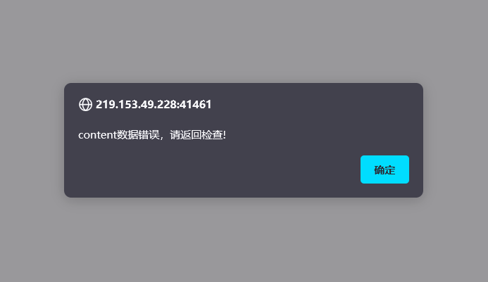

说明提交的信息有错误(格式不对)，修改后重新提交

```http
POST /info.php HTTP/1.1  //这里"?"去掉提交
Host: 219.153.49.228:41461
User-Agent: Mozilla/5.0 (Windows NT 10.0; Win64; x64; rv:96.0) Gecko/20100101 Firefox/96.0
Accept: text/html,application/xhtml+xml,application/xml;q=0.9,image/avif,image/webp,*/*;q=0.8
Accept-Language: zh-CN,zh;q=0.8,zh-TW;q=0.7,zh-HK;q=0.5,en-US;q=0.3,en;q=0.2
Accept-Encoding: gzip, deflate
Connection: close
Referer: http://219.153.49.228:41461/index.html
Upgrade-Insecure-Requests: 1

content=Vm0wd2QyUXlVWGxWV0d4V1YwZDRWMVl3WkRSV01WbDNXa1JTV0ZKdGVGWlZiVFZyVmxVeFYyTkljRmhoTWsweFZtcEdTMk15U2tWVWJHaG9UVmhDVVZadE1UUlRNazE1Vkd0c2FsSnRhRzlVVjNOM1pVWmFkR05GWkZSTmF6RTFWVEowVjFaWFNraGhSemxWVmpOT00xcFZXbUZrUjA1R1pFWlNUbFpYZHpGV1ZFb3dWakZhV0ZOcmFHaFNlbXhXVm0xNFlVMHhXbk5YYlVacVZtdGFNRlZ0ZUZOVWJVcEdZMFZ3VjJKVVJYZFpWRVpyVTBaT2NscEhjRk5XUjNob1YxZDRVMUl5VW5OWGJHUllZbFZhY2xWcVFURlNNWEJHVjJ4T1ZXSkdjRlpXYlhSM1ZqSktWVkpZWkZwV1JYQklWbXBHVDFkV2NFZGhSMnhUVFcxb1dsWXhXbXROUjFGNVZXNU9hbEp0VWxsWmJGWmhZMVphZEdSSFJrNVNiRm93V2xWYVQxWlhTbFpqUldSYVRVWmFNMVpxU2t0V1ZrcFpXa1p3YkdFelFrbFdiWEJIVkRKU1YxZHVUbFJpVjNoVVZGY3hiMWRzV1hoYVJGSnBUV3RzTTFSVmFHOVhSMHBJVld4c1dtSkhhRlJXTUZwVFZqSkdSbFJzVG1sU2JrSmFWMnhXWVZReFdsaFRiRnBZVmtWd1YxbHJXa3RUUmxweFUydGFiRlpzV2xwWGExcDNZa2RGZWxGcmJGaFhTRUpJVmtSS1UxWXhXblZVYkdocFZqTm9WVlpHWTNoaU1XUkhWMjVTVGxaRlNsaFVWM2hIVGxaYVdFNVZPVmhTTUZZMVZsZDRjMWR0U2toaFJsSlhUVlp3V0ZreFdrdGpiVkpIVld4a2FWSnRPVE5XTW5oWFdWWlJlRmRzYUZSaVJuQnhWV3hrVTFsV1VsWlhiVVpPVFZad2VGVXlkREJXUmtwelYyeHdXR0V4Y0hKWlZXUkdaVWRPU0U5V1pHaGhNSEJ2Vm10U1MxUXlVa2RUYmtwb1VqSm9WRmxZY0ZkbGJHUllaVWM1YVUxWFVraFdNalZUVkd4S1JsZHVTbFZXYkZwNlZHeGFZVmRGTlZaUFZtaFRUVWhDU2xac1pEUmpNV1IwVTJ0a1dHSlhhR0ZVVnpWdlYwWnNObEpzWkdwaVNFSklWMnRrYzFVeVNuSlRiVVpYVFc1b1dGZFdXbEpsUm1SellVWlNhRTFzU25oV1YzUlhXVlpaZUZkdVJsVmlWR3h6V1d0YWQyVkdWWGxrUjNSb1lsVndWMVp0Y0dGWGJGcFhZMGhLVjFaRldreFdNVnBIWTIxS1IyRkdhRlJTVlhCS1ZtMTBVMU14VlhoWFdHaFhZbXhhVjFsc2FFTldSbXhaWTBaa2EwMVdjREJaTUZZd1lWVXhXRlZyYUZkTmFsWlVWa2Q0WVZKc1RuTmhSbFpYWWtaWk1GWkhkR0ZaVm1SSVZXdG9hMUp0YUZSWmJGcExVMnhrVjFadFJtcE5WMUl3VlRKMGExZEhTbGhoUjBaVlZucFdkbFl3V25KbFJtUnlaRWR3YVZacmNFbFdiR1EwWVRKR1YxTnVVbEJXUlRWWVZGYzFiMWRHYkhGVGExcHNVbTFTV2xkclZURlhSa3BaVVd4c1dGWnRVVEJYVm1SSFVqRmFXVnBIYUZOV1ZGWlZWbGN4TkdReVZrZFdiR1JvVW5wc2IxUldXbmRsYkZsNVkwVmtWMDFFUmpGWlZXaExWakpHY2xkcmVGZGhhM0JRVldwS1IxSXlSa2hpUms1cFlUQndNbFp0TVRCVk1VMTRWVmhzVm1FeVVsVlpiWFIzWVVaV2RFMVhPV3BTYkhCNFZrY3dOVmRHV25OalJteGFUVVpWTVZsV1ZYaGpiVXBGVld4a1RtRnNXbFZXYTJRMFdWWktjMVJ1VG1oU2JGcFlXV3RhV2sxR1drZFZhMlJXVFZac05WVnRkR0ZWUmxsNVlVaENWbUpIYUVOYVJFWmhZekZ3UlZWdGNFNVdNVWwzVmxSS01HRXhaRWhUYkdob1VtMW9ZVlpyVm1GTk1WcHlWMjFHYWxacmNEQmFSV1F3VlRKRmVsRllaRmhpUmxwb1dWUktSMVl4VG5WVWJXaE9UVzFvV1ZaR1dtRlRNVlpIWTBWV1UyRXpRbk5WYlRGVFRWWlZlV042UmxkTlZuQjZXVEJhVjFkR1dYcFZia3BhWVd0YWVsWnFTa3RTTWtaSVkwZDRhRTFZUWpSV01XUXdXVmRSZVZaclpGZGliRXBQVm14a1UxWXhVbGhrU0dSWFRWZDRlVlpYTVVkWFJrbDNWbXBTV2sxSGFHaFdha3BIWTIxT1JtVkdXazVXYmtKSlYxaHdSMVl5VFhsU2EyaHBVbXMxY0ZVd1ZrdE5iRnB4VW0xR1ZrMVZNVFJXVnpWVFZqSkZlVlZ0YUZaTlJuQm9WbXBHYzJNeGNFVlZiR1JUWWxob1lWZFVRbUZoTWtWM1RWWmthbEpGU21GVVZWcGFaREZzVjFaWWFGaFNiRnA2V1ZWYWExUnNXWGxoUkVwWFRWWndhRlY2UmtwbFJsSjFWbXhLYVZKc2NGbFdSbEpIVXpBMWMxZHJaRlpoTWxKWFZGWmFkMDFHVm5Sa1J6bFdVbXhzTlZsVmFFTldiVXBJWVVWU1YwMXVhSEpXYWtaaFpFVTVWMVpyTlZkaWEwWXpWbXhqZDAxV1RYaFhhMmhVWWtkb2IxVnFRbUZXYkZwMFpVaGtUazFXY0hsV01qRkhZV3hhY2s1WWJGaGhNWEJRV1ZaYVMyTnRUa1ZYYkdScFVqQTBNRmRZY0VkV2JWRjNUVlprV0dKWGVITlpWRVozVjFaa1dHVkhPVkpOVlRFMFdUQmFZVll4WkVoaFJsSlZWbTFTVkZwWGVITldiR1J6Vkcxb1YyRXpRWGhXVm1NeFlqRlplRmRZY0doVFJYQllWbXRXWVdOc1ZuRlNiR1JxVFZoQ1NGbFZaRzlVYXpGV1kwWmtWMkpIVGpSVWEyUlNaVlphY2xwR1pHbGlSWEJRVm0xNGExVXhXbk5WYkdoclUwZFNWRlJXWkRCTk1WbDVUVlZrVjAxcmNFaFphMUpoVjJ4YVYxTnNRbGROYWtaSFdsWmFWMk5zY0VoU2JHUlhUVlZ3VWxac1VrZGhNVTE0VTFob2FsSlhVbWhWYkZKWFZERldjMkZGVGxSTlZuQjRWVzB4UjFack1WWk5WRkpYVm0xb2VsWnNXbXRUUjBaSlVteGFhVkl4UlhkV2JURTBZekpOZUdORmFGQldiVkpVV1d0V2QxZHNXa2hsUjNCUFZteHNORll5TlU5aGJFcFlZVVpvVjJGck5WTmFSRVp6VmpGYVdXRkhjR2xXV0VKSFZteGtOR0V4VW5OWFdHeG9Va1Z3V0ZSV1duZGhSbFkyVW10d2JGSnNTakZXUnpGSFZUSktSMk5HYkZoV00xSm9Xa2N4VjJNeFpISmFSbVJwVmxad2FGWnRjRWRUTVVsNFZXNU9XR0pWV2xkVmJYaHpUbFpzVm1GRlRsZGlWWEJKV1ZWV1QxbFdTa1pYYmtwWFlXdGFhRnBGVlRWV01WcHlUbFprYVdFd1dYcFdiWGhUVXpBMVNGUllhRmhpUjFKb1ZXeGtiMkl4Vm5GUmJVWlhZa1p3TUZwVmFHdFVhekZYWTBoc1YwMXFSa2haVjNoaFkyMU9SVkZ0UmxOV01VWXpWbTF3UzFNeVRuTlVia3BxVW0xb2NGVnRlSGRpTVZweVZXdDBVMDFXYkRSV1Z6VkxWMGRLUjFOdVFsZGlSbkF6VmpGYWExWXhWbkphUjNST1lURndTVmRYZEc5U01WcElVbGhvYWxORk5WZFpiRkpIVmtaU1YxZHNXbXhXTURReVZXMTRiMVV5UlhwUmJVWlhWbTFSTUZwRVJscGxWazV6WWtaYWFWSXlhRzlXVjNSWFdWZE9jMVp1UmxOaVdGSnlWbTE0WVdWV1VuTlhiWFJwVWpCd1dsbFZVbUZXTURGWVZWaGtXRlp0VWxOYVZscGhZMnh3UjFwR2FGTk5NbWcxVm14a2QxUXhWWGxUV0docFUwVTFXRmx0TVZOWFJsSlhXa1JDVGsxV2NEQlVWbFpyVmpBeFJWSnNhRnBoTVVwb1ZqSjRZVmRHVm5WWGJHUk9ZbTFvYjFacVFtRldNazV6WTBWb1UySkhVazlVVnpGdlUyeFplRlZyZEd4aVZscElWakZvYjJGc1NsaFZiV2hXWWtaS1dGWkVSbGRqTWtaR1ZHeFNUbFp1UWpSV1Z6QjRVakZhY2sxV1dtbFNSbHBYV1d0a2IyUnNXWGRYYlhSVVVqRmFTRll5ZUhkV01VcFhZak53VjJGcldtaFpla1pyVjBaU2NtSkdWbWxTTW1oVlYxZDRiMkl3TlZkWGJsSk9Va1ZhYjFSV1duTk9WbFY1WkVkMGFHSkZjREJhVldSdlZqSktSMk5FVGxwTmJtaDZWbXhhUjFkWFJrZGhSazVwVW01Qk1WWXhXbGRaVjBWNFZXNU9XRmRIZUc5VmExWjNWMFpzV0dSRmRHcGlSbGt5VlcweE1GWXdNVmRqUkVaWFlsaG9XRmxXV2s5U2JFNXpZMFprVjFKVmNGbFdXSEJIVkRGWmVGcElWbE5pUlRWd1ZteGFkMkZHV25SalJXUlVUVlZzTkZaWE5VOVhSMHBXVjJ4a1ZtSllhRE5VVlZwelZteGtjMVJzWkZkaVNFSlpWMVJDYTFJeFdsZFhiazVxVTBWd1dGbFhkR0ZoUm5CR1ZsUldWMDFXU25sVWJGcHJWR3N4ZEdGSFJsZGlWRVl6VldwS1NtVldWbGxoUm1ocFlrVndWbGRYZEd0aU1rbDRWbTVTVGxaNmJGaFphMXAzWld4WmVVNVhkRlZoZWtaYVZWZDRjMWxXV2xoaFJrSlhVa1Z3VEZWdE1VOVNWa1owVW14T1YwMVZXWHBXYlhoVFV6RktkRlp1VGxOaWExcFpXV3RrVTJOR1ZuRlJWRUpPVW0xU1dsa3dWbXRXTWtwWFYyeG9WMUo2Vmt4WlZscExZMjFPU1ZGc1pHbFNia0Y2Vm1wR1lWbFdTWGhpUkZwVFlrWndUMVpxUmt0VFZscHhVMnBTVjAxV1ZqVlZNblJyWVd4T1JrNVdhRnBpUjJoVVZGUkdkMWRIVmtoa1IzQnBVakZLTmxaclpEUmlNVlY1VWxoc2EyVnJTbGhXYTFaeVpVWnNjVkpzY0d4U2JWSmFXVEJrYjFaR1NsbFJiV2hZVm0xUmQxZFdaRmRqTVdSMVVteE9hVkl4U25oV1JscHJWVEF4UjFadVVteFNWR3h3VldwQ2QxZHNiRlpWYTNSWFRXdHdTVlpIY0ZOV1YwVjVWV3hPWVZac2NHaFpNbmgzVWpGd1IyRkdUazVOYldjeFZtMTRhMDFHV1hoVVdHaGhVbGRTV0ZsdGVFdGpiRlYzVmxSR1ZVMVdTbGhXTWpWUFZERmFkVkZyWkZoaE1WcHlWbXBCZUZKV1NuTmFSbkJvVFZWd2IxWnFTalJaVm1SSFZtNVdXR0pIVW05WlZFNURVMVprVlZOcVVsUk5helZZVmxjMVUxVXlTa1pPVmxKWFlrWndZVlJWV21Gak1YQkZWV3h3VjJFeWR6RldhMXB2WWpKR2MxTnNhR2hTZW14WFdWZDBkMlJzV2tWU2JGcHJUVlp3ZVZwRlZURmhWa3AxVVZoa1YxSnNjRlJXVkVaaFkyc3hWMWRyTlZkU2EzQlpWbTB3ZUdJeVZuTlhibEpPVmxad2MxWnRlR0ZsYkZsNVpVaGthRlp0VWtoVk1XaDNWMFpaZWxGcmFGZGhhM0JRVm1wR1UyUldTbk5YYld4VFRWVndWbFl4WkRSaU1rbDRZa1prWVZKc1dsTlpiRlpoWWpGU1YxZHVaR3hpUmxZMVZHeGFUMVl5U2xaalJXeGhWbFp3YUZacVNrdFRSbFoxVjIxR1UwMHlhRFpXYlhCSFdWWmtXRkpyWkdGU1ZGWllWRlpXYzA1R1dYaFZhMDVhVmpCV05GWlhOVk5WTWtweVRsWnNXbUV4Y0doV01WcGhaRVV4VjFOck5WTmlSbXQ1Vmxjd2VGSXlSblJTYWxwWFlrZG9XVmxVU2xOa2JGcFZVMnQwVTAxck5VaFphMXB2VmpBd2VGTnRPVmRoYTNBMldsVmFTbVZHY0VsVGJXaFRUVEpvVlZaR1ZtRmtNa1pIVjI1U1RsWkdTbkZVVlZKWFYwWmFkRTVXVG1oTlZXOHlXV3RhYTFadFNsbGhSRTVWVmxad2VsWnRlR3RqTVZKeldrWmthVk5GU2xwV01WSkRZVEZKZUZkc1pGaGlhelZ4VlRCV2QxbFdjRmhrUjBab1VtNUNSMVpzVWxkV01ERlhVMjVzVldKR2NISlpWbVJHWkRGa1dXTkdaR2xYUjJoVlZsaHdRazFXU1hoYVJteG9VbTFTV1ZWcVRtOVdiR1JYVld0MFZrMVdjRmhaYTJoUFZqSktWbGRzYUZwaE1YQXpWRlphY21ReFpIUmtSMmhPWVROQ1NWZFVRbTlqTVZsM1RWaFdhRkpGTldGV2ExWkhUa1paZUZkclpHcGlWVnBJV1ZWa2IxUnNaRVpUYkZwWFlsaG9WRlY2Umt0a1JscDFWR3hPYVdFeGNGcFhWM1JyVlRGUmVHSklVbXhTV0ZKWlZXMTRkMU5HV1hsTlZXUllVakJ3V0ZWdGNFOVdWbHB6VjI1d1dsWnNjRXRhVm1SSFVqRldjMVpzWkd4aE1XOTVWbTF3UjFsV2JGZFRXR2hoVTBaS1ZGbHJXa3RVTVZwellVVk9WRlpzY0hoVk1WSkhWbXN4Y2xkcVFsZGlWRlpNVmpCa1MxTkhSa2RYYkdScFZrVmFWVlp0ZEdGa01XUklWbXRrYWxJemFGaFVWVkpTWlZaYVdFMVVVbWhOVmtwNlZqSTFWMVZ0Um5OalJteFhZVEZhVEZsVldtRldWa3AwWkVaT1RsWXhTWGhXYkdRMFdWWlplRk5zV21wU2JrSllXV3hTUTA1R1dsVlNhemxUVFZad01WVnRlRTloVm1SSFUyNXNWMkpVUlRCVmVrcFhZekpLUjFkdFJsUlNWRlpZVmtaa01HUXlWbGRXV0d4c1VsZFNXRlJYZEhkV2JGWllZMFpPVjFZd1ZqVldWM2hQV1ZaYWMyTkhhR0ZTYkhCVVdrVmFTMk14Vm5OVWJHaFRWbGhDYUZadGNFZFpWMFYzVFZWa1ZWZEhhRmxXTUdSdlZqRnNjbGR1WkZkTlYzaFdWVEo0VDFkR1duTmpSRUpoVmxkb2NsWXdXbUZrVmtaeldrWndWMVl4UmpOV2FrSmhVMjFSZUZwR1ZsUmlSbkJ3VmpCYVMwNXNXblJqUldSWVlsWmFlbFp0TlZkWFIwcElWVzA1V2xaRk5VUlZNVnByVmxaT1dXRkdWazVXV0VGM1ZtMHhNR0V4WkVoU2FscFhZa2RvWVZsc2FGTlVSbFY1WlVad2JGSXdXa3BYYTFwUFZHeFplbUZHY0ZkaE1YQjJXV3BLUjJNeFRuTmhSbHBwVW01Q2FGZFhkR3RpTWxKellraEdVMkpGTlZoVVZtUlRaV3hyZDFwRVVtaFdhM0F4VlZab2ExZEdXa1pUYkdoYVZrVmFjbGw2Um10WFZuQkhXa2RvYVZKWVFscFdNV1F3WVRKSmVWVnVUbGhpYXpWb1ZXeGFkMk14V25SbFIwWnNZa1p3TUZwVmFHdGhSbHAwVld0b1ZrMVhhRE5XTUZwaFl6RmtkR0ZHWkdoaE0wSlZWbGN4ZW1WR1dYbFNhMlJTWWtkU1QxUlZWbmRXYkZsNFdrUkNhRTFFUWpWV2JUVlBWMFprU0dWSVNsWmhhelZFVmxWYVlXTldSbk5hUlRsWFlrWlpNVmRyVm10TlIwWklVMnRhYWxKdGVHRldiRnAzWkd4WmVVMVZkRk5OVlRWNVdWVmFZVlJzU25WUmJXaFlZVEZLU0ZwRVJrdGpNazVHVjJ4Q1YwMXVhRlZXYWtKWFUyc3hWMWRZYUZoaVIxSmhWbXBDVjA1R1dsaE9WVGxZVW0xU1NWcFZZelZXYlVWNFYycE9WMDFHY0ZSV2FrWnJaRlp3U0dGR1RtbFRSVXBJVm14amVHVnJOVmRXV0dST1ZtMVNjVlZyVm1GWFJsWnhWRzA1V0ZKdGVGaFdNblF3WVdzeGNrNVZhRnBoTVhCMlZtcEJkMlZHVG5GVGJHUlhZa1Z3U1ZaclVrZFhiVlpIWTBWc1ZHSlhhRlJVVkVwdlZsWmFSMVp0Um10TlYxSllWakowYTFsV1RrbFJiazVXWWtaS1dGWXdXbUZrUlRWWFZHMW9UbFpYT0hsWFYzUnFUbFphVjFkdVRsaGhhelZvVm1wT2IxbFdjRmRhUlRsUFlrWndlbGRyVlRGaFJUQjNVMnhvVjJKVVFqUlVWVnBTWlVkS1IxcEdVbWhOV0VKYVYxY3hNR1F4YkZkalJtaHJVakJhYjFWdE5VTlNNVmw1WkVSQ2FHRjZSbGhaTUdoelZsZEtSMk5JU2xkU00yaG9WakJrVW1WdFRrZGFSMnhZVWpKb05WWnJaREJoTVU1MFZteGtWbUpIZUc5VmJURnZZMFpzY2xadVpGZGlSMUpaVkZab2QxUnNXWGRPVm1oWFlsUldWRlpIZUdGT2JVcElVbXhrYVZkSFozcFhiRnBoV1ZkU1JrMVdXbUZTYkZwdldsZDBZVmxXV2xkYVJGSnFUVmQ0V0ZZeWVHdGhiRXBHVGxkR1YyRXhXa2hVYTFwYVpVWmtjbHBIY0dsV1ZuQkpWMVpXYTJJeFVuTmFSVnBVWWtad1dGbHNhRzlXUmxZMlVtdDBhMUpzY0RGV1IzaFBZVmRGZUdOR2NGaFdNMUp5VmxSS1QxSXhaSFZUYkdSb1RUQktVRlpYTUhoVk1XUnpZVE5rVjJKWVVsaFVWM1IzVjBaV2RHTkZPVmRXYkhCNlZqSTFkMWRzV25OalJYUmhVa1ZhY2xwR1dsTmpNazVIV2taT1YxSnNjRWRXYlRGM1VqRnNXRkpZYUZoWFIyaHhWV3hhWVZVeGJITmhSazVxVW14d01GcEZXbmRVYkVwMFZXeHNZVkpYVWtoWlZsVjRZMnhrZFdKR1ZsZFdNbWcyVjFaV1lWTXlVa2hTYTJSWVlrZFNjRll3Wkc1bGJHUlhWbTFHVmsxV2JEUlhhMmhUVlRKS1IxTnNVbFZXYkhBelZURmFZV05zYTNwaFIyeE9WbTEzTVZaWGVHOWtNVlowVW01T2FsSnRlRmhaVkVaaFZFWnNWbGR1VGs5aVJYQXdXa1ZhVDFSc1dYaFRXR2hYWVRKUk1GWlVTa2RTYXpGSllrZG9VMkpZYUZsWFYzaHZWVEZrUjFwR1pHRlNWR3h4VkZaYWQwMVdWblJsUlRsb1ZteHdXRmt3YUhOV01rcFZVbGhrWVZKRmNGaFpla1pyWkZaV2NrNVdhRk5XUmxwWlZtdGFZVmxYVVhoVWEyUllWMGQ0YzFVd1ZURlhSbEpZWkVaa1QxSnRkRE5YYTJNMVYwWktjMk5JY0ZwTlIyZ3pWbXBLUjJOc1pITlZiSEJPWW0xbmVsWlhjRWRrTVU1SVUydG9hRkl6YUhCVmJUVkRXVlphZEdORlpHaGlWbHBKVm0wMVMxUnNXblJWYkd4WFRVZFNkbFl4V25Oa1IxWkdaRWR3VGxac2NEUldWbU40VWpGa1IxTnVVbXhUUjNoWVZGYzFVbVF4V25GUldHaFhUV3MxU0ZscldsZGhWa3B6WWtST1YySlVSVEJYVm1ST1pVWndTVlJzYUdsU2JIQlpWbTB4TUdRd05WZFhiRnBZWVRGd1VWWnRkRXRWTVZaSFZWaGtVVlZVTURrPQ
```

仍然提示提交数据不对。

查找解题评论区，**在Burpsuite中鼠标右键选择change request method**，即可自动生成改变请求之后的数据包

```http
POST /info.php HTTP/1.1
Host: 219.153.49.228:41461
User-Agent: Mozilla/5.0 (Windows NT 10.0; Win64; x64; rv:96.0) Gecko/20100101 Firefox/96.0
Accept: text/html,application/xhtml+xml,application/xml;q=0.9,image/avif,image/webp,*/*;q=0.8
Accept-Language: zh-CN,zh;q=0.8,zh-TW;q=0.7,zh-HK;q=0.5,en-US;q=0.3,en;q=0.2
Accept-Encoding: gzip, deflate
Connection: close
Referer: http://219.153.49.228:41461/
Upgrade-Insecure-Requests: 1
Content-Type: application/x-www-form-urlencoded     //注意自动生成POST报文时添加的这两行代码
Content-Length: 9966

content=Vm0wd2QyUXlVWGxWV0d4V1YwZDRWMVl3WkRSV01WbDNXa1JTV0ZKdGVGWlZiVFZyVmxVeFYyTkljRmhoTWsweFZtcEdTMk15U2tWVWJHaG9UVmhDVVZadE1UUlRNazE1Vkd0c2FsSnRhRzlVVjNOM1pVWmFkR05GWkZSTmF6RTFWVEowVjFaWFNraGhSemxWVmpOT00xcFZXbUZrUjA1R1pFWlNUbFpYZHpGV1ZFb3dWakZhV0ZOcmFHaFNlbXhXVm0xNFlVMHhXbk5YYlVacVZtdGFNRlZ0ZUZOVWJVcEdZMFZ3VjJKVVJYZFpWRVpyVTBaT2NscEhjRk5XUjNob1YxZDRVMUl5VW5OWGJHUllZbFZhY2xWcVFURlNNWEJHVjJ4T1ZXSkdjRlpXYlhSM1ZqSktWVkpZWkZwV1JYQklWbXBHVDFkV2NFZGhSMnhUVFcxb1dsWXhXbXROUjFGNVZXNU9hbEp0VWxsWmJGWmhZMVphZEdSSFJrNVNiRm93V2xWYVQxWlhTbFpqUldSYVRVWmFNMVpxU2t0V1ZrcFpXa1p3YkdFelFrbFdiWEJIVkRKU1YxZHVUbFJpVjNoVVZGY3hiMWRzV1hoYVJGSnBUV3RzTTFSVmFHOVhSMHBJVld4c1dtSkhhRlJXTUZwVFZqSkdSbFJzVG1sU2JrSmFWMnhXWVZReFdsaFRiRnBZVmtWd1YxbHJXa3RUUmxweFUydGFiRlpzV2xwWGExcDNZa2RGZWxGcmJGaFhTRUpJVmtSS1UxWXhXblZVYkdocFZqTm9WVlpHWTNoaU1XUkhWMjVTVGxaRlNsaFVWM2hIVGxaYVdFNVZPVmhTTUZZMVZsZDRjMWR0U2toaFJsSlhUVlp3V0ZreFdrdGpiVkpIVld4a2FWSnRPVE5XTW5oWFdWWlJlRmRzYUZSaVJuQnhWV3hrVTFsV1VsWlhiVVpPVFZad2VGVXlkREJXUmtwelYyeHdXR0V4Y0hKWlZXUkdaVWRPU0U5V1pHaGhNSEJ2Vm10U1MxUXlVa2RUYmtwb1VqSm9WRmxZY0ZkbGJHUllaVWM1YVUxWFVraFdNalZUVkd4S1JsZHVTbFZXYkZwNlZHeGFZVmRGTlZaUFZtaFRUVWhDU2xac1pEUmpNV1IwVTJ0a1dHSlhhR0ZVVnpWdlYwWnNObEpzWkdwaVNFSklWMnRrYzFVeVNuSlRiVVpYVFc1b1dGZFdXbEpsUm1SellVWlNhRTFzU25oV1YzUlhXVlpaZUZkdVJsVmlWR3h6V1d0YWQyVkdWWGxrUjNSb1lsVndWMVp0Y0dGWGJGcFhZMGhLVjFaRldreFdNVnBIWTIxS1IyRkdhRlJTVlhCS1ZtMTBVMU14VlhoWFdHaFhZbXhhVjFsc2FFTldSbXhaWTBaa2EwMVdjREJaTUZZd1lWVXhXRlZyYUZkTmFsWlVWa2Q0WVZKc1RuTmhSbFpYWWtaWk1GWkhkR0ZaVm1SSVZXdG9hMUp0YUZSWmJGcExVMnhrVjFadFJtcE5WMUl3VlRKMGExZEhTbGhoUjBaVlZucFdkbFl3V25KbFJtUnlaRWR3YVZacmNFbFdiR1EwWVRKR1YxTnVVbEJXUlRWWVZGYzFiMWRHYkhGVGExcHNVbTFTV2xkclZURlhSa3BaVVd4c1dGWnRVVEJYVm1SSFVqRmFXVnBIYUZOV1ZGWlZWbGN4TkdReVZrZFdiR1JvVW5wc2IxUldXbmRsYkZsNVkwVmtWMDFFUmpGWlZXaExWakpHY2xkcmVGZGhhM0JRVldwS1IxSXlSa2hpUms1cFlUQndNbFp0TVRCVk1VMTRWVmhzVm1FeVVsVlpiWFIzWVVaV2RFMVhPV3BTYkhCNFZrY3dOVmRHV25OalJteGFUVVpWTVZsV1ZYaGpiVXBGVld4a1RtRnNXbFZXYTJRMFdWWktjMVJ1VG1oU2JGcFlXV3RhV2sxR1drZFZhMlJXVFZac05WVnRkR0ZWUmxsNVlVaENWbUpIYUVOYVJFWmhZekZ3UlZWdGNFNVdNVWwzVmxSS01HRXhaRWhUYkdob1VtMW9ZVlpyVm1GTk1WcHlWMjFHYWxacmNEQmFSV1F3VlRKRmVsRllaRmhpUmxwb1dWUktSMVl4VG5WVWJXaE9UVzFvV1ZaR1dtRlRNVlpIWTBWV1UyRXpRbk5WYlRGVFRWWlZlV042UmxkTlZuQjZXVEJhVjFkR1dYcFZia3BhWVd0YWVsWnFTa3RTTWtaSVkwZDRhRTFZUWpSV01XUXdXVmRSZVZaclpGZGliRXBQVm14a1UxWXhVbGhrU0dSWFRWZDRlVlpYTVVkWFJrbDNWbXBTV2sxSGFHaFdha3BIWTIxT1JtVkdXazVXYmtKSlYxaHdSMVl5VFhsU2EyaHBVbXMxY0ZVd1ZrdE5iRnB4VW0xR1ZrMVZNVFJXVnpWVFZqSkZlVlZ0YUZaTlJuQm9WbXBHYzJNeGNFVlZiR1JUWWxob1lWZFVRbUZoTWtWM1RWWmthbEpGU21GVVZWcGFaREZzVjFaWWFGaFNiRnA2V1ZWYWExUnNXWGxoUkVwWFRWWndhRlY2UmtwbFJsSjFWbXhLYVZKc2NGbFdSbEpIVXpBMWMxZHJaRlpoTWxKWFZGWmFkMDFHVm5Sa1J6bFdVbXhzTlZsVmFFTldiVXBJWVVWU1YwMXVhSEpXYWtaaFpFVTVWMVpyTlZkaWEwWXpWbXhqZDAxV1RYaFhhMmhVWWtkb2IxVnFRbUZXYkZwMFpVaGtUazFXY0hsV01qRkhZV3hhY2s1WWJGaGhNWEJRV1ZaYVMyTnRUa1ZYYkdScFVqQTBNRmRZY0VkV2JWRjNUVlprV0dKWGVITlpWRVozVjFaa1dHVkhPVkpOVlRFMFdUQmFZVll4WkVoaFJsSlZWbTFTVkZwWGVITldiR1J6Vkcxb1YyRXpRWGhXVm1NeFlqRlplRmRZY0doVFJYQllWbXRXWVdOc1ZuRlNiR1JxVFZoQ1NGbFZaRzlVYXpGV1kwWmtWMkpIVGpSVWEyUlNaVlphY2xwR1pHbGlSWEJRVm0xNGExVXhXbk5WYkdoclUwZFNWRlJXWkRCTk1WbDVUVlZrVjAxcmNFaFphMUpoVjJ4YVYxTnNRbGROYWtaSFdsWmFWMk5zY0VoU2JHUlhUVlZ3VWxac1VrZGhNVTE0VTFob2FsSlhVbWhWYkZKWFZERldjMkZGVGxSTlZuQjRWVzB4UjFack1WWk5WRkpYVm0xb2VsWnNXbXRUUjBaSlVteGFhVkl4UlhkV2JURTBZekpOZUdORmFGQldiVkpVV1d0V2QxZHNXa2hsUjNCUFZteHNORll5TlU5aGJFcFlZVVpvVjJGck5WTmFSRVp6VmpGYVdXRkhjR2xXV0VKSFZteGtOR0V4VW5OWFdHeG9Va1Z3V0ZSV1duZGhSbFkyVW10d2JGSnNTakZXUnpGSFZUSktSMk5HYkZoV00xSm9Xa2N4VjJNeFpISmFSbVJwVmxad2FGWnRjRWRUTVVsNFZXNU9XR0pWV2xkVmJYaHpUbFpzVm1GRlRsZGlWWEJKV1ZWV1QxbFdTa1pYYmtwWFlXdGFhRnBGVlRWV01WcHlUbFprYVdFd1dYcFdiWGhUVXpBMVNGUllhRmhpUjFKb1ZXeGtiMkl4Vm5GUmJVWlhZa1p3TUZwVmFHdFVhekZYWTBoc1YwMXFSa2haVjNoaFkyMU9SVkZ0UmxOV01VWXpWbTF3UzFNeVRuTlVia3BxVW0xb2NGVnRlSGRpTVZweVZXdDBVMDFXYkRSV1Z6VkxWMGRLUjFOdVFsZGlSbkF6VmpGYWExWXhWbkphUjNST1lURndTVmRYZEc5U01WcElVbGhvYWxORk5WZFpiRkpIVmtaU1YxZHNXbXhXTURReVZXMTRiMVV5UlhwUmJVWlhWbTFSTUZwRVJscGxWazV6WWtaYWFWSXlhRzlXVjNSWFdWZE9jMVp1UmxOaVdGSnlWbTE0WVdWV1VuTlhiWFJwVWpCd1dsbFZVbUZXTURGWVZWaGtXRlp0VWxOYVZscGhZMnh3UjFwR2FGTk5NbWcxVm14a2QxUXhWWGxUV0docFUwVTFXRmx0TVZOWFJsSlhXa1JDVGsxV2NEQlVWbFpyVmpBeFJWSnNhRnBoTVVwb1ZqSjRZVmRHVm5WWGJHUk9ZbTFvYjFacVFtRldNazV6WTBWb1UySkhVazlVVnpGdlUyeFplRlZyZEd4aVZscElWakZvYjJGc1NsaFZiV2hXWWtaS1dGWkVSbGRqTWtaR1ZHeFNUbFp1UWpSV1Z6QjRVakZhY2sxV1dtbFNSbHBYV1d0a2IyUnNXWGRYYlhSVVVqRmFTRll5ZUhkV01VcFhZak53VjJGcldtaFpla1pyVjBaU2NtSkdWbWxTTW1oVlYxZDRiMkl3TlZkWGJsSk9Va1ZhYjFSV1duTk9WbFY1WkVkMGFHSkZjREJhVldSdlZqSktSMk5FVGxwTmJtaDZWbXhhUjFkWFJrZGhSazVwVW01Qk1WWXhXbGRaVjBWNFZXNU9XRmRIZUc5VmExWjNWMFpzV0dSRmRHcGlSbGt5VlcweE1GWXdNVmRqUkVaWFlsaG9XRmxXV2s5U2JFNXpZMFprVjFKVmNGbFdXSEJIVkRGWmVGcElWbE5pUlRWd1ZteGFkMkZHV25SalJXUlVUVlZzTkZaWE5VOVhSMHBXVjJ4a1ZtSllhRE5VVlZwelZteGtjMVJzWkZkaVNFSlpWMVJDYTFJeFdsZFhiazVxVTBWd1dGbFhkR0ZoUm5CR1ZsUldWMDFXU25sVWJGcHJWR3N4ZEdGSFJsZGlWRVl6VldwS1NtVldWbGxoUm1ocFlrVndWbGRYZEd0aU1rbDRWbTVTVGxaNmJGaFphMXAzWld4WmVVNVhkRlZoZWtaYVZWZDRjMWxXV2xoaFJrSlhVa1Z3VEZWdE1VOVNWa1owVW14T1YwMVZXWHBXYlhoVFV6RktkRlp1VGxOaWExcFpXV3RrVTJOR1ZuRlJWRUpPVW0xU1dsa3dWbXRXTWtwWFYyeG9WMUo2Vmt4WlZscExZMjFPU1ZGc1pHbFNia0Y2Vm1wR1lWbFdTWGhpUkZwVFlrWndUMVpxUmt0VFZscHhVMnBTVjAxV1ZqVlZNblJyWVd4T1JrNVdhRnBpUjJoVVZGUkdkMWRIVmtoa1IzQnBVakZLTmxaclpEUmlNVlY1VWxoc2EyVnJTbGhXYTFaeVpVWnNjVkpzY0d4U2JWSmFXVEJrYjFaR1NsbFJiV2hZVm0xUmQxZFdaRmRqTVdSMVVteE9hVkl4U25oV1JscHJWVEF4UjFadVVteFNWR3h3VldwQ2QxZHNiRlpWYTNSWFRXdHdTVlpIY0ZOV1YwVjVWV3hPWVZac2NHaFpNbmgzVWpGd1IyRkdUazVOYldjeFZtMTRhMDFHV1hoVVdHaGhVbGRTV0ZsdGVFdGpiRlYzVmxSR1ZVMVdTbGhXTWpWUFZERmFkVkZyWkZoaE1WcHlWbXBCZUZKV1NuTmFSbkJvVFZWd2IxWnFTalJaVm1SSFZtNVdXR0pIVW05WlZFNURVMVprVlZOcVVsUk5helZZVmxjMVUxVXlTa1pPVmxKWFlrWndZVlJWV21Gak1YQkZWV3h3VjJFeWR6RldhMXB2WWpKR2MxTnNhR2hTZW14WFdWZDBkMlJzV2tWU2JGcHJUVlp3ZVZwRlZURmhWa3AxVVZoa1YxSnNjRlJXVkVaaFkyc3hWMWRyTlZkU2EzQlpWbTB3ZUdJeVZuTlhibEpPVmxad2MxWnRlR0ZsYkZsNVpVaGthRlp0VWtoVk1XaDNWMFpaZWxGcmFGZGhhM0JRVm1wR1UyUldTbk5YYld4VFRWVndWbFl4WkRSaU1rbDRZa1prWVZKc1dsTlpiRlpoWWpGU1YxZHVaR3hpUmxZMVZHeGFUMVl5U2xaalJXeGhWbFp3YUZacVNrdFRSbFoxVjIxR1UwMHlhRFpXYlhCSFdWWmtXRkpyWkdGU1ZGWllWRlpXYzA1R1dYaFZhMDVhVmpCV05GWlhOVk5WTWtweVRsWnNXbUV4Y0doV01WcGhaRVV4VjFOck5WTmlSbXQ1Vmxjd2VGSXlSblJTYWxwWFlrZG9XVmxVU2xOa2JGcFZVMnQwVTAxck5VaFphMXB2VmpBd2VGTnRPVmRoYTNBMldsVmFTbVZHY0VsVGJXaFRUVEpvVlZaR1ZtRmtNa1pIVjI1U1RsWkdTbkZVVlZKWFYwWmFkRTVXVG1oTlZXOHlXV3RhYTFadFNsbGhSRTVWVmxad2VsWnRlR3RqTVZKeldrWmthVk5GU2xwV01WSkRZVEZKZUZkc1pGaGlhelZ4VlRCV2QxbFdjRmhrUjBab1VtNUNSMVpzVWxkV01ERlhVMjVzVldKR2NISlpWbVJHWkRGa1dXTkdaR2xYUjJoVlZsaHdRazFXU1hoYVJteG9VbTFTV1ZWcVRtOVdiR1JYVld0MFZrMVdjRmhaYTJoUFZqSktWbGRzYUZwaE1YQXpWRlphY21ReFpIUmtSMmhPWVROQ1NWZFVRbTlqTVZsM1RWaFdhRkpGTldGV2ExWkhUa1paZUZkclpHcGlWVnBJV1ZWa2IxUnNaRVpUYkZwWFlsaG9WRlY2Umt0a1JscDFWR3hPYVdFeGNGcFhWM1JyVlRGUmVHSklVbXhTV0ZKWlZXMTRkMU5HV1hsTlZXUllVakJ3V0ZWdGNFOVdWbHB6VjI1d1dsWnNjRXRhVm1SSFVqRldjMVpzWkd4aE1XOTVWbTF3UjFsV2JGZFRXR2hoVTBaS1ZGbHJXa3RVTVZwellVVk9WRlpzY0hoVk1WSkhWbXN4Y2xkcVFsZGlWRlpNVmpCa1MxTkhSa2RYYkdScFZrVmFWVlp0ZEdGa01XUklWbXRrYWxJemFGaFVWVkpTWlZaYVdFMVVVbWhOVmtwNlZqSTFWMVZ0Um5OalJteFhZVEZhVEZsVldtRldWa3AwWkVaT1RsWXhTWGhXYkdRMFdWWlplRk5zV21wU2JrSllXV3hTUTA1R1dsVlNhemxUVFZad01WVnRlRTloVm1SSFUyNXNWMkpVUlRCVmVrcFhZekpLUjFkdFJsUlNWRlpZVmtaa01HUXlWbGRXV0d4c1VsZFNXRlJYZEhkV2JGWllZMFpPVjFZd1ZqVldWM2hQV1ZaYWMyTkhhR0ZTYkhCVVdrVmFTMk14Vm5OVWJHaFRWbGhDYUZadGNFZFpWMFYzVFZWa1ZWZEhhRmxXTUdSdlZqRnNjbGR1WkZkTlYzaFdWVEo0VDFkR1duTmpSRUpoVmxkb2NsWXdXbUZrVmtaeldrWndWMVl4UmpOV2FrSmhVMjFSZUZwR1ZsUmlSbkJ3VmpCYVMwNXNXblJqUldSWVlsWmFlbFp0TlZkWFIwcElWVzA1V2xaRk5VUlZNVnByVmxaT1dXRkdWazVXV0VGM1ZtMHhNR0V4WkVoU2FscFhZa2RvWVZsc2FGTlVSbFY1WlVad2JGSXdXa3BYYTFwUFZHeFplbUZHY0ZkaE1YQjJXV3BLUjJNeFRuTmhSbHBwVW01Q2FGZFhkR3RpTWxKellraEdVMkpGTlZoVVZtUlRaV3hyZDFwRVVtaFdhM0F4VlZab2ExZEdXa1pUYkdoYVZrVmFjbGw2Um10WFZuQkhXa2RvYVZKWVFscFdNV1F3WVRKSmVWVnVUbGhpYXpWb1ZXeGFkMk14V25SbFIwWnNZa1p3TUZwVmFHdGhSbHAwVld0b1ZrMVhhRE5XTUZwaFl6RmtkR0ZHWkdoaE0wSlZWbGN4ZW1WR1dYbFNhMlJTWWtkU1QxUlZWbmRXYkZsNFdrUkNhRTFFUWpWV2JUVlBWMFprU0dWSVNsWmhhelZFVmxWYVlXTldSbk5hUlRsWFlrWlpNVmRyVm10TlIwWklVMnRhYWxKdGVHRldiRnAzWkd4WmVVMVZkRk5OVlRWNVdWVmFZVlJzU25WUmJXaFlZVEZLU0ZwRVJrdGpNazVHVjJ4Q1YwMXVhRlZXYWtKWFUyc3hWMWRZYUZoaVIxSmhWbXBDVjA1R1dsaE9WVGxZVW0xU1NWcFZZelZXYlVWNFYycE9WMDFHY0ZSV2FrWnJaRlp3U0dGR1RtbFRSVXBJVm14amVHVnJOVmRXV0dST1ZtMVNjVlZyVm1GWFJsWnhWRzA1V0ZKdGVGaFdNblF3WVdzeGNrNVZhRnBoTVhCMlZtcEJkMlZHVG5GVGJHUlhZa1Z3U1ZaclVrZFhiVlpIWTBWc1ZHSlhhRlJVVkVwdlZsWmFSMVp0Um10TlYxSllWakowYTFsV1RrbFJiazVXWWtaS1dGWXdXbUZrUlRWWFZHMW9UbFpYT0hsWFYzUnFUbFphVjFkdVRsaGhhelZvVm1wT2IxbFdjRmRhUlRsUFlrWndlbGRyVlRGaFJUQjNVMnhvVjJKVVFqUlVWVnBTWlVkS1IxcEdVbWhOV0VKYVYxY3hNR1F4YkZkalJtaHJVakJhYjFWdE5VTlNNVmw1WkVSQ2FHRjZSbGhaTUdoelZsZEtSMk5JU2xkU00yaG9WakJrVW1WdFRrZGFSMnhZVWpKb05WWnJaREJoTVU1MFZteGtWbUpIZUc5VmJURnZZMFpzY2xadVpGZGlSMUpaVkZab2QxUnNXWGRPVm1oWFlsUldWRlpIZUdGT2JVcElVbXhrYVZkSFozcFhiRnBoV1ZkU1JrMVdXbUZTYkZwdldsZDBZVmxXV2xkYVJGSnFUVmQ0V0ZZeWVHdGhiRXBHVGxkR1YyRXhXa2hVYTFwYVpVWmtjbHBIY0dsV1ZuQkpWMVpXYTJJeFVuTmFSVnBVWWtad1dGbHNhRzlXUmxZMlVtdDBhMUpzY0RGV1IzaFBZVmRGZUdOR2NGaFdNMUp5VmxSS1QxSXhaSFZUYkdSb1RUQktVRlpYTUhoVk1XUnpZVE5rVjJKWVVsaFVWM1IzVjBaV2RHTkZPVmRXYkhCNlZqSTFkMWRzV25OalJYUmhVa1ZhY2xwR1dsTmpNazVIV2taT1YxSnNjRWRXYlRGM1VqRnNXRkpZYUZoWFIyaHhWV3hhWVZVeGJITmhSazVxVW14d01GcEZXbmRVYkVwMFZXeHNZVkpYVWtoWlZsVjRZMnhrZFdKR1ZsZFdNbWcyVjFaV1lWTXlVa2hTYTJSWVlrZFNjRll3Wkc1bGJHUlhWbTFHVmsxV2JEUlhhMmhUVlRKS1IxTnNVbFZXYkhBelZURmFZV05zYTNwaFIyeE9WbTEzTVZaWGVHOWtNVlowVW01T2FsSnRlRmhaVkVaaFZFWnNWbGR1VGs5aVJYQXdXa1ZhVDFSc1dYaFRXR2hYWVRKUk1GWlVTa2RTYXpGSllrZG9VMkpZYUZsWFYzaHZWVEZrUjFwR1pHRlNWR3h4VkZaYWQwMVdWblJsUlRsb1ZteHdXRmt3YUhOV01rcFZVbGhrWVZKRmNGaFpla1pyWkZaV2NrNVdhRk5XUmxwWlZtdGFZVmxYVVhoVWEyUllWMGQ0YzFVd1ZURlhSbEpZWkVaa1QxSnRkRE5YYTJNMVYwWktjMk5JY0ZwTlIyZ3pWbXBLUjJOc1pITlZiSEJPWW0xbmVsWlhjRWRrTVU1SVUydG9hRkl6YUhCVmJUVkRXVlphZEdORlpHaGlWbHBKVm0wMVMxUnNXblJWYkd4WFRVZFNkbFl4V25Oa1IxWkdaRWR3VGxac2NEUldWbU40VWpGa1IxTnVVbXhUUjNoWVZGYzFVbVF4V25GUldHaFhUV3MxU0ZscldsZGhWa3B6WWtST1YySlVSVEJYVm1ST1pVWndTVlJzYUdsU2JIQlpWbTB4TUdRd05WZFhiRnBZWVRGd1VWWnRkRXRWTVZaSFZWaGtVVlZVTURrPQ
```

成功提交并访问

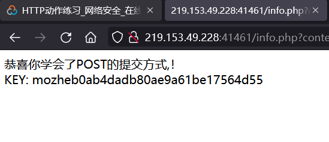

对比课件两次提交的POST报文的区别，显然手动修改的POST报文不符合提交要求：

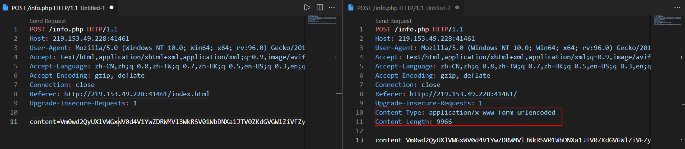

### 投票系统程序设计缺陷分析

墨者学院——在线靶场——网络安全——投票系统程序设计缺陷分析——支付墨币——点击访问

