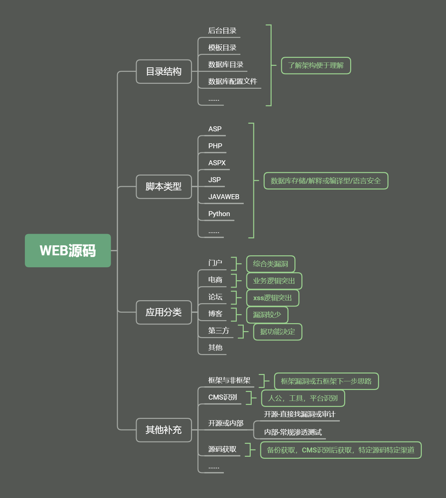
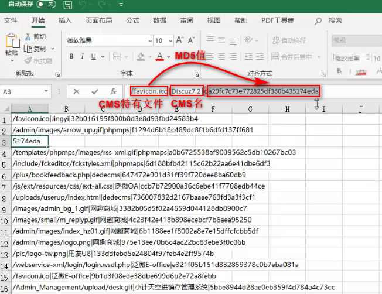
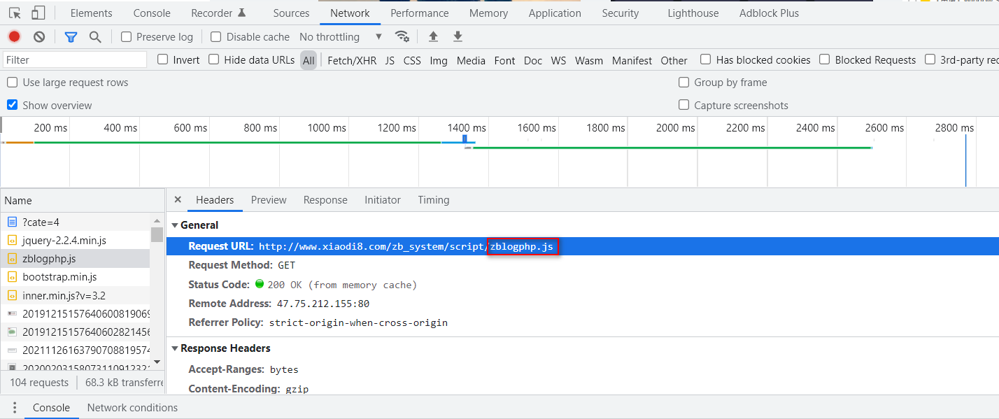
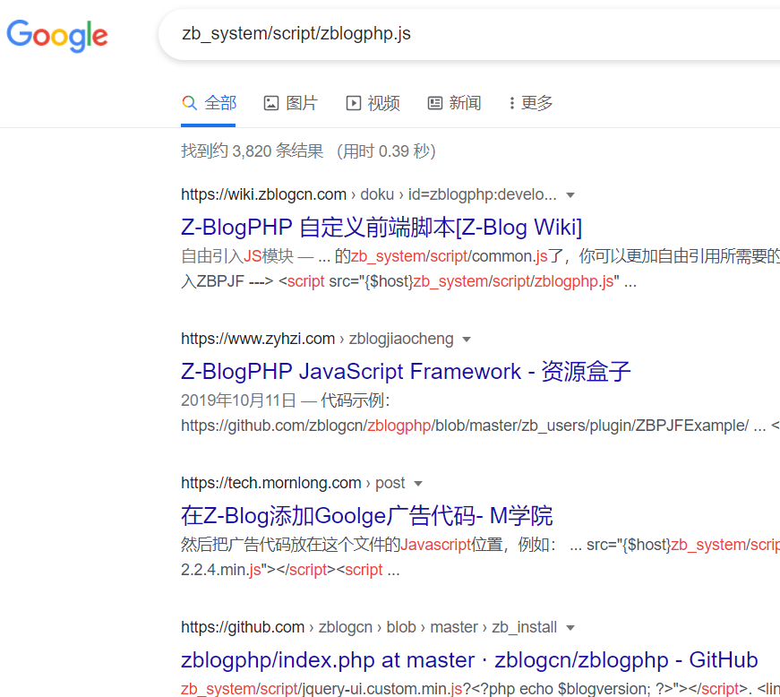

**前言**：Web源码在安全测试中是非常重要的信息来源，可以用来代码审计漏洞，也可以用来做信息突破口。 其中WEB源码有很多技术需要简明分析。比如：获取某ASP源码后可以采用默认数据库下载为突破，获取某其他脚本源码漏洞可以进行代码审计挖掘或分析其业务逻辑等，总之源码的获取将为后期的安全测试提供了更多的思路。

# 知识点

## Web源码的目录结构

### 4个重点目录

1. 数据库配置文件
2. 后台目录
3. 模板目录
4. 数据库目录等

比如：对于一个CMS来说：

- index.php 根据文件后缀判定网站语言是php
- admin 网站后台路径
- data 数据相关目录
- install 安装目录
- member 会员目录
- template 模板(主题)目录(和网站相关的整体架构)
- data/confing.php 数据库配置文件，网站和数据库的通讯信息，连接账号密码，可以去连接对方数据库，从数据库去得到这个网站的源码里面涉及到的管理员的账号密码

## Web源码的脚本类型

ASP、PHP、ASPX、JSP、JAVAWEB等脚本类型源码安全问题

1. 数据库存储：不同脚本写出的数据库的存储是不同的 
2. 解释和编译：不同脚本语言对应的执行方法不同
3. 语言安全：不同脚本语言的源码涉及到的安全问题及安全漏洞不同，即**某些语言容易出现某些漏洞**

#### 示例

[Web安全学习笔记之语言与框架](https://websec.readthedocs.io/zh/latest/language/index.html)

## Web源码的应用分类

社交，论坛，门户，第三方，博客等不同的代码机制对应漏洞

开源，未开源问题， 框架非框架问题，关于CMS识别问题及后续等

**拿到对方的源码或者判断这个网站的应用类型之后应该侧重在哪些方向、哪些漏洞上做文章**

- 门户网站------------------------综合类漏洞
- 电商网站------------------------------业务逻辑漏洞
- 论坛网站------------------------------XSS漏洞
- 博客网站------------------------------漏洞较少
- 第三方网站(如IP查询网站)---------------------------根据功能决定

## Web源码的其他说明

### 框架或非框架

框架即指网站开发过程中使用到的现成的模块的集成，开发时直接引用框架里的模块来实现功能。

#### 意义：

若网站采用框架开发，则寻找的漏洞即针对框架的漏洞

若网站采用非框架开发，则寻找的漏洞就针对源代码(代码审计)

### CMS相关

#### CMS指纹识别

CMS是Content Management System的缩写，意为"内容管理系统"。 内容管理系统是企业信息化建设和电子政务的新宠，也是一个相对较新的市场。

CMS指纹识别：判定一个网站是用什么程序搭建的。

#### CMS识别方法

1. 人工识别：即访问网站观察名称等信息去搜索：xxx建站系统

2. 工具识别：工具识别的原理是扫描网站的特有文件，改文件就是该CMS所特有的，其他CMS不具备，可以通过扫描特有文件是否存在来确定是什么CMS，以下是CMS特有文件的**2个字典库即CMS指纹库**
   1. https://github.com/Lucifer1993/cmsprint
   
   2. https://www.ddosi.org/tidefinger/#%E4%B8%8B%E8%BD%BD%E5%9C%B0%E5%9D%80
   
      
   
   CMS指纹库的实现原理即是通过**访问或下载**比对特有文件的MD5值，若匹配成功则查找成功并返回CMS名称
   
3. 平台识别：

   1. [在线CMS指纹识别](http://whatweb.bugscaner.com/look/)
   2. [云悉CMS指纹识别](https://www.yunsee.cn/)

#### CMS识别的意义：

若能够识别CMS，就可在网上下载CMS源码，查找已公开的漏洞进行分析以及利用。

#### 开源CMS或内部CMS

1. 开源CMS：可以通过CMS识别出来的CMS，去网上找寻漏洞文章。直接找漏洞或审计
2. 内部CMS：找不到源码或者不知道对方的CMS名称，常规的渗透测试，用扫描工具去判断。

### 源码获取方法

1.  扫描工具探测备份文件
2. CMS识别技术获取CMS名称然后从网上下载
3. 百度直接搜索：源码
4. 咸鱼上会有卖：灰色网站
5. 第三方源码站：如[菜鸟源码](https://www.cnyma.com/)
6. 各种行业对应

## 总结

**关注应用分类及脚本类型估摸出可能存在的漏洞（其中框架例外），在获取源码后可进行本地安全测试（本地安全测试（手工使用工具去扫描，不需要接触代码））或代码审计，也可以分析其目录工作原理（数据库备份，bak文件等），未获取到的源码采用各种方法想办法获取。**

# 演示案例

## ASP、PHP等源码下安全测试

### 平台识别——某CMS无漏洞——默认数据库

略

### 平台识别——某CMS有漏洞——漏洞利用

略

## 源码应用分类下的针对漏洞

### niushop电商类漏洞关注点——支付业务逻辑漏洞

商品支付漏洞利用:购买商品，通过bp抓包(点击“立即购买”时抓)、改包(商品数量改为<=0)，再Forward让网页页面跳转到支付界面，即可实现0元支付。

[商品支付，支付逻辑漏洞安全(niushop)——实例讲解一毛钱购买手机](https://juejin.cn/post/7028871981701267493)

## 简要目标从识别到源码获取

### 本地演示个人博客——手工发现其CMS——漏洞搜索或下载分析

#### 手工发现CMS

右键——检查——通过对网站数据包的请求，检查有哪些特殊的文件名的文件

在搜索引擎中搜索这个**特殊文件名**，可以得到网站CMS

http://weipan.1016sangshen.cn/    内部搭建的靶场

### 人工爆框架——搜索特定url识别CMS——获取其他相符站点——漏洞测试

略

### 借助特定行业源码或咸鱼进行搜索获取CMS-本地搭建-代码审计或其他

略

# 涉及资源
- https://cnmmm.com
- https://www.yunsee.cn
- https://w.ddosi.workers.dev
- http://whatweb.bugscaner.com
- https://github.com/Lucifer1993/cmsprint
- https://github.com/M4tir/Github-Monitor
- https://websec.readthedocs.io/zh/latest/language/index.html
- windows 靶机集合部分源码
